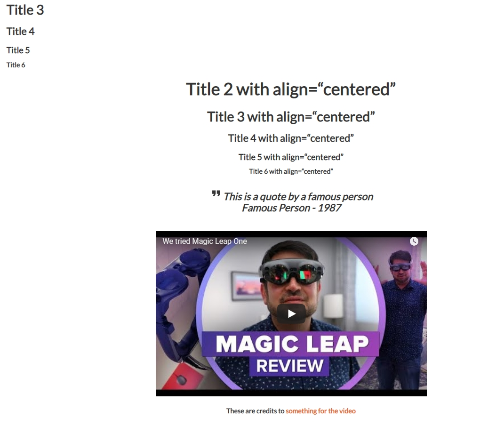

# Cobuild Lab Website and Blog
`DEV`  

`PROD`  

## Running in development

`gatsby develop`

## Running live

`gatsby build` and `gatsby serve` after.

## Instructions to create a new blog post

1. Press the button that says **Branch: master**

2. Select **dev** from the list

3. Go the **src/pages/blog** folder

4. To upload pictures go to the **media** folder: https://github.com/cobuildlab/cobuildlab-web/tree/master/src/pages/blog/media

   4.1 Press the **Upload files** button

   4.2 Drag and drop your picture or select it from your computer

   4.3 Select the option **Commit directly to the dev branch.**

   4.4 Add an optional description or press the green button **Commit changes**

5. Inside the **blog folder:** https://github.com/cobuildlab/cobuildlab-web/tree/master/src/pages/blog

   5.1 To create a new post press the **Create New File** button

   5.2 Press the **Upload files** button or start typing in the text box

   5.3 Drag and drop your file or select it from your computer

   5.4 Select the option **Commit directly to the dev branch.**

   5.5 Add an optional description or press the green button **Commit changes**

6. Go to **Pull Requests:** https://github.com/cobuildlab/cobuildlab-web/pulls

   6.1 Click on the green button **New pull request**

   6.2 Base must be **master**

   6.3 Compare must be **dev**

   6.4 Click on the green button **Create pull request**

 

## Components for blog post (titles and such)

|          Name          | Description                                                  |                                             Use                                             |                                            Text Align                                             |
| :--------------------: | ------------------------------------------------------------ | :-----------------------------------------------------------------------------------------: | :-----------------------------------------------------------------------------------------------: |
|   Title size 2 (h2)    | Use to add a h2 to the post                                  |                                `<title-2>Title 2</title-2>`                                 | You can add text align (centered, left, right) like this: `<title-2 align="any of the 3 aligns">` |
|   Title size 3 (h3)    | Use to add a h3 to the post                                  |                                `<title-3>Title 3</title-3>`                                 | You can add text align (centered, left, right) like this: `<title-2 align="any of the 3 aligns">` |
|   Title size 4 (h4)    | Use to add a h4 to the post                                  |                                `<title-4>Title 4</title-4>`                                 | You can add text align (centered, left, right) like this: `<title-2 align="any of the 3 aligns">` |
|   Title size 5 (h5)    | Use to add a h5 to the post                                  |                                `<title-5>Title 5</title-5>`                                 | You can add text align (centered, left, right) like this: `<title-2 align="any of the 3 aligns">` |
|   Title size 6 (h6)    | Use to add a h6 to the post                                  |                                `<title-6>Title 6</title-6>`                                 | You can add text align (centered, left, right) like this: `<title-2 align="any of the 3 aligns">` |
| Author or person Quote | Use to add an author's quote                                 |                      `<block-quote>Your quote goes here</block-quote>`                      |                                                                                                   |
|        Credits         | Use it to add credits to something, you can put links inside |                         `<credits>Your credits goes here</credits>`                         |
|     Youtube Video      | Use it to add a youtube video                                |                     `<youtube-video id="yourvideoid"></youtube-video>`                      |                  Look for your youtube video id by checking the url of the video                  |
|     Image Carousel     | Use it to add a carousel for a max of 4 images               | `<carousel folder='blog'>./media/121321312312321.jpeg ./media/asdasd122131.jpeg</carousel>` |                     Look for your image paths and separate them with a space                      |
