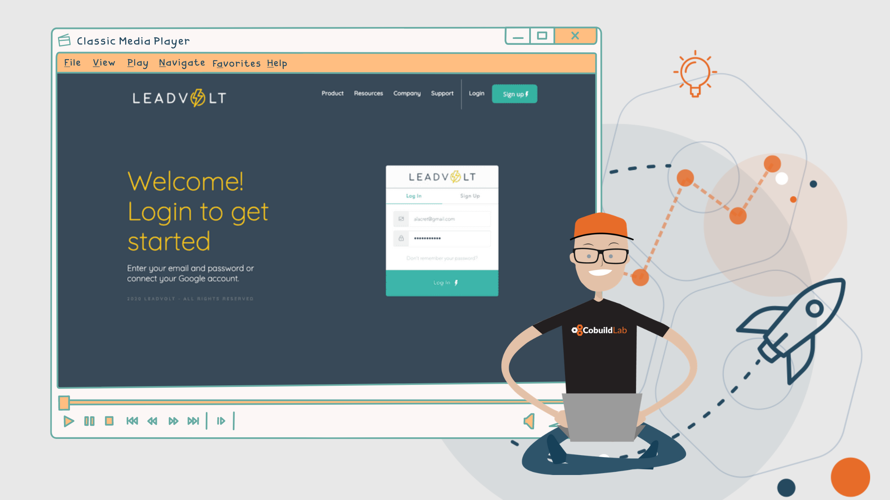

Miami, FL. Nov 20, 2020 - Earlier this year the partnership between Cobuild Lab and 8base to develop a new platform was announced and now it’s in the final stage of development.     

Besides being a sponsor of our <a target="_blank" href="https://www.meetup.com/es-ES/Miami-Software-Developers/?chapter_analytics_code=UA-105326682-2"> Miami Software Developers</a> group, the  8base team joined forces with Cobuild Lab to develop a new platform. “We are glad to work with such a talented and dedicated team as 8base” comments <a target="_blank" href="https://www.linkedin.com/in/alacret/"> Angel Lacret</a>, Chief of Product Development of Cobuild Lab.    

The new platform named Lead Volt is a very specific CRM for the automotive insurance industry. CRM or Customer Relationship Management is an application that allows centralizing in a single database all the interactions between a company and its customers.    

<title-4> What’s a CRM? </title-4>    

A CRM is a program or application in which all the conversations that anyone in a company has with a client, whether it's are emails, calls, or meetings, are automatically saved in the file of that specific client. This file is accessible to everyone in the company; internal notes and/or activities with a date to be done can be placed on these conversations, assigned to a team member, thus improving the overall productivity.    

Companies that implement CRM solutions can:     

* Increase productivity: gathers all processes and business information in one place available to everyone in the company      

* Makes it easier to manage each sales process and emerging opportunities     

* Create new sales opportunities      

* Collect information for Sales Managers and Sales Executives     

* Update budgets in real-time optimizing sales processes    

<title-4> LEAD VOLT </title-4>    

The platform will allow Lead Volt to share and maximize the knowledge of a given customer and thus understand their needs and anticipate them.  *“Of course, we are using the Backend-as-a-Service offered by <a target="_blank" href="https://www.8base.com/"> 8base</a> since it allows us to develop a solution to manage three basic areas on the Lead Volt platform: sales management, marketing, and after-sales or customer service,”* said Lacret. CRM software allows us to segment a customer base, so it also makes it easier to plan sales and marketing strategies more effectively and increase revenues.    

We are getting prepared to launch its <a target="_blank" href="https://cobuildlab.com/blog/minimum-viable-product/amp/">MVP (Minimum Viable Product)</a> and try out all the features that were added. Stay tuned for more updates about the Lead Volt project and thank you so much for reading.     

<title-5 align="left"> About 8base </title-5>

<a target="_blank" href="https://www.8base.com/"> 8base</a> is a Backend-as-a-Service that combines computing, application services, and integrations for building SaaS and market-facing applications. Founded by <a target="_blank" href="https://www.linkedin.com/in/albertsantalo/"> Albert Santalo</a> in 2017, 8base’s mission is to democratize software development and unlock the power of digital transformation for businesses worldwide. They achieve this by providing the industry’s most modern low-code technology platform, operating environment, and toolset. With 8base, users can build enterprise-grade applications faster, more efficiently, and less expensively than with legacy IT alternatives.    

<title-5 align="left"> About Cobuild Lab </title-5>

We transform Small and Medium size businesses by automating manual processes and tasks into optimized and streamlined workflows with Web and Mobile custom software. Everything from using email autoresponders to automated workflow can help you redefine your relationship with the customer and open up new revenue streams for you. It's time for you to use technology and automation to make your business more efficient.    

<youtube-video id="5fbYxQNgJ7s&"></youtube-video>     

Got an idea for a web or mobile app? Let’s build it! Check out our <a target="_blank" href="https://cobuildlab.com/price-calculator/">  price calculator</a> to have an estimate of the cost of your project or email us at contact@cobuildlab.com and get a FREE online consultation. 
