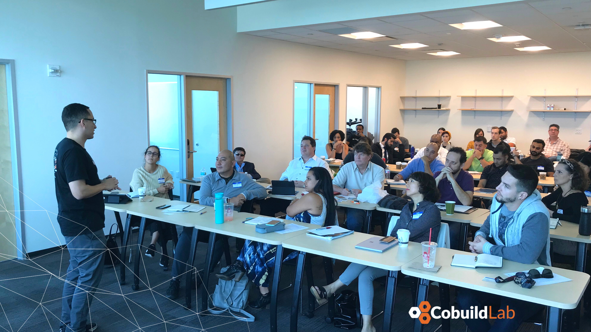

Miami, FL. November 30, 2020 - To become the owner and master of one's own time is the greatest thing. Deciding which projects to work on, how many hours a day you want to dedicate to your activities, not having to ask anyone's permission to take a break or to make any important decision. This is probably the most attractive thing when deciding to undertake, to start your own business.    

But the entrepreneurial route is not for everyone. Many may simply not be able to withstand the initial efforts or the simple fact of having to think longer than usual in order to achieve success in an aggressive environment without many guarantees or lack of risk. Eager to support new ideas, Cobuild Lab and Navigate Capital have joined forces to create a platform created by entrepreneurs for entrepreneurs in which they will share their experiences on the road to success.     

Growth Therapy is a communication tool for entrepreneurs in the tech industry. In a video format, this program is intended to serve as a guide to all those visionaries who want to be masters of their own time and want to see their ground-breaking idea materialized. So, we talked to <a target="_blank" href="https://www.linkedin.com/in/alacret/"> Angel Lacret</a>, founder and CEO of <a target="_blank" href="https://cobuildlab.com/"> Cobuild Lab</a> about this new journey.     

     

<title-5 align="left">What is Growth Therapy? </title-5>

*Growth Therapy comes from the need to help entrepreneurs accomplish their goals. We want to share the entrepreneurial path from the first steps shaping an idea, establishing the foundations to build a business until the moment they finally manage to raise capital.*     

*Alongside <a target="_blank" href="https://www.linkedin.com/in/psostre/">Pedro Sostre</a>, a consultant and author with 20 years of experience in building companies, founder of <a target="_blank" href="https://www.navigate.capital/"> Navigate</a>, we will share our experience and other industry professionals experience so we can communicate success stories that not only inspire others but help them understand better and learn how you can bring your idea to the real world.*      

     

<title-5 align="left">What motivated you to create a space for entrepreneurs in the early stages?</title-5>

*The motivation is exactly the same that made me decide to start Cobuild Lab, I have surrounded myself with incredibly passionate and visionary people to help other technology entrepreneurs to take their first steps, to walk with them on their journey, and to provide them with all the tools they need to achieve their goals. We want to support the entrepreneurial community so that we can grow even more in the city.*     

*The momentum for this initiative came from our own experience as entrepreneurs. Although we had many setbacks on the way to starting Cobuild Lab, we also got a lot of help from amazing people who gave us advice on different aspects of the business. Once we established the company, our client portfolio grew and so did our network. We have learned a lot since then from our mistakes and most importantly we have learned from others' mistakes.*     

*We realized that just like us, there are many visionaries who want to undertake, looking to succeed but don't have a guide to help them move forward, there is no manual with step-by-step instructions. That doesn't exist. Miami is one of the most entrepreneurial cities in the United States today, and tech is taking off in such an incredible way that it could be the next Silicon Valley. We decided to be helpful to other entrepreneurs, to become that guide and that support that we had at the very beginning, and to be able to share our experience with them.*     

     

<title-5 align="left">Why Growth Therapy?</title-5>

*We decided to call it that since we see it as group therapy. In each episode, there will be a different special guest who will share their experience from putting their idea on a whiteboard to finding the capital and getting the project off the ground. We want everyone to be able to learn from the experiences shared on the channel. The mistakes, successes, losses, and gains. The entrepreneur's journey is not just from point A (the idea) to point B (the success), it's the process that makes the true difference.*     

*Just as a tree doesn't grow overnight, an idea also needs some time to grow.*     

<title-5 align="left">What will subscribers appreciate most?</title-5>

*Honesty and transparency. We want to share real cases of real companies with real problems and tangible solutions.*      

     

At Cobuild Lab we’re firm believers that every single time we’re writing a line of code we’re writing our future, we build software products such as web or mobile apps that run our lives and are changing the world we live in. For us, working in Tech means working for the future and so it is for many entrepreneurs who have ridden the wave of opportunities that the digital transformation has brought.     

Growth Therapy is for you, the visionary and passionate creator who thinks outside the box, and quoting Apple’s founder Steve Jobs *“people who are crazy enough to believe they can change the world, are the ones who do”*. Let’s change the world, let’s build a great idea!     

The first episode will be out soon on YouTube so stay tuned for more updates. Thank you so much for reading!

