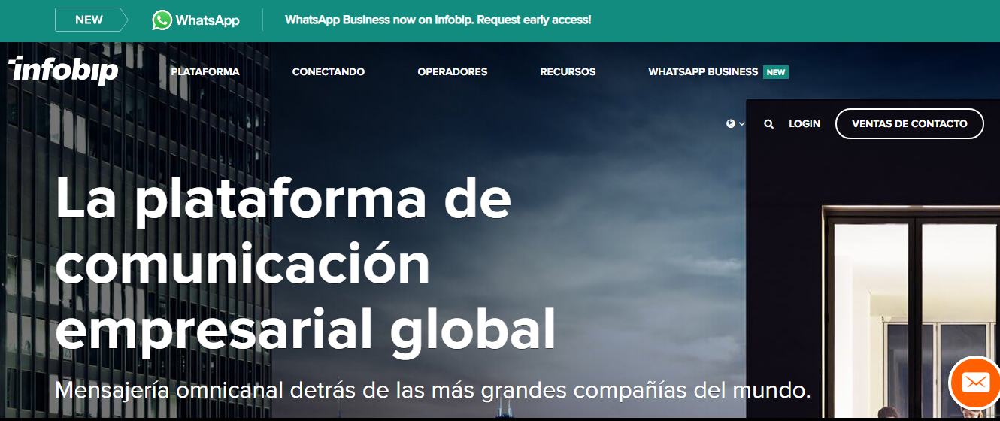
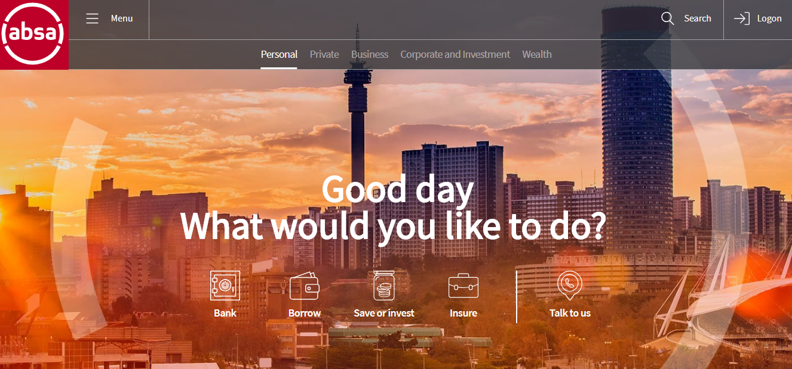
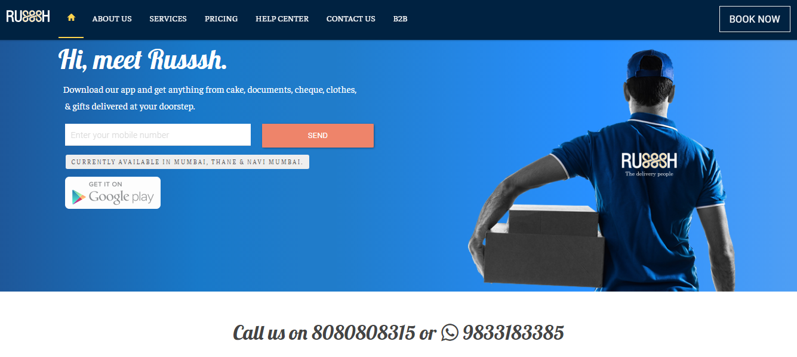
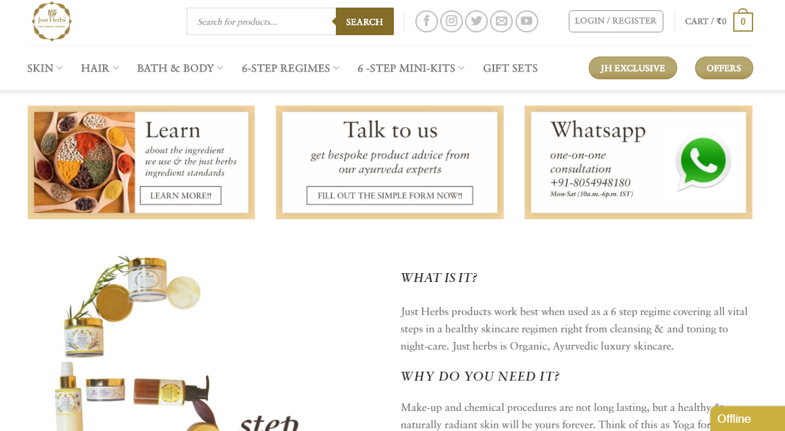
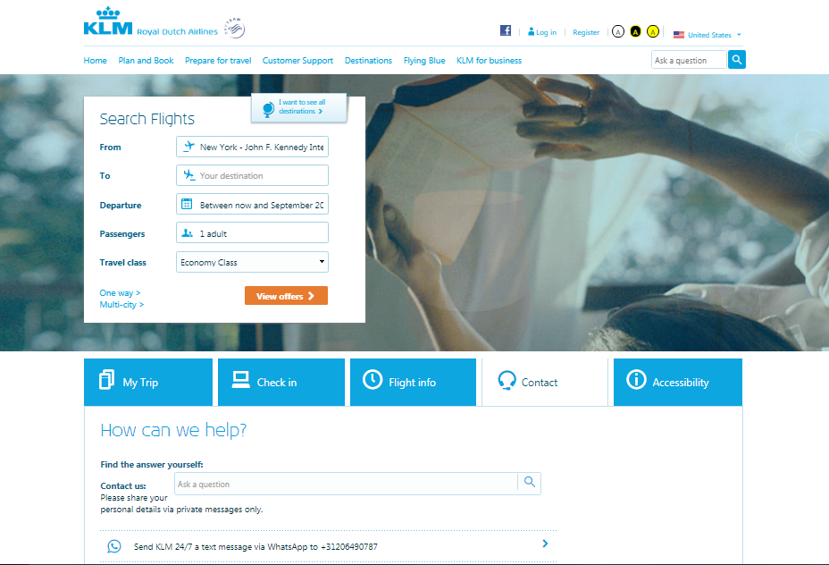

Since it was launched in January on this year, WhatsApp Business has come to revolutionize the traditional customer support for companies around the world. **Its functionalities allow the brand to be closer to the clients and interact with them**, as they do with families and friends.

Currently,** the people want to connect and talk to companies immediately and the phone call is no longer enough.** We need the conversation to be in text and to be in writing for future review or check.

WhatsApp Business offers a new way to meet customer requests, but we must be careful to not invade their privacy. **In this new communication channel, the client must to initiate the conversation with the brand** and then we have to ask if they want to receive the news, images or information of our service /product.

We did an investigation and found 10 companies that implemented WhatsApp Business into their marketing plan. Let's see how their customer support works through this application that millions of people have installed on their phones.  

<tittle-2>**1.- Infobip**</tittle-2>

The business communication provider, Infobip, presented, in August of this year, WhatsApp Business within the range of its communication channels, which proves the reach and impact of this platform. They have more than 55 offices on 6 continents and now they will offer their customers this messaging service to interact with their audience through an application that the users know and trust.  

"Infobip is enabling this communication in an efficient and convenient way that helps companies to scale their communications, increase brand loyalty and encourage commitment which is vital in today's business world. The messaging channels are key to interact and get involved with customers", says Silvio Kutic, Infobip CEO.

<tittle-2>**2.- Meliá Hotels International.**</tittle-2>

It is one the latest companies that announced the activation of WhatsApp Business to use this service to provide useful information to their clients about reservations, confirmation number, localization of the hotel, among other aspects that they need to know, all with the prior consent of the client.

<tittle-2>**3.- Absa Bank**</tittle-2>

Absa is one of the first banks to try WhatsApp Business to process the requirements of its clients. They value your opinion so much that they put on their website the number of each department, with the time of attention. More than 10.000 customers have registered since Absa launched[ ChatBanking](https://www.absa.co.za/media-centre/press-statements/2018/absa-customers-embrace-chatbanking-on-whatsapp/) on WhatsApp service on July 2018 in South Africa.

"ChatBanking on WhatsApp will enable cost-effective, safe and easy digital interactions, and offer more accessible and efficient engagement with our customers through a secure interface", says Arrie Rautenbach, CE of Absa Retail and Business Banking.

With this service, you can obtain the actual balance in your account, buy airtime, data or SMS bundles for the cell phone registered in your account, make payments, get a mini statement with the last three transactions, among other options.

<tittle-2>**4.-  Accor Hotels**</tittle-2>

90 percent of Accor Hotels in the United Kingdom and Ireland also started to incorporate Whatsapp Business, so that their guests can contact the reception, restaurant or room service, instead of using the classic phone call.

<tittle-2>**5.- Russsh**</tittle-2>

A relatively new company, Russsh is an on-demand delivery service in Mumbai, India, to send cake, clothes, groceries, food, gifts, flowers, documents, cash, checks and other things, but if you want to ask them if they can send a specific article, you can write them to trough Whatsapp Business. This type of attention provides greater confidence and security to customers since you can track your delivery by this application.

 

<tittle-2>**6.- Access Bank Plc**</tittle-2>

One of the five largest banks in Nigeria that wants to communicate with their private and corporate clients by WhatsApp Business is Access. Through this channel, the customers can ask, check their balances and receive service requests treated promptly.

<tittle-2>**7- Just Herbs**</tittle-2>

Just Herbs is a brand from India that sells Ayurvedic products online, for skin, hair and body. They know that women take their time to buy beauty products. Then, they open to WhatsApp Business to answer all the questions of their clients. If you want to ask them if any particular cream is the right for your skin type, send a message through WhatsApp Business before buying.

 

<tittle-2>**8.- Netflix**</tittle-2>

If you are looking for a good series or movies and you do not know who to ask, you can talk with Netflix on WhatsApp Business and request a recommendation. But, this service only is available in India, for now. You can also converse with them if you have connection problems and give you the assistance you need. So easy!

<tittle-2>**9.- KLM Royal Dutch Airlines**</tittle-2>

Imagine how wonderful it would be to get your booking confirmation, check-in notification, boarding pass and flight status updates in a WhatsApp message. Well, this is what KLM Royal Dutch Airlines offers you on its website. This company includes WhatsApp Business in its official and verified passengers service channels, besides Twitter, Facebook, Messenger and phone calls, which give you the closeness to request all the information about your flight.

<tittle-2>**10.- Burger & Relish Restaurant**</tittle-2>

A popular American diner style restaurant located in Accra, Ghana, implemented WhatsApp Business to promote the menu, a new plate or events they organize in their restaurants. Each waiter takes the number of their clients and asks them if they would like to receive information about future events via WhatsApp.

Unlike previous companies, Burger & Relish compiles this list of clients per person, which gives them the opportunity to interact face to face with the client before doing it through WhatsApp.

All these companies have prioritized the need of the customers to speak directly and raise their requests, but not just read them. **Interacting with WhatsApp implies the commitment to solve their doubts and make it fast**. It's a challenge but the loyalty of your audience will be superior with this communication and marketing strategy.

