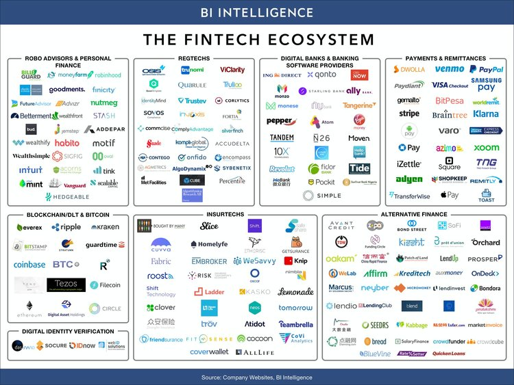

Do you want to launch a startup? Before you get started why not know which are the top software industries right now, this will be the key to getting started with the right foot!
Which criteria did we use? We considered the number of proposals generated as well as the income produced in these industries.  

<title-2>Top industries for Software Startups for 2020</title-2>

 

<title-3>* Micro-mobility in the Transportation Tech Industry</title-3>

The micro-mobility industry is a type of urban transportation, and this year it has been on fire.  

These devices work as an alternative to public transport and it has not stopped growing, to the point where Ford even acquired [Spin](https://www.spin.app/https://www.spin.app/) for $100 million. Now Ford has been investing even more resources making these devices more durable with a longer battery life.

Last year this industry was announced as a trend, and this prediction today is a reality.

Many people in our city use these devices to go to work quickly, without spending fuel, avoiding traffic, or worrying about parking.

Of course software development has been an integral part in the growth of this industry, making these vehicles a type of IoT devices since they’re linked of the web.

All is possible in this industry that has not stopped growing during 2019. 

What you need for having a startup in this industry is knowing enough or having someone on your team who knows about electric transportation technologies such as small and efficient batteries among other things..

You will also need a lot of capital, and knowledge on laws of the state where you're going to start.  In some states, these transportation devices are not yet legal, or the use is limited so consider this issue carefully. 

[Global revenues from electric bicycles are expected to increase $24.3 billion in 2025, $15.7 billion higher than 2016, according to Navigant Research.](https://www.inc.com/best-industries/index.html#back)

Last year, global investors raised $3.7 billion for electric bicycle and scooter companies in the first ten months, and this year, growth has been much higher, which means that people are interested in this business, so if you are thinking about launching a product in this industry, it is the perfect time to do so.

<youtube-video id="XnRr8PDFhbU"></youtube-video>

<title-3>* Healthcare Industry</title-3>

Health is another mega-trend in the software industry. 

Not only are startups providing products that brings medical services to the patient, by providing  a platform where doctors can offer their services. But now this industry is also developing solutions for preventive health. 

Nowadays, there are [artificial intelligence](https://cobuildlab.com/blog/artificial-intelligence-in-2018/) and several technologies that startups are taking advantage of.

At the same time, many related micro-niches have been developing such as health for babies, elderly people, mothers, and much more.

This passion for healthcare [software development](https://cobuildlab.com/blog/best-software-development-process/) has been promoted in our country so much, that actually revenue last year was $36 billion and still  growing exponentially. 

This year an example of a startup that we can follow in this industry is Nurx. It is an app that aims to give women better and faster access to birth control. 

Women can request the prescription and receive it directly to their door at no cost if they have health insurance. 

If they do not have one, for a monthly fee starting at  $15, they can benefit from the platform and their birth control plans. 

It works in every state in the country, including Florida. This startup raised $41.4M in funding in 2019. Hans Gangeskar and Dr. Edvard Engesaeth were the co-founders of this startup that is on fire and we invite you to follow it, especially if you are thinking of starting a similar project.  

<youtube-video id="2aXIt7IMadA"></youtube-video>

[Spring Discovery](https://www.springdisc.com/) is another example of a healthcare startup in 2019. This startup had a total funding of $22.3 million.

Its founder, Ben Kamens, had the goal of developing the project for discovering new therapies for elderly diseases such as cardiovascular diseases, degenerative diseases, among others. Spring Discovery’s machine learning platform reduces the time it takes to run experiments.

It is an exciting proposal that still stands, and we will have to follow it up.

If you want to start, you should keep in mind that it is probable you will have to incorporate software specialists and medical experts in your team. It would also be ideal to work with healthcare specialists in your chosen area of work for validating your app solution hypothesis.. This will help you develop a much more functional product.

It’s also possible that you will have to meet certain legal requirements, comply with regulations, and have permits, depending on the state you are. All of this, to develop a new software product in this niche.

<title-3>* Financial Technology or FinTech</title-3>

The automation of various financial services became a necessity, and therefore, FinTech or financial technology has taken hold in the market of software startups. 

This technology makes it easier for companies, businesses, and consumers to better manage their operations, processes, and financial lives through the use of specialized software and algorithms. 

This industry encompasses financial sectors such as education, retail banking, fundraising and nonprofit organizations, investment management, among others. Linking software development to these services, for banking institutions and consumers. 

Since it was born, it has not stopped being a trend in startups. It is  an explosive industry, which requires significant investments, security, and industry know-how, but provides large revenue generating opportunities as well. Money and the economy often move the world, that’s a reality.

One startup that has raised capital in 2019 in the FinTech sector is [Sparkling Logic](https://www.sparklinglogic.com/). A Silicon Valley startup that helps organizations in their business and financial decisions. Users of this application can get value from interacting with customers through dynamic pricing, risk management, fraud flagging in daily transactions, among other benefits.

An interesting fact is that it is able to monitor IoT devices in order to help the client company make better decisions based on the usage data.

This startup was founded by Carlos Serrano Morales, Carole-Ann Matignon, and Davorin Kuchan. The total amount of capital raised is still unknown, but it is a good example of this kind of startup. 

In Miami, these startups that began even a few years ago still are still showing  growth, because this is an industry that as time goes by becomes more necessary. Not only in Miami, but also in the rest of Florida. 

So what do you need to get started? Raise a lot of capital, you will need it to get experts in cybersecurity and banking security. You will have to comply with legal requirements established by the state in which you’re operating you will need to use solid and secure technologies, having the right people on your team, and launch your product into the market. 

Business Insider shared this visual showing some of this year’s top players in the FinTech ecosystem. 

Source: [Business Insider](https://www.businessinsider.com/fintech-ecosystem-report)

<title-3>* Education Technology</title-3>

Education technology has been helping transform traditional education by creating new ways to learn as well as ways to automate various processes, of course software development has been at the forefront of this transformation.

Either with apps, web pages, or other technological resources which have allowed new ways to access knowledge or academic training. In 2019 many education technology startups as well as established companies have raised or invested new financial capital That's why we decided to add it to our list of trends in startup industries. 

Education and technology are now best friends. 

With methods like [Cloud Computing, Speech-to-text options, Virtual and Augmented Learning Experience, Learning Analytics](https://elearningindustry.com/educational-technology-trends-top-right-now), among others, education today is more accessible, customizable, fast, and in general has never been as integrated with technology as today.

Since 2018, [this sector has invested more than 16.3 billion dollars just in the area of higher education.](https://www.qs.com/5-types-of-higher-education-technology-you-should-be-investing-in/) Universities are some of the main potential clients of this type of technology as well as companies linked to education. 

Although lately some startups have bet on mass consumer products in this area, taking into account that new generations are much more self-taught, having less barriers to engage in digital education. 

For startups of this type, you need an academic program, something to teach, and perhaps specialists in the area that provide the educational content you want to transmit. Plus you’ll need a team of developers, as well as possibly a team to help onboard new users.. 

Capital is relevant, but not the most important, since many [open source or free software](https://cobuildlab.com/blog/software-open-source-vs-proprietary-software/) technologies are available to you. You’ll need the right people to help you choose the framework and [tech stack](https://cobuildlab.com/blog/key-elements-that-you-should-consider-to-select-your-technology-stack/) that suits you best.

A recent example of a startup in this industry dating back to 2018 is [Xennial Digital.](http://www.xennialdigital.com/)  They’re a digital agency where with the help of virtual reality technologies have developed a portal consisting of multiple experiences for K-12 students to learn STEM concepts in an immersive environment.

They developed the XDVR Learning Portal in partnership with ByteSpeed and have continued to grow since last year. Another great thing about them is that they are a local venture headquartered here in Miami. 

<title-3>* Cannabis</title-3>

Five years ago, there was no legal or formal cannabis market in the United States, at least not how we know it today. [This market grew almost 40 percent in 2017 to $367 million, according to a recent report by New Frontier Data](https://www.inc.com/best-industries/index.html), reached $500 million in 2018 and is expected to reach $1.91 billion by 2022. It's a growing market without a doubt, and software is a big part of it as well.

Cannabis are products that contain  Cannabidiol or CBD and hemp as their base substance which is a natural and chemical substance without psychotropic effects, but with anxiolytic, anti-inflammatory, and analgesic properties. That is why it has been used for treatment of deadly diseases.

What could happen to this market? It is not 100% legal in all the states in the country yet, and where it is, it’s often restricted. 
 
Despite this, its culture and popularity continue to grow within and outside the United States. That is why in 2019 many startups were launched in this industry, offering different types of services such as buying and selling, distribution, and even the creation of cannabis communities. 

Cobuild Lab actually had the pleasure of accelerating and developing an app called [WeedMatch](https://cobuildlab.com/customer-success-stories/weedmatch/) for the Chilean market. In this app, cannabis lovers can match, meet, and date. While staying up to date on the events and all the news highlights of this culture all in one app. An exciting proposal cooked in our software laboratory in Miami, with a Latin American destination. 

It’s an industry that has a proven growth record, and most importantly its still in its infancy stage, primed for even more growth. Will you be the next to join? 

<title-3>* AdTech or Advertising Technology Industry</title-3>

AdTech is an abbreviation for advertising technology. This market is absolutely explosive. The more time that goes by, the more it grows, and the more software options that there are, and more alternatives will keep on being added even if it would seem the  market is already saturated. It is and will continue to be a good option and a good proposal for any new software product.

These type of startups develops software to be used in all contexts within the advertising field.

Software applications in these fields can be endless, it can range from analytics solutions, banner creations, scheduling, back-end system, targeting, management, and much more.

Giants such as [Google](https://www.google.com/), [Facebook](https://www.facebook.com/),Microsoft, are some of the largest players in this industry. They not only grow products in-house but often bet on supporting startups that offer innovative products or valuable services, one of those could be you. 

You have to think about your value proposition, add marketing experts to your team, and investigate how you can improve what already exists in the area. 

Millions, if not billions of dollars move and are generated in this industry that is undoubtedly highly in demand. 

An example of a recent startup in this industry is [StickEarn](https://east.vc/portfolio/stickearn/). A crowdsourcing advertising platform that allows drivers and vehicle owners register and adjust the way they place ads on their vehicles, and even select their preferred brand or vendor to promote on their vehicle.

It was founded in 2018, by Archie Carlson, Garry Limanata, Hartanto Alim, and Sugito Alim.

<title-3>* PropTech</title-3>

Proptech is a term that refers to technology related to the real estate and property management industry, whether in the form of software applications or in the shape of hardware such as sensors or materials.

A report by Yo startups showed that investment in [real estate startups had doubled almost 40 times between 2005 and 2018](https://www.planradar.com/proptech-in-the-construction-industry/), especially in the US market, followed by China and the DACH region.

The real estate business has its processes well defined with different operations to be done. Today there is software for almost every operation on the area, and it can continue to be like this if you are encouraged to develop your startup in this trendy industry.

Some of the areas where you can find space are in construction management, intelligent homes,  sustainable services, real estate management, facilities maintenance, contracts and guarantees,  accounting, and so on. 

To build your startup in this industry it’s likely that you’ll need in your team some sort of industry expert, depending on your idea this could be an architect, civil engineer, or a real estate expert.  Having the right team will help you find the right space in the industry, while also helping you create a good value proposition for your software product.

<title-3>Want to know more?</title-3>

Make sure you sign-up for our newsletter, in the coming weeks we will be posting in depth industry studies in each of these trending areas to help you build your software product in the best way possible.

