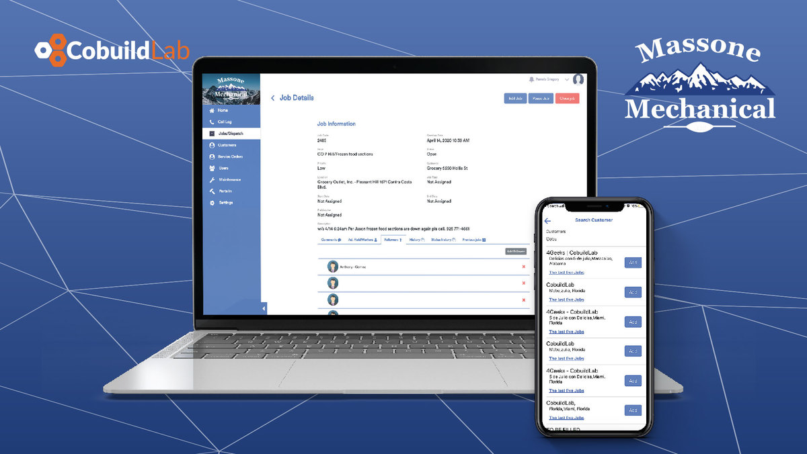
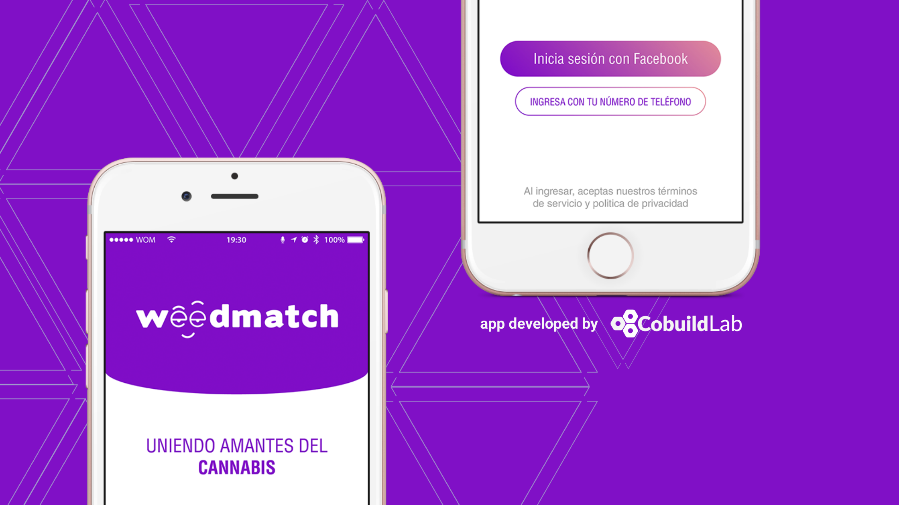

Miami, FL. July 9, 2020 - Here at Cobuild Lab we've been helping business owners, CTO's, COO's and IT leaders get past the techno-speak and help them take a business process and turn it into a custom software solution.    

With over 70 projects in our portfolio, we pride ourselves in offering agile techniques, tools, and technologies to increase development speed to deliver faster results. And today we'd like to introduce you to some of the projects we feel proud of so you can get a feel for our work.     

<title-3 align="centered"> Massone Mechanical  </title-3> 

    

<a target="_blank" href="https://www.massonemechanical.com/">  Massone Mechanical </a> is a refrigeration company based on the San Francisco bay area that provides its services and refrigeration solutions to businesses ranging from small convenience stores to large supermarkets. If you need quality products, maintenance or installation anywhere in the bay area, they’re the ones to reach.    

They wanted to improve their processes on information management and customer service delivery and they sought to set up a mechanism to automate the recording of calls and service orders for maintenance and installation, and in doing so, improving communication and reception for field workers.      

We met Robert Mitchell, the head of IT for Massone almost four years ago and we started working on possible ways of improving the company’s workflow. We tried different versions of ERP applications and Third Party solutions. Then we decided that the optimal way to speed up Massone’s workflow was to develop a Custom Application.    

The resulting platform has had a great positive effect within the company, significantly improving the information flow within all levels of the company, making it more competitive and efficient. And it is a perfect example of how a B2B company can scale its operations and reduce costs by implementing a <a target="_blank" href="https://cobuildlab.com/blog/identifying-opportunities-to-create-a-software-product/">  software product. </a>     

<title-3 align="centered"> Jobcore </title-3> 

    

<a target="_blank" href="https://www.jobcore.co/">  Jobcore </a> is a scheduling, hiring, and payment marketplace for the hospitality industry: it's the validated and curated talent pool of workers and hundreds of companies organizing events and hiring every day.    

Alejandro Sanchez,  director of marketing and technology of <a target="_blank" href="https://bestmiamiweddings.com/?gclid=CjwKCAjwr8zoBRA0EiwANmvpYEvMKSx01ODW0kTooBv-sSfNwl6ODH0OKORoHKnIA_lRbOsE-UM8JRoCP7IQAvD_BwE">  Best Miami Weddings </a> has had problems keeping track of how his workers report hours since the apps available on the market didn't work for him, so he proposed this idea about building a web and mobile platform custom made to its needs, and so the project began.    

After several iterations, the concept was expanded to create a complete marketplace for the industry, where employers can publish their position needs to a wider audience.We built  a <a target="_blank" href="https://cobuildlab.com/blog/mobile-apps-web-apps-or-cross-platform-what%E2%80%99s-the-best-for-my-small-business/amp/">  web and mobile app </a> for both Android and iPhone marketplaces with two interfaces: for employers and for talents.    

The Employers interface is very user-friendly, it allows them to plan their shifts and invite talents to work for them. This interface allows them not only to manage their schedules but also to see the activity for a specific job, and track the time that their employees work on each shift.    

Individuals looking for jobs in the service industry such as bartending can apply to jobs via the app. It allows them to get notifications for open positions, apply, fill the shift and track payments, all in one place.  The platform has been released but we are currently working on new versions.    

<title-3 align="centered"> Weedmatch </title-3> 

    

<a target="_blank" href="https://weedmatch.cl/">  Weedmatch </a> is the first free cannabis social network made by a group of Venezuelans led by its founder Oscar Lopez in Chile where you can interact with other people and be aware of events and news about the culture of cannabis. The part of the match is specially dedicated to cannabis relationships or encounters, which will eventually expand the networks of consumers and brands.    

Born as an idea on April 20th (4/20) 2017, when attending a national cannabis march in Chile, surprised with the call and massiveness, Oscar Lopez decided to create something to unite all the community, and from there emerged the idea of a social network. As he delved deeper into the idea and the Chilean cannabis culture he realized that the market and opportunity were much bigger than he expected and at the same time the worldwide cannabis culture begins to have high traction: it was a case of perfect timing.    

We built a <a target="_blank" href="https://cobuildlab.com/apps-development-graphic/">  mobile app </a> for  Android and iPhone that allows you to contact people close to you, interested in the cannabis culture. Allows you to match and create a chat to chat and know the interests of those people.    

The project lasted approximately four and a half months with a back-end programmer, a front-end programmer, a typesetter, and a Qa. Working as a team with the client and holding daily meetings, the first beta of the application was developed and then functionalities were added. Currently, the project is already alive and all the Chilean community loving cannabis enjoys it.    

Learn more about our app development services <a target="_blank" href="https://cobuildlab.com/2020">  here </a> and if you have any questions you can contact us at contact@cobuildlab.com and get a FREE consultation. Thank you so much for reading!
