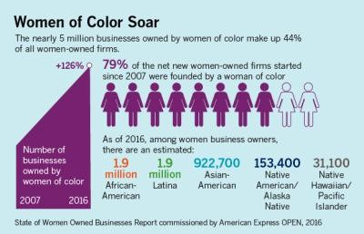
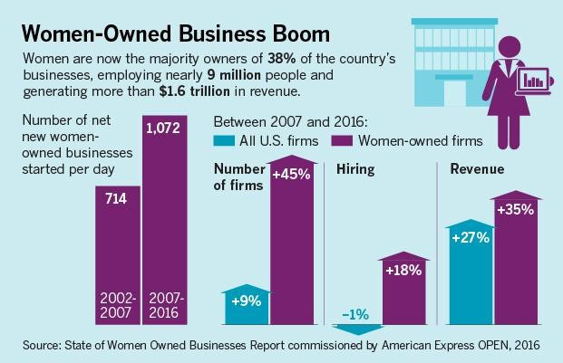

<title-6>*We can assume that this (Business owned by Woman) will continue growing over the years and we are not so far from business parity*</title-6>

<title-6>By: Roxana Alastre</title-6>

Rising as a **Woman Entrepreneur** can bring tough times to your life, especially when you're picking the **leadership** and business role over the socially forced gender roles as wife and mother. 
But as a soothing response to that, you can have the certainty that you're not the first one to handle these situations and you surely won't be the last, so it is very important to keep a few things in mind if you’re starting your path as **Woman Entrepreneur:**  

*    **Join to support groups** 

It's very difficult to work alone, finding women around the world who can share their experience and process with you will be a great upholder. Also creating women's support groups will be an amazing experience for you, in that way many women can share their ideas, goals and even frustrations. 

<title-6>Associations<title-6>

There are a lot of great associations like the **American Business Women's Association (ABWA)** where you can surely find good resources and supportive people who will be very happy to help you. 

Learning from the success and failures of others can increase your growth massively, that's why sharing experiences are so important when it comes to **entrepreneurs.**

<title-6>Online help</title-6>

The **Entrepreneur.com** blog periodically offers articles with inspiring stories of **Women** (and Men) **Entrepreneurs** from around the world, you can check it out anytime you need something to inspire you.

The site **startups.co.uk** has an online list of support groups and resources only for **female entrepreneurs** in the UK and around the world, it's a very useful resource when you are at the beginning of a **startup**. 

Even **Forbes.com** did a recent article about Alice, "The Siri for **female entrepreneurs**", a platform that uses **Artificial Intelligence (AI)** to help women **entrepreneurs** connect with other **business growing people, funders, investors, and resources**. 

You really have a lot of sources on the web so there's no excuse to feel alone during this process.

*   **Be conscious about sexism but don’t allow it to be your anchor**

You must be ready to feel underappreciated, especially when it comes to technology or sports **start-ups** that were dominated only by men. Awful and sexist comments could come when you are rising the top or try to collect investors for your business, but those are situations when you have to speak it out and overcome it. 

<title-6>Let’s talk about testimonials and quantities</title-6>

Although sexism may not always be so outstanding, it can be present in little things. And it's Heather Marie case, she is a founder and CEO of **Shoppable**, an e-commerce platform, she tells the story about a meeting where she asked the investor if he had seen the background on her company, he told her "No, I didn't. Actually, I've got to be honest with you. I didn't look into at it at all. I just took the meeting because you're hot." Of course, Marie ended the meeting quickly. 

Diverse cases as Marie's are described in **Thecut.com** in an amazing article who describe every aspect of sexism in **Silicon Valley**. They even describe how wider is the gap with black female founders who make up point two percent (.**2%**) of all venture funding according to a recent study that also shows up that "more than **60.000 start-ups** found that only 88 had **back female founders**". It also says that "Black-female-founded **start-ups** raised an average of **$36.000**, while the white-male-led **start-ups** that _failed_ raised an average of **$1.3 million.** 

<credits>Source: Womenable.com</credits>

In other hand, the **Women Owned Businesses’ Report** shows a big **growth** for businesses owned by women of color between the years 2007 and 2016, which can translate into a shortening in the gap of racism and sexism on **start-up** businesses. 

**To fight against sexism** 

Of course, there are very big chances of not having to deal with this kind of treatment in every opportunity, in that order, you cannot allow yourself to become a princess in danger if you chose this path is necessary to overcome every obstacle with **strength** and **braveness.** 

The sexism surely exists but that doesn’t have to hold you back even a little. 
 
*   **Be confident**

Confidence is the key to success, being confident is a very good way to show how much you trust in your project without having to say anything about it. 

You can find a lot of online tools to help you to get through self-confidence issues and to improve your body language so it’s absolute best. If you have problems with presenting at meetings, joining online sites as **Toastmasters.com** could help you to improve your speaking and leadership skills with conversational clubs. 

**Become an expert** 

**Having all the knowledge** around your **start-up** and your **vision clarified** before starting a presentation can instantly boost your **reliability**. Deep investigation on your niche is completely necessary in order to become an expert, wondering about what you would ask if you were watching your presentation is also a very good way to be prepared for incoming questions. 

If you are up to make some online appearances in blogs or even answering comments, you have to project the most professional image possible, remember that you are the face of your business but must show that you are also the brain.

*   **Follow your passion**
You shouldn't start any business unless you will be doing something you are really good at or you’re absolutely up to learn and innovate for the next years. That’s why the best tip is to find something you **really enjoy** and are willing to **stick with it** forever and over everything. In that way, you’ll be able to overcome every situation for your business. 

**On a final note** 

If you’re really thinking about starting as an entrepreneur you must know that over **30% of all US businesses are majority female owned**, and what is even wonderful is that this number continues to grow at twice the rate of all US firms, and they are **increasing** over the years.  

<credits>Source: Womenable.com</credits>

The **Womenable and American Express OPEN** took a look at the state of women-owned businesses across the U.S in the past years and in these charts you can really appreciate the huge growth between 2007 and 2016. Based on that we can assume that this will continue growing over the years and we are not so far from business parity. 

According to **Forbes**, "more women investors are starting their own funds and **looking to invest in women**, including Cowboy Ventures, Investors Circle, Female Founders Fund, Golden Seeds and 37 Angels", in the article they even present a complete list of women who invest in women that you can find here. 

To raise an empire takes time, take a moment to digest our recommendations and implement them in your journey. And we will love to read your comments so if you’re a **Woman Entrepreneur**: _Do you have any pieces of advice for those who want to start this journey?_ And if you are willing to start this path: _What are your deepest concerns about this?_ 

_**Comment below and we will be happy to read you!**_
