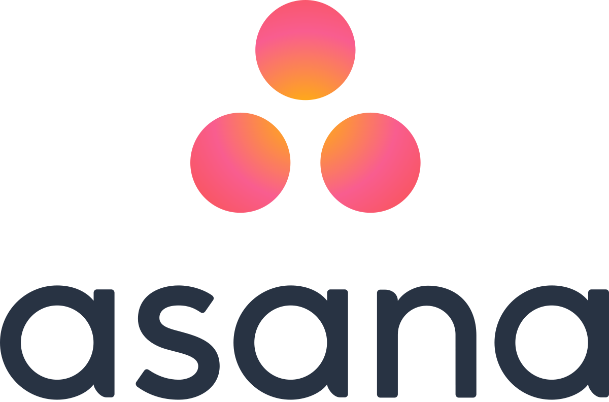
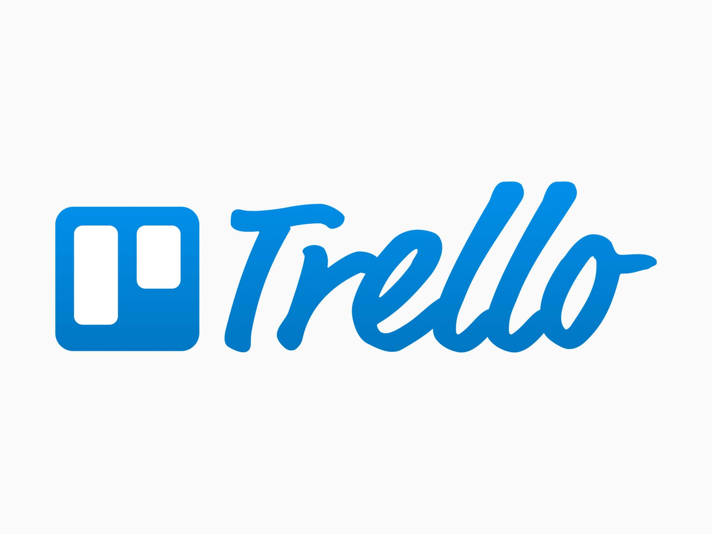
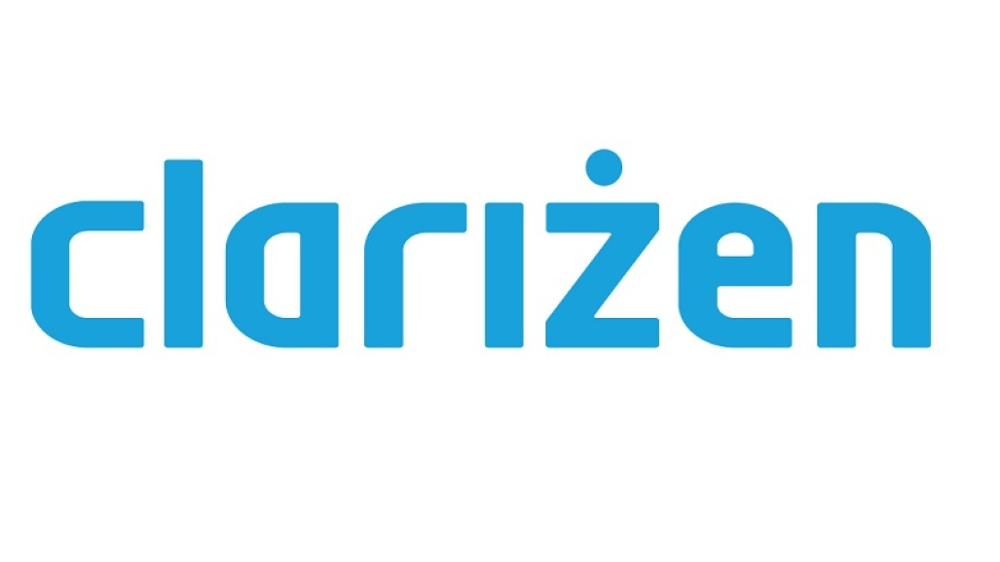

Welcome to this new article where you can get some tools and tips to get the most out of your **team's time and tasks**, increasing your company's productivity. 

You should implement technology in your company through task management tools, such as the ones we’ll show below. The business world is in constant change, so don’t stay behind and sign up on this world of [digital transformation](https://cobuildlab.com/blog/what-is-digital-transformation-and-how-can-small-businesses-take-advantage-of-it-this-2020/) and grow your business.  Let's begin!

 

<title-2>Yes, having the right time and task management is very important</title-2>

 

Task management is an essential issue since it helps you increase the productivity of your team, and therefore, of your company. First, you must start by understanding what work management is just the process of organizing and planning how to divide your time between specific activities during the development of any project. 

When we manage a team, we have the responsibility to assign tasks, follow them, provide help (when needed), close these activities when they are done, and why not? Evaluate productivity. 

All this process would be easy with just a member or a few people inside, but when the team grows or if it's big, this work turns more challenging. That’s when technology comes to save us. 

You must take into account that good work management allows you to work more intelligently, even decreasing the time of work. Not managing time harms efficiency and causes stress (for you and the team).   

Some benefits are :
- Greater productivity and efficiency.
- A better professional reputation.
- Less stress.
- Increased opportunities for advancement.
- Increased opportunities to achieve important life and career goals. It's about personal and commercial growth.

Task management software aims to provide help with specific tasks. 

You can add tasks, name them, categorize them, and also define the start and due dates. 

 

<title-3>There is another term we want to talk to you about, and that is “project management”</title-3>

 

Project management is a little more than task management because it involves planning, organizing, collaborating, and delivering many different activities, and sometimes even more than one team. It is similar to task management but in a macro way. 

There are excellent software tools that can help you with this, and best of all, many of them serve both purposes. That is, collaboratively managing tasks and projects. 

 

<title-3>Task Management vs Project Management</title-3>

 

<youtube-video id="BZjS-3zZrrk"></youtube-video>

 

<title-2>Some Tasks and Project Management Tools for Your Company</title-2>

 

Some of the task and project management tools you can implement in your business are: 

 

<title-3>Asana:</title-3>

 

 

[Facebook](https://www.facebook.com/) has changed our lives in many ways, and one of them is with [Asana](https://asana.com/es). This tool is a simultaneous task, and the project manager created in principle to improve the productivity of the Facebook team members. Then it was launched commercially in 2012, and until today it is a success. 

Since that year until today, they have made many relevant commercial alliances with [Microsoft](https://www.microsoft.com/es-ve/), [Gmail](google.com), among others, to expand the gestures and advantages of the tool. 

It is paid but very useful. 

“Asana simplifies team-based work management.”

 

<title-3>Trello:</title-3>

 

 

[Trello](https://trello.com/) is known for visualizing project tasks on a cardboard-like dashboard that’s great for managing short and quick everyday assignments.

It is not only a project management tool if you like and are a fan of absolute order, but you can also use it for any aspect of your life, even to organize some travel or household chores. It is very functional in any sense. 

 

<title-3>Scoro:</title-3>

 

 

[Scoro](https://www.scoro.com/) gives you all the tools you need for efficient time management, including time tracking, billing, work reporting, project & task management.  This work tool helps you manage your sales and customers, plan your team's time and projects, and track your business results. 

 

<title-3>Clarizen:</title-3>

 

 

[Clarizen‘s](https://www.clarizen.com/) cloud-based project management software has a single goal: to help move your business forward. Clarizen uses software as a service business model. Clarizen's features include attaching CAD drawings to a project, moving between the project view and design view, and an E-mail reporting feature. 

 

<title-3>ProofHub:</title-3>

 

 

[ProofHub](https://www.proofhub.com/) is a versatile project management system used by leading organizations like NASA, Disney, Taco Bell, and many more. This all-in-one tool comes packed with powerful features to eliminate the need of having too many different tools to run your business. 

 

<title-2>Develop Your Task and Project Management Tool Adapted to Your Needs</title-2>

 

The development of a task and project management tool gives your team a way to get closer to the total success of your company, significantly increasing the productivity that translates into a more productive enterprise. Today the efficiency of your company is linked to technology, so we invite you to develop your tool with Cobuild Lab and reach high and increase productivity by organizing your time and projects.  

We have reached the end of this very informative article where here you’ve learned about some of the task and project management tools you can use or develop within your company, improving the efficiency and performance of your work team. So you know that if you want your company to stay in the vanguard you must take into account all these recommendations. Begin to manage your team's time and tasks. 
