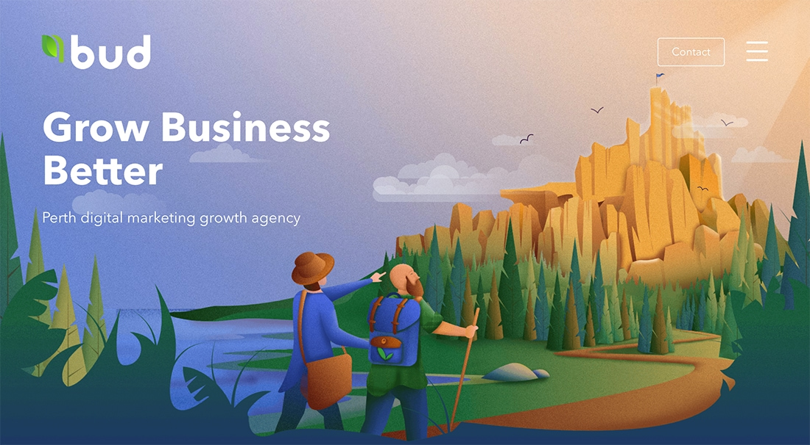
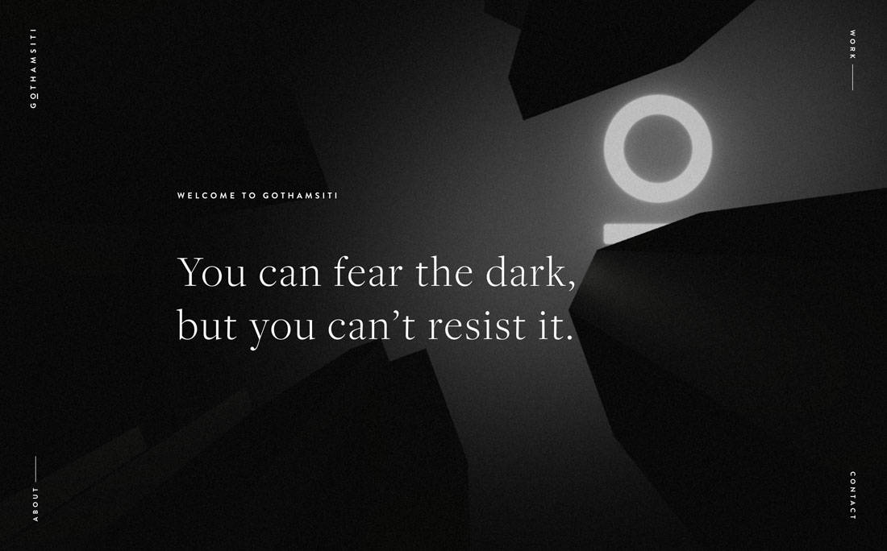
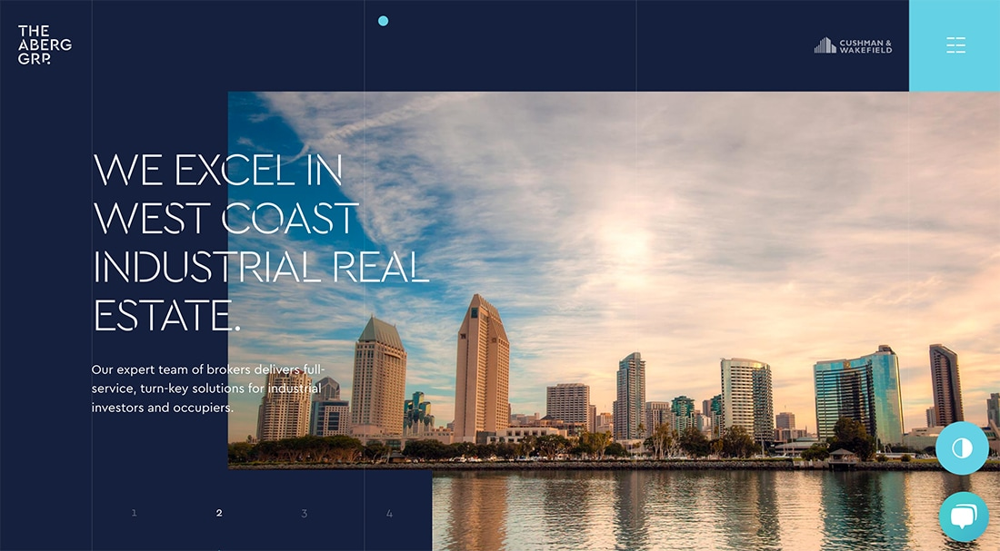
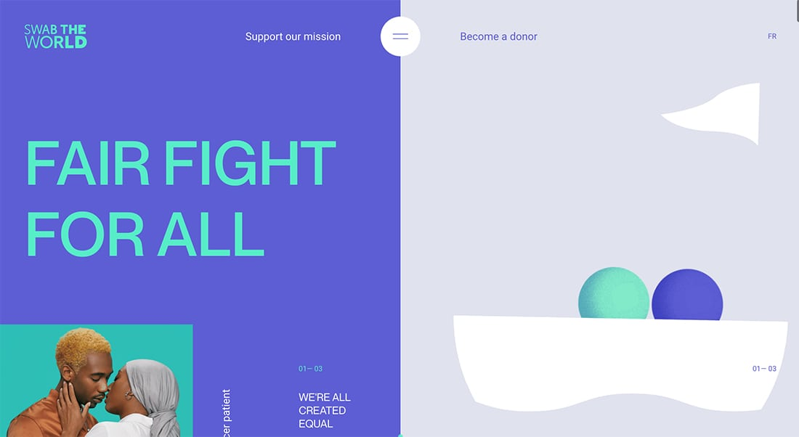

Miami, FL. July 28, 2020 - Not many people can see the opportunities arising during a crisis. If you’re reading this, congratulations! You belong to the 3% of those who are prepared to seize every opportunity to improve, grow, and succeed. Whether you own a personal brand or a company,  you sure know how important it is to have a website. But in the digital world we live in, just having a website it's no longer enough, it must have an attractive design to stand out from the rest.     

Although we are already halfway through the year, web design trends tend to change frequently and so far, the technical possibilities to experiment and implement on our website are very interesting and almost infinite. And the main goal is to provide excellent user experience, increasing the likelihood of spending more time on the website, this is why you can't miss this 5 web design trends of 2020 that we've compiled for you.    

Web designers often play with different styles and experiment with countless techniques; of course, many of these styles have lasted over time and are still in use thanks to their high effectiveness.  But new trends in web design 2020 include new technical aspects that will make it easier to deliver our message more effectively, connect with our audience on a new level and show them who we are, what we are passionate about, and what we have to offer. Without further ado, here are some trends in web design that you should consider to optimize your website.    

<title-4 align="centered"> 1. A much more minimalist web navigation </title-4>  
With ultra-minimalist navigation, a lot of the complexity of use is reduced, thus improving the user experience. The less the user has to move around on a website, the more time they spend immersed in it. Therefore, they will be more focused on moving through the information they are interested in, rather than wondering how to do it. At the same time, images are becoming more and more important; using large-scale photos and videos is a great opportunity to impress users while using only the minimum of text.     
    

<title-4 align="centered"> 2. More blank spaces </title-4>  
Nowadays designers are betting on using more solid color structures, including white, throughout the website as it gives more stability to the central design. Using the visual cleanliness provided by this color, more space is gained and images and text are highlighted even more so that elements can breathe and be more appreciated by the user. On the other hand, well-structured white frames around a website allow a better organization and also help to prioritize and separate the different sections of the website.    
    

<title-4 align="centered"> 3. Dark mode </title-4>  
Dark mode has been one of the most popular features to hit our phones over the past year. As we know, many applications -such as Whatsapp, Gmail, Facebook Messenger, or Instagram- have joined this initiative to provide users with a more enjoyable experience.  Although the dark mode offers better usability and is quite practical (the feature can lessen the strain on your eyes, saves energy and extends the life of the device), this doesn't mean your website can't look attractive. Dark backgrounds improve the visibility of other colors for a truly dynamic and mobile design.    
    

<title-4 align="centered"> 4. Greater typographical expressiveness </title-4> 
Some brands manage to differentiate themselves from the competition by creating their typographies and experimenting with them until they achieve a dynamic, visually attractive, and enveloping effect. This year's web design trends don't leave aside the game and the combination of different typographies to achieve that messy effect, which also injects a bit of humanity and personality to the brand.    
    

<title-4 align="centered"> 5. Mixing photos with graphic elements </title-4> 
Shocking photographs won't be enough, and right now we are one step away from being much more creative with them. Photographs with graphic design irradiate a unique personality. To make the most of this trend, make sure you combine the style of the illustrations, photos, and graphics with your brand's personality to give it a unique shine. This movement also extends beyond the screen, with a modern web design that emphasizes more user-friendly site experiences.     
    

These trends will remain for a while thanks to its versatility. We can say that they are timeless "basic" concepts that never fail, but if we take these concepts and decide to apply other trends such as illustrations, micro-interactions, 3D designs, add videos and other design elements, the sky would be the limit for the incredible websites we could create. And since a picture is worth a thousand words, watch this video and get your mind blown away.    

<youtube-video id="54ZCz8mc7jE"></youtube-video>    

2020 has proved to be a year for reflection, learning, and renewal. Thanks to this plethora of web design trends, this year will surely be a turning point for web design,  and we hope you will use these trends to improve and optimize your website. Would you like to know more about web design? Let us know in the comments. Thank you so much for reading! 
