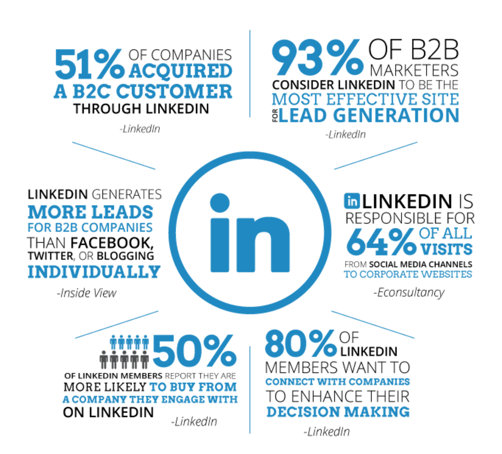
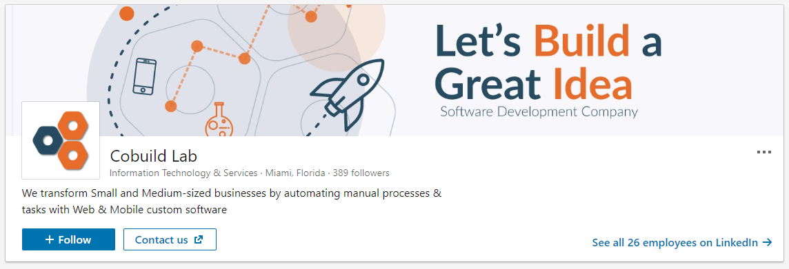
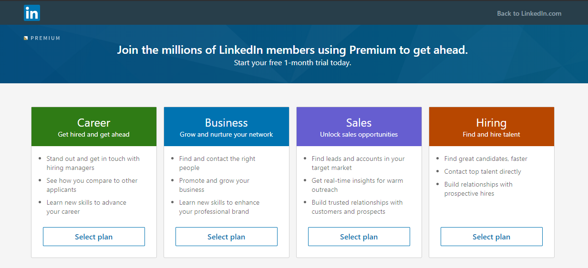
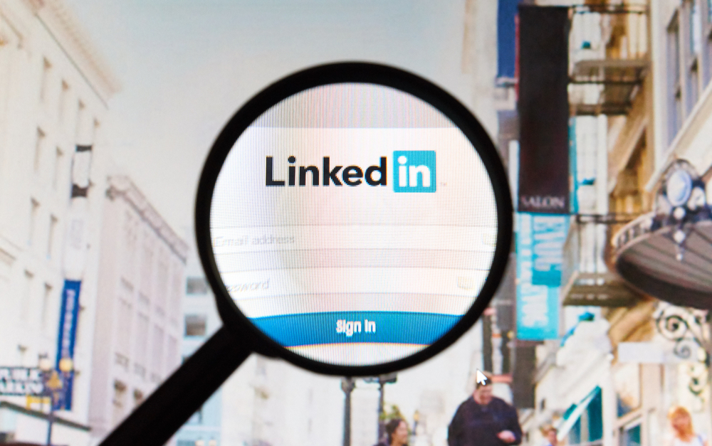
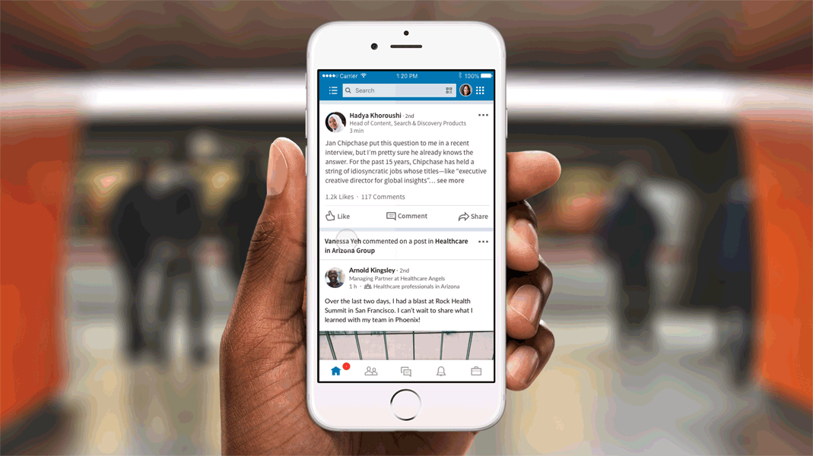
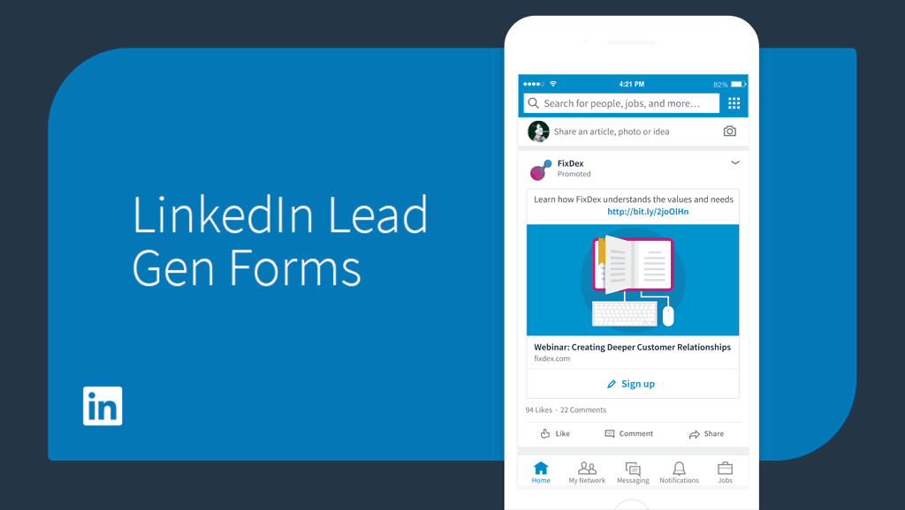
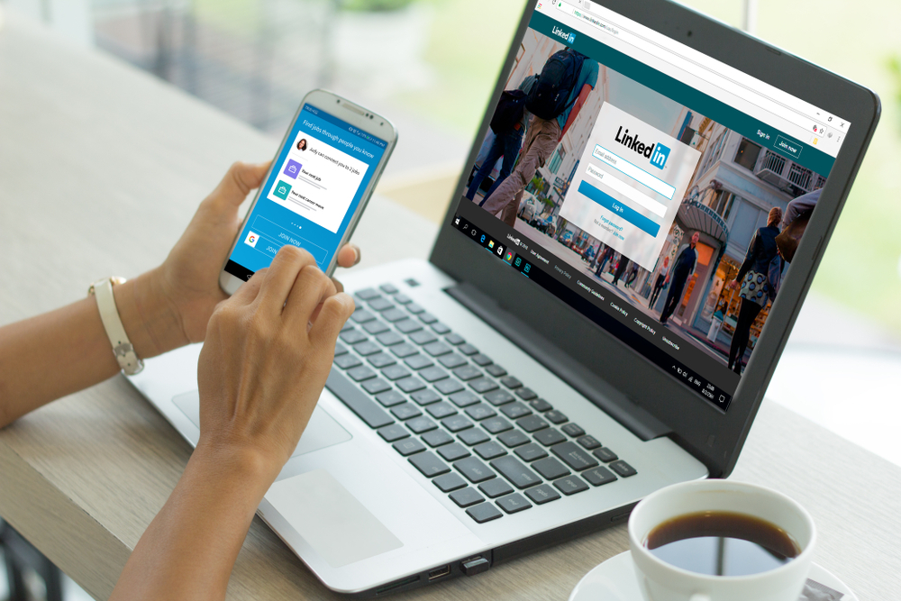

To penetrate and survive in the global market today, B2B tech companies have to invest in their creative department for the development of a healthy marketing strategy.
Social media marketing has taken the lead in most of these companies as a part of a healthy marketing strategy. LinkedIn is one of the leading platforms, with <a target="_blank" href="https://www.falcon.io/insights-hub/topics/social-media-strategy/the-essential-linkedin-b2b-marketing-guide-for-2018/">   93% of marketers </a> choosing it as a highly effective site for lead generation.    

    

As a B2B tech company looking to develop an effective LinkedIn marketing strategy, it will take an investment in energy, time, and sometimes even money.
Consider the following 7 advanced LinkedIn strategies to generate leads for B2B businesses in the technology field.    

<title-5 align="centered"> 1.  	Optimizing the company’s profile </title-5>

    

As a B2B Tech company, optimizing your profile is the first step in lead generation. Create your professional profile quickly and make it engaging and interesting. Including some items such as  experience, a professional photo, company website URL, services offered, and other details will make your professional profile more reliable.    

·  The photo you add should be exceptional and one that accurately depicts the brand of your B2B tech company and the message you want to pass to your target audience.    

·  Put links  and descriptions of the services and products that you provide in the products and services tab.   

·  Ask your LinkedIn members to give reviews of your products and use those reviews to act as testimonials.     

<title-5 align="centered"> 2.  	Upgrade your LinkedIn Membership </title-5>

    

Find the LinkedIn package that suits your B2B Tech company from the several different packages available. The first level is the free LinkedIn package that is available to every individual and company that signs up to LinkedIn. Though this basic package is useful in keeping a network of business friends and co-workers, it is limited in terms of features that would be needed by a B2B tech company.    

A good level of package that suits businesses is the premium package, as it has more advanced features. The following are the available different pricing levels for different needs:    

·         Premium Career Account - $29.99/month    

·         Premium Business Account - $47.99/month    

·         Premium Sales Account - $64.99/month    

·         Premium Hiring Account - $99.95/month     

Note that the above Business, Sales, and Hiring account are billed annually. Learn the importance of each feature for you to maximize the features in a new package before purchasing it.    

<title-5 align="centered"> 3.      Use of advanced search option </title-5>
    

<a target="_blank" href="https://www.cleverly.co/blog/linkedin-advanced-search-tactics-101">   The advanced search </a> option provides great filters on the relevant and most active users on the platform. As a B2B tech firm, the aim is to use the most relevant keyword to get a genuine lead for the business. The advanced search option for LinkedIn has great filters to help the user narrow their search options.    

Instagram, for instance, uses advanced search filters to ensure the specific keyword typed is validated. In LinkedIn, if one searches for B2B tech firms offering specific services, the search bots locate the exact firm, service, or professional.    

<title-5 align="centered"> 4.      Utilizing LinkedIn Groups effectively </title-5>
    

**Joining existing** <a target="_blank" href="https://blog.linkedin.com/2018/september/10/unveiling-a-new-linkedin-groups-experience-a-shared-space-to-build-community">    Linkedin groups </a> 

Take your time while filling out your profile and join a few of the many groups that are in the same industry as your company. Join a few groups that you can be able to keep up with.    

**Create your own company’s group**

Once you have joined groups and understood how they work, you should go ahead and open a group for your company.The group acts as an attraction to potential clients, relationships, and investors who may be interested in the specific business case. The admin of the group should ensure the discussions on the platform are related to the business. For instance, if it is about a tech service or product, the regular members of the group should keep talking about its uses and benefits.    

<title-5 align="centered"> 5.  	Turning the company page into a lead generation page </title-5>
    

Rather than having a static page for tech tips and job opportunities, companies have developed new techniques, especially with <a target="_blank" href="https://www.linkedin.com/pulse/how-do-you-turn-linkedin-company-page-lead-generator-toby-marshall/">   converting the company pages into lead generation machines</a>. The company page should be a powerful platform where people exchange ideas. For instance, if you have a SaaS software, tips about how users can connect to it and its benefits should be the priority of the page. Consumers and other users visiting the page should be able to generate new ideas on the development and use of the application. The potential customers will see this, and it will lead to the generation of more sales.    

<title-5 align="centered"> 6.  	Convert visitors into potential customers with LinkedIn Lead Gen Forms </title-5>
    

People want to spend as little time as possible in an ad or a post. <a target="_blank" href="https://business.linkedin.com/marketing-solutions/blog/best-practices--lead-generation/2017/how-to-use-linkedin-lead-gen-forms">    Using lead Gen Forms </a> removes the need for those forms that require to be filled manually.  When visitors click your page, data from their profile automatically populates a form. All they need to do is submit the form, which requires little time and effort.The company will also collect information about your leads, that is more accurate and complete.    

<title-5 align="centered"> 7.  	Creating content that ignites conversation </title-5>

Constant update of content is the most crucial marketing tool for tech companies to gain a following and get new leads and clients. Writing content is not enough; writing great content is the king to a vibrant LinkedIn marketing strategy.     

 

Not only should your team learn how to create content, but it should learn how to <a target="_blank" href="https://www.referralcandy.com/blog/viral-on-linkedin/">   write content that will stand out </a> of the hundreds of thousands of blogs that are published on LinkedIn every week. Craft an eye-capturing headline by combining clarity, accuracy, and brevity. Since the new feed only shows a part of the content, you should aim at creating a concise headline that will act as a click-bait to intrigue clients and make them want to see the entire content.    

 Once you have visitors reading your content, you will want to have them glued, thereby ensuring that the content is great from the introduction to the end. Research content is crucial in any tech field, and most clients and consumers appreciate an active tech company taking the initiative to give knowledge and more insight into the business. The information, authoritativeness delivery, and legitimacy of the content help you position your company and brand in the industry as the “go-to” person for a specific niche of the tech business.    

<title-5 align="left"> Conclusions </title-5>

·  Signing up on LinkedIn is not enough. We highly recommend using LinkedIn as a lead generation tool for B2B companies to boost your sales.    

·  Start by optimizing your company’s LinkedIn profileThen upgrade your LinkedIn Membership to a premium account.    

·  Remember to use the advanced search optionThen start Utilizing LinkedIn Groups effectively.    

·  Don’t forget to turn your company into a lead generation page.    

·  Always convert visitors into potential customers with LinkedIn Lead Gen Forms.    

·  And finally, regularly post content that ignites conversation.    
