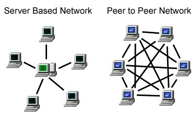
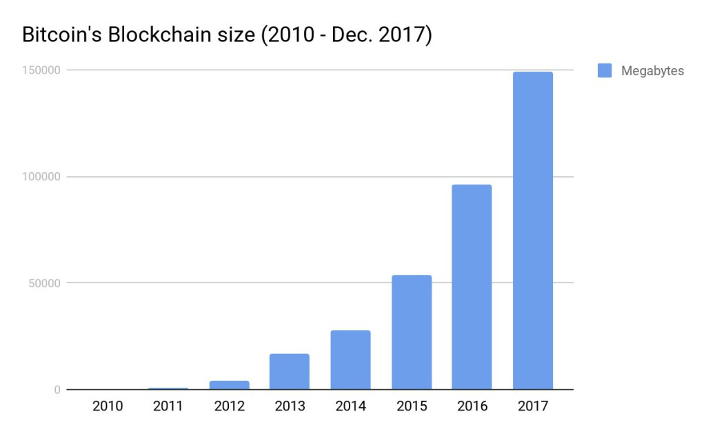

**BLOCKCHAIN** 

Maybe you hear quit a lot about this right in a few, and you might have a very basic understanding of what it is or you might think is all about cryptocurrencies and this new cyber money that people is always talking about. Yeah they could be easily related one with another but in fact blockchain is a technology that nowadays could be implemented in many fields; data science, electoral systems, and many more. The relationship between bitcoin and blockchain is the result of what we can call the first attempt of creating a bank where all the data could be decentralized and the transactions could be executed in a protected environment at the same time. but leaving this aside for a moment let’s talk about Blockchain, let’s skim a bit through the technologies where it is leaning on, and how the process is done. 

We’re expecting to help you through the process of understanding more this technology and choosing how to implement it into your projects depending of what you want to solve with it and which kind of users are going to be interacting with your app or service. 

1.- **What’s Blockchain?** 

Going through all the explanations we will try to give you a resume, to let you get a better chance to have a greater understanding of what it is: Blockchain is a technology or if you want to be more precise it’s a data structure created to built decentralized and more secure computational systems,  its first implementation is related to the Bitcoin project, to give a solution and also to prevent the double-spending problem. “Decentralized” and “Secure”, among others these two are keywords behind the blockchain functionality. before blockchain was born for most people were hard to believe that you could put these two words in one phrase without losing sense. but...  how can we protect something that could be in any where? we will be answering this question along this introduction by making enfasis in how the Decentralized network works and the security patterns organizations are using nowadays to protected them in the quickly growing world of Blockchain. 

Due to the ideology that comes up with the materialization of the bitcoin project. there was 2 priorities within the network. it has to be Decentralized (No point of control between nodes), and it has to be relatively anonymous. Here is when the P2P (Peer-to-Peer) appears to be part of the party. 

1.1.- **But.. what’s a P2P network and what’s his role in blockchain?** 

Peer to Peer or Network between equals is a network pattern design, in this kind of network some of the most important aspects or maybe all of them works individually and there’s no Server Based functionally between them. everything is decentralized, everyone can shared information. greater advantages of P2P are:  Fault-Tolerance, Redundancy, Shared Resources, Direct interaction between nodes, **Decentralized Management**, Self-administration. 

Here we can see how a Server Based Network needs a server in between to share information with his peers while in Peer to Peer all the nodes are connected in between with all the peers which participate in the network. 

**Cons:** The changes necessary for keeping the group happy, productive, and healthy might take a long time to manifest because they depend so much on individual transactions propagating through the network. 

**Pros:** The interactions between individuals can happen very quickly, and the group has a lot of freedom to decide how to change as a whole, since there is also no central authority deciding and controlling how things “should be”. 

1.2.- **Decentralized in Blockchain** 

The decentralized premise comes with the idea to create transactions with no one in between, neither an organization who could control it or put rules on it. the process controls itself just by its own conformation within (attributes) through the implementation of blocks that putting one linked to another, together conforms a chain of stored ledgers with the information of all transactions made since the beginning of the network. 

1.2.2.-  **What’s a block and how they are conformed?** 

A block is a data structure compose of a header and a list of transactions.  they are the ones in charge of carrying with the information of all transactions since the very first block which is commonly known as the **Genesis Block** which is also the most characteristic one, is the only one which doesn't have a hash referring to a previous block. In many practical solutions, this block is itself hardcoded in software. in the bitcoin project in average a block contains a list of 500 transactions which is more or less equivalent to 1 MB. 

1.2.2.1.- **Block’s Header** 

It contains metadata relevant to that specific block created. such as:

*   **Previous Hash:** Every block is created to be added to the chain in consequence of the inheritance from the hash owned by the previous block. this in fact seeds the principal of one of the most important characteristics of blockchain.
*   **Mining competition data:** The system can only add a block with a valid hash with it. the difficulty target is giving by how much time (timestamp in UNIX) and attempts (nonces) it takes to calculate a valid hash.
*   **Merkle tree:** A hash of the root of the merkle tree of this block’s transaction. (the summarization of the hashes)
*   **Version:** This is used in Bitcoin to point to the currently version in use.  

 

Putting all this attributes together represents what we can call the fingerprint of the block. 

1.2.2.2.- **Transactions** 

A **transaction** is a transfer of data values that are broadcast to the [network](https://en.bitcoin.it/wiki/Network) and collected into [blocks](https://en.bitcoin.it/wiki/Block). Transactions are not encrypted, so it is possible to browse and view every transaction ever collected into a block. Once transactions are buried under enough [confirmations](https://en.bitcoin.it/wiki/Confirmation) they can be considered [irreversible](https://en.bitcoin.it/wiki/Irreversible_Transactions) (in the bitcoin project the number of confirmations is relative to the quantity of bitcoins you’re trying to transfer, if you’re trying to transfer a significant amount of unities the amount of confirmations are higher than in an opposite scenario). 

1.3.- **Security within the Network** There are two ways to implement security within a blockchain. you can discard one from the other just by making a single question: is your app or system going to be implemented over a Public environment or a Private one? this question doesn’t tend to be made to create a range of opinions making people believe one implementation is securer than the other. we just want to let you know an decide which implementation is viable for your project.

*   **Public Blockchain:**

The most common example: The environment where you make a bitcoin transaction is a public one, people around the world can access in and make transactions with others and the persons behind the bitcoin project doesn’t need to be acquainted of who are these people to let them use the platform. they aren’t  “vetted users”. but how they let that happen without getting worry about the security of the system? 

In a public environment the security it’s an expensive thing, in these cases where you don’t know the participants that are going to be making transactions in between, the system is vulnerable to be attacked from people or organizations who might have been motivated by a financial incentive. so to protect the process it has to go through an extra bit(relative) of complexity to avoid it, and this means the costs get higher. 

They can be Public in two senses:

1.  Anyone, without permission granted by another authority, can **write** data
2.  Anyone, without permission granted by another authority, can **read** data

The most common is the anyone-can-write (Bitcoin’s implementation).

*   **Private Blockchain:**

In a private blockchain all are vetted users you’re always acquainted of who is going to be using your network so this kind usually gets its security by the use of contracts or treatments of behaving    (legal  contracts)  all the participants agreed to respect the rules and to not get under actions that could damage the  network.  This obviously keeps a lot of money in your pockets (The costs are cheapest than in the public one). 

1.3.1.- **What is “proof of work”?** 

The proof-of-work system is one in which the sender of a message (or the creator of a kind of transaction) needs to perform hard work to sign the operation. They need to bear the cost, in an economic sense. But the process of _verification_ of this work is easy and fast, so that everyone can do it in a very short period. 

This approach was first used in the hashcash algorithm—later to be used as bitcoin’s core mining function—to eliminate spammers. To send an email, the sender first needed to calculate the SHA1 hash from specific input data such that it would contain a particular number of zeros. 

The difficulty level was established such that a modern computer took about one second to complete the hash, but for spammers, who need to send thousands of messages at once, it would carry a very high economic cost, making the business of spamming unprofitable. 

This approach is used in bitcoin for similar reasons. One main difference is in the target time for resolving the puzzle. When you mine a bitcoin, it needs to consume enough resources to guarantee that a new block will be not created too fast—it could cause many orphan blocks, and more blocks have to be mined to confirm the transaction. Unlike with the original email context for hashcash, on average, a new bitcoin block is signed every ten minutes. 

If we add more power to the network, the puzzle needs to become harder. So the economic cost is growing. (In practice, the level of difficulty is changed every 2016 blocks.) 

Finally we’ve made a review through some of the most important concepts of the blockchain functionality, with these we can have a very basic understanding of how is everything going on inside of a chain, there are more approaches for making everything more secure and accessible, and others attributes we have to get in matter to measure the compatibility of using blockchain in our app as a feature or as a main characteristic of its functionality that we’ll be aboarding in future posts. 

**Thanks for reading hope you enjoy it!**