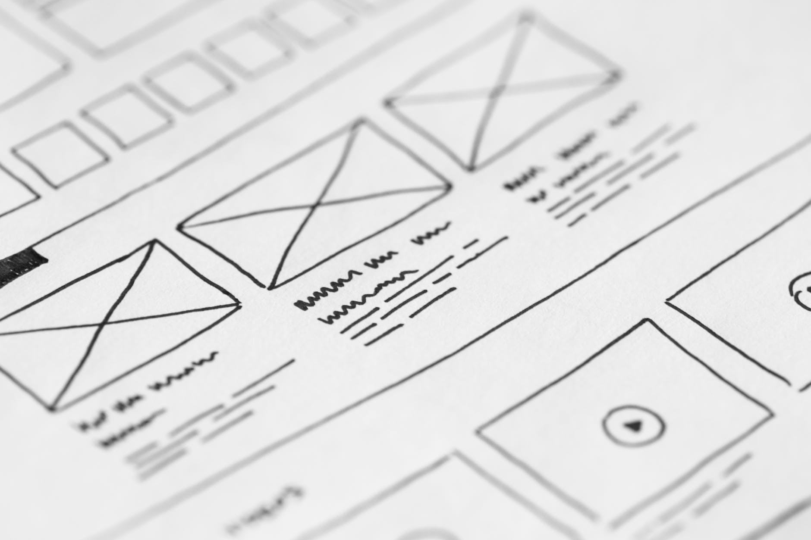

Miami, FL. Mar 23, 2020 - Today is a great plus one news day. Ernesto Morales is joining our developing team in 2020.   

<a target="_blank" href="https://www.linkedin.com/in/ermoral/"> Ernesto Morales</a> is a Venezuelan talent who graduated from the <a target="_blank" href="https://www.linkedin.com/school/universidad-del-zulia/"> University of Zulia (LUZ) </a> with a Bachelor's degree in Fine Arts with a minor in Drawing, also obtained his Graphic Designer degree from <a target="_blank" href="http://www.uts.edu.ve/inicio.html"> I.U.T. Antonio José de Sucre </a>. He has grown professionally in the area of printing and then focused his interest in the field of technology, accumulating 18 years of experience.    

With his Diploma of Teaching Component of the University of Zulia, he has stood out as a teacher in the school of Graphic Design at the <a target="_blank" href="https://www.urbe.edu/"> University Rafael Belloso Chacín (URBE) </a>
 and also teaches the History of Design at the I.U.T. Antonio José de Sucre in Maracaibo, Venezuela.   

If you don't know it, UX is what makes you feel a brand or product when you interact with it, while UI is a visual layer of colors, textures, shapes, and elements. Behind an incredible product or application, there has to be previous research work and a good strategy that translated into an attractive interface. "What I am most passionate about visual interfaces is creating a design that not only solves a need but is also a design that you can interact with. And the more you use it, the more it envelops all your senses," commented Morales.    

*What do you like most about working at Cobuild Lab?*    

"The workflow in Cobuild Lab helps you better understand the vision of the client for the project. You are so committed that you know what the client needs, and you focus all your attention in helping him to have the success he is looking for with each design, and somehow along the way, their success becomes yours." He said. "Knowing that you are helping an entrepreneur to take his first steps, makes you feel that you are part of something bigger. Cobuild Lab works as support providing the technology they need to facilitate their processes so they can focus on what they are passionate about knowing that a dedicated team has their back".   

Eager to learn more, Ernesto wants to improve his UX/UI design skills, and we will be able to see more of his incredible work for Cobuild Lab very soon. Stay tuned!
