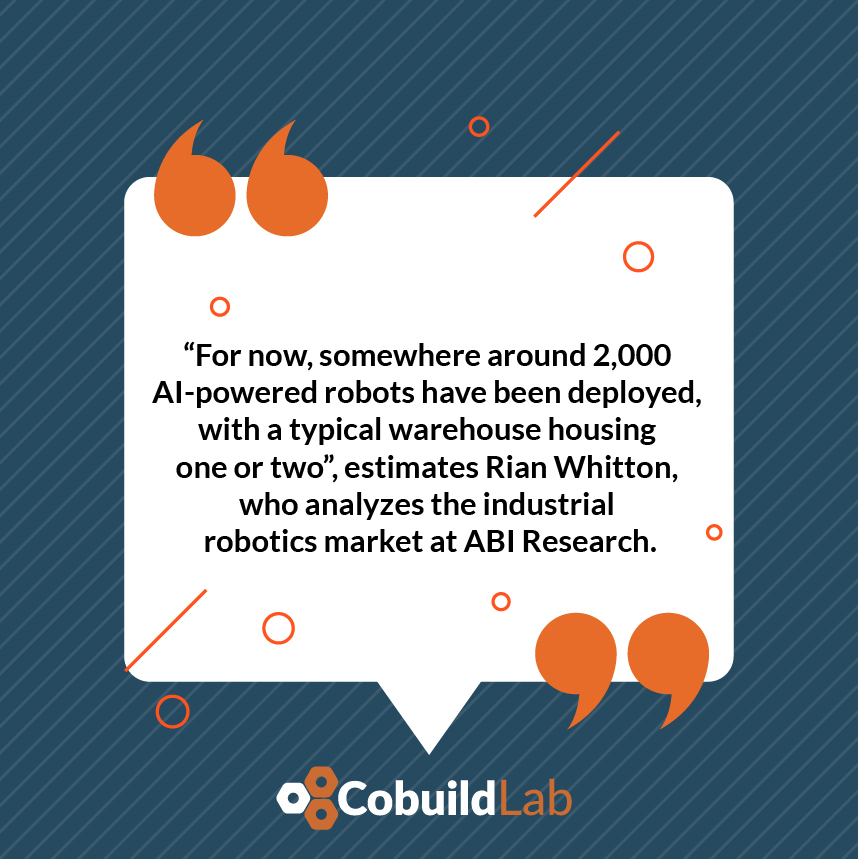

Miami, FL. Oct 06, 2021

For years now, we have seen the prediction of science fiction movies about the use of robots in our daily lives come true. 

It has also happened that <a target="_blank" href="https://www.cobuildlab.com/blog/what-is-robotic-engineering-and-how-can-you-use-it-within-your-company/"> robotic engineering </a> has escalated into the commercial area. Many businesses of different sizes rely on robots to perform simple and repetitive jobs, mainly associated with moving simple objects from point A to point B. 

These robots were programmed to perform very specific tasks without any variation, but a new generation of robots was born to change everything: **AI-powered robots**, which thanks to <a target="_blank" href="https://www.cobuildlab.com/blog/deep-learning-solutions-and-applications-for-your-business/"> deep learning </a> (AI discipline) have expanded the limits of their ability. Read on if you are interested in knowing more, especially if you manage your warehouse or are a 3PL. 

 

<title-2>Moving from traditional commercial robots to artificial intelligence-powered robots: why and how?</title-2>

 

Previously, commercial robots in warehouses were dedicated to moving objects from one place to another. They had an established route, and outside of it, the robot could not perform actions other than those for which it was programmed. They performed a few and specific tasks. 

In the new generation of robots, they can manipulate objects of varying shapes and sizes, in unpredictable orientations, and even perform different tasks within automation. 

The reason for this ability is deep learning algorithms. 

Before the pandemic, only a few companies wanted and had this tool in their warehouses because it was part of their innovation and automation processes. There was no compelling reason to make AI-driven robots a necessity. 

Then came the pandemic, and e-commerce peaked because people couldn't leave their homes. 

**That new landscape changed the rules of the game as follows:**

* Supply chains had to be strengthened and accelerated to meet the high demand for products. 
* Labor shortages intensified, and robots took on a much greater role. 
* The flow of supplies increased.
* Warehouses became an even more key point in the supply chain. 
* Many companies had to automate their processes and move towards digital transformation. 

And a technological solution that allowed large, medium, and small companies was the implementation of robots powered by <a target="_blank" href="https://www.cobuildlab.com/services/artificial-intelligence-development/"> artificial intelligence.</a>

 

 

The same study indicates that each warehouse will soon house more than 10 robots, bringing the total to tens of thousands in the coming years. The question is: **will your company be left out?**

 

<title-3>Interesting news about AI-powered robots inside companies:</title-3>

 

In 2012, <a target="_blank" href="https://searchaws.techtarget.com/feature/How-Amazon-launched-the-warehouse-robotics-industry"> Amazon acquired Kiva Systems </a>, a robotics company in Massachusetts that produces autonomous mobile robots, known in the industry as AMRs, to move racks of goods in warehouses.

<a target="_blank" href="https://www.supplychain247.com/article/vecna_robotics_fedex_video_for_press_day"> FedEx began using AMR robot models </a>, designed by Vecna Robotics, another Massachusetts-based company.

<a target="_blank" href="https://www.logiwa.com/blog/warehouse-robotics">  Alibaba uses 60 robots in its warehouses </a> which allowed it to ramp up its operations (especially during pandemics) and triple its production.

 

<title-3>How does a robot operated by artificial intelligence work?</title-3>

 

* They have visual, auditory, thermal, and haptic sensors that capture information from the environment. A deep learning algorithm interprets this data and allows the robot to make decisions based on the environment. 

* It is even possible to integrate the robot software into your warehouse management system (WMS) so that information flows to all instances of the process.

* They are typically used to deliver and distribute goods in warehouses. 

* To perform daily inventory cycle counts with greater accuracy. 

* Some robots can scan inventory from a distance of up to 7 meters, thanks to <a target="_blank" href="https://www.cobuildlab.com/blog/RFID-for-Warehouse-and-Inventory/"> RFID </a> sensors and scanners. 

* It's possible using robots to sort packages.

 

<title-3>Benefits for companies by adopting AI-powered robots in their warehouses:</title-3>

 

* A lower process error rate
* Time reduction
* Increased efficiency and use of resources
* Reduced packaging costs in the medium and long term.
* Adaptable workforce to any change and increase of work/demand. A few lines of code is enough. 
* Increased safety in the warehouse (taking the necessary precautions, especially in mixed environments). 
* Increased productivity and accuracy in material handling. 

 

<title-3>Questions to ask yourself to find out if you need AI-driven robots in your warehouse</title-3>

 

1. Where are the bottlenecks in my warehouse operations? 

2. Do workers spend much of their time retrieving goods? 

3. Have you experienced inventory flow failures? Too much or not enough merchandise.

If the answer is yes to one or all of these situations, you need a <a target="_blank" href="https://www.cobuildlab.com/services/custom-software-development/"> software solution to solve them. If it is customized, even better. </a> 

**Here is an example of AI-powered robots used for logistics:**

 

<youtube-video id="iYkg3woXB1A"></youtube-video>

 

One of the technological solutions is the incorporation of **AI-powered robots** into your warehouses (or your 3PL's). If you are interested, contact us, and we will be glad to help you. 

