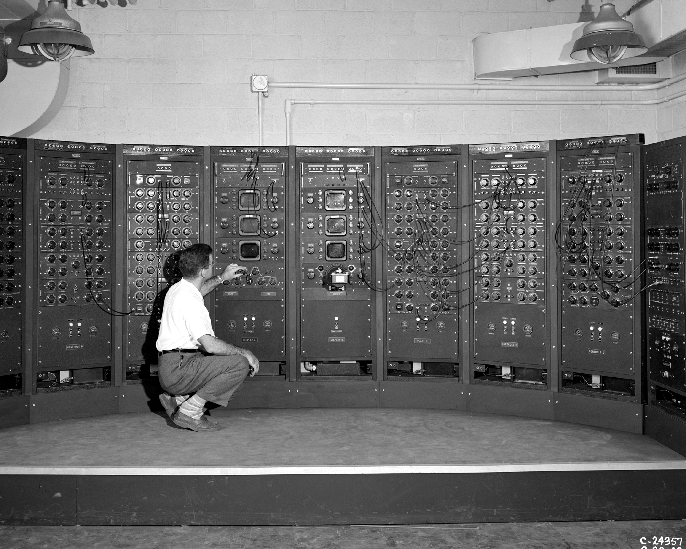
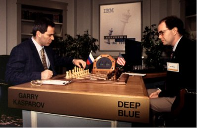

Artificial Intelligence is undoubtedly one of the technologies that have changed our lifestyle and revolutionized industries and the world of commerce. AI is found in almost everything we do daily, but haven't you ever wondered how it all began? Well, stay with us and read this wonderful post and learn a little more about the history and evolution of AI.  

 

<title-2>At the beginning:</title-2>

 

The history of artificial intelligence began around 1943, in a paper written by Warren McCulloch and Walter Pits, who proposed a model of artificial neurons. A few years later in 1949, Donald Hebb demonstrated an updated rule to modify the strength of the connection between neurons. His rule is now called Hebbian learning, but even at that time it was not yet known as AI.

It was not until 1950 that the young British polymath, Alan Turing, explored the mathematical possibility of artificial intelligence. Alan Turing published his book "Computing Machinery and Intelligence", where he doubtlessly proposed a very revolutionary test for that time, the Turing test, which was based on testing the ability of the machine to show intelligent behavior equivalent to human intelligence.

 

 

Source: <a target="_blank" href="https://www.storyfit.com/blog/intro-to-ai">  Storyfit</a>

Between 1955 and ‘56 the first artificial intelligence program was created, called "Logic Theorist", which was in charge of giving solutions to theorems. Likewise, the word "Artificial Intelligence" was adopted for the first time by the American computer scientist John McCarthy in a conference. Between 1966 and ‘72 a breakthrough for AI was made when the first chatbot called Elisa was created, and the first human-like robot was created in Japan, called WABOT-1. Moving a little further in the history of AI, in 1997 for the first time a computer competed against a man in a game of chess, and surprisingly the IBM Deep Blue defeated the world chess champion at that time, Garry Kasparov.

 

 

In the year 2006 the AI began to be heard a little more among the people since companies like Facebook, Twitter and Netflix started to implement it to improve their services.  Between the years 2011 and 2019, AI obtained its greatest advances, such as chatbots improvements, cell phone improvements, improved GPS, phones with greater capabilities, applications with better solutions, easier communication, and business among others. 

 

<title-2>Today, AI:</title-2>

 

Today, artificial intelligence is in every aspect of our lives, making our days easier and more bearable.  Here are the areas in which AI is being used today:

 

<title-3>Virtual Assistant or Chatbots:</title-3>

 

These are mostly used by financial institutions, companies that provide a service under contract, or simply as a form of contact and product consultation. 

 

<title-3>Agriculture and Farming:</title-3>

 

Today, AI is being implemented in agriculture because it helps us to better plan our crops, to better manage the times, and even to contribute to their growth through irrigation either by intelligent irrigation systems or by drones, these maximize the water resource and do not exceed the irrigation times.  

 

<title-3>Retail, Shopping, and Fashion:</title-3>

 

Companies are using more and more AI in their sales because it significantly improves the income, it is also used to perform market analysis, and future projections of the same. With these, companies can improve their market strategies, and grow even more.  

 

<title-3>Security and Surveillance:</title-3>

 

The military is already using or researching AI in cybersecurity, logistics, transportation, and intelligence analysis. For example, the military might use a drone to collect videos of possible enemy troop movements, and an analyst could scrutinize the images and try to judge their significance.

 

<title-3>Sports Analytics and Activities:</title-3>

 

In this area, it is used more than anything else to keep sports statistics such as teams and players, countries, records, among others, all of this in real-time to provide an unforgettable experience. 

 

<title-3>Manufacturing and Production:</title-3>

 

It is mostly used by companies to improve production rates in manufacturing, either by optimizing a process, raw material loading times, improving product presentation, etc.

 

<title-3>Self-driving cars or Autonomous Vehicles:</title-3>

 

AI is starting to be used in cars to reduce the driving time of the person and helping when taking a direction as it suggests different ways where you can reach your destination and which one is more convenient for you. Several companies like uber are investing in these technologies to be used as cabs or even as delivery services.

 

<title-3>Warehousing and Logistic Supply Chain:</title-3>

 

The AI helps within the logistics of a company so that their products can be found more easily at the time of being sent to its users, and even helps them to be monitored until the time of delivery.  It is widely used by shipping companies and department stores.

More specifically, artificial intelligence is used in logistics processes:

* A more agile, centralized, and controlled planning of supplies, personnel, revenues, expenditures, transfers, errors, among other data relevant to operations. 

* To organize work and teams efficiently. 

* Optimization of vehicles and delivery drivers. 

* To store sensitive and essential information that supports strategic decisions. 

* To increase access to information for all those involved in the process and activities. 

* Inventory management and rotation. 

* Accelerate production times, which translates into customer satisfaction. 

And not to mention that a custom-developed software tool involving AI technology can be updated and integrated as often as you need it. According to your company's evolution. 

 

<title-2>For the future:</title-2>

 

As you have seen, AI has been growing and evolving over the years, and the future is no different, with an estimated annual growth rate (CAGR) of 42.2% until 2027. Among some of its trends we have:  

- Computers can solve problems known to the human race with less margin for error. 

- Machines will become our best friends, advisors, caretakers, and they would be in charge of our company processes. 

- We could accurately predict the future, based on data and high-level analytics. (Applies for Logistics and supply chain management)

- We will live in symbiosis with AI and machines. Healthcare industry is one of the most benefited from machine learning and AI. 

- We will be able to upload any data to the cloud and keep it in safe forever, if we want.

- Humans do not have to work anymore on risks and too many manual processes.

- Even money, economies, and government contracts can be safeguard with machines. 

Source: <a target="_blank" href="https://bigthink.com/endless-innovation/why-ray-kurzweils-predictions-are-right-86-of-the-time">   Big Think </a>

So you have already managed to see the importance of AI in our daily lives and the future that awaits us. You’ve seen its history and who were its pioneers and believed in this kind of technology, so if you have your company, or have not yet implemented IA in your daily life is time for you to believe in it and start to enjoy the comforts that it provides so that our world is truly much better.    
