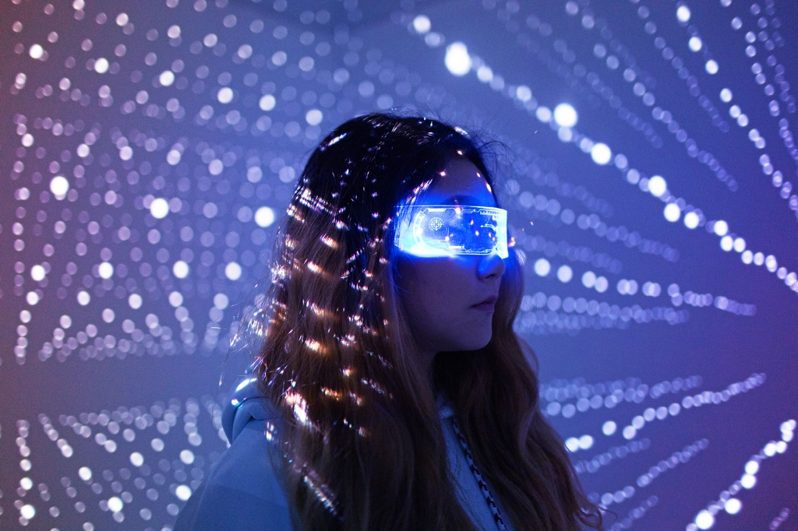

Miami, FL.July 04, 2022

"Metaverse" is the latest buzzword to capture our imagination as part of the technology industry. So much so that one of the most popular Internet platforms is rebranding to signal its adoption of the futuristic idea. Thanks for that, Meta!

Although Facebook, Instagram, and WhatsApp are robust tools, the best part of the Meta is still developing in many respects. Metaverse has become a big market where tech titans and gaming giants such as Microsoft, Epic Games, Roblox, and others create virtual worlds or metaverses where everyone will be part.

Some <a target="_blank" href="https://www.cobuildlab.com/blog/how-and-why-should-a-startup-use-ai/">   startups </a> are using it to catapult their success. Is it a <a target="_blank" href="https://www.cobuildlab.com/services/">   good idea to develop </a> a **Metaverse startup?** The answer is here. Let's begin with what this technology is, and then we'll see what happens.

 

<title-2>What is the Metaverse, and where does the idea come from?</title-2>

 

The Metaverse is a fusion of virtual, augmented, and physical reality that blurs the line between your online and real-life interactions. 

It is a world of endlessly interconnected virtual communities, where people can meet, work, and play, using virtual reality headsets, augmented reality goggles, smartphone apps, or other devices. 

Interest in such platforms has skyrocketed since Mark Zuckerberg announced that Facebook would change its name to Meta and invest at least $10 billion in the Metaverse. And as more people start betting on a future immersed in the Metaverse, ventures have already begun to create new projects in this digital space.

 

 

Source: <a target="_blank" href="https://www.timeforkids.com/g56/what-is-the-metaverse/?rl=en-860">   Timeforkids </a>

We entered the Metaverse through <a target="_blank" href="https://www.cobuildlab.com/blog/Great-idea-of-Entertainment-Virtual-Reality-or-Augmented-Reality/">   virtual reality (VR) and augmented reality (AR) </a>, simply on a screen. 

These experiences allow for a more extraordinary blending of our digital and physical lives. But as time goes by, these two worlds will become more intertwined, so we must be prepared to adopt new habits in our lifestyles. It includes our stores.

 

<title-2>Impact of the Metaverse on real-life and startups</title-2>

 

<title-3>Real Life </title-3>

 

* **We will become a more accepting and tolerant work culture:** 

One of the biggest challenges of large-scale cultural acceptance is unconscious bias. 

All people have some form of unconscious bias demonstrated through their actions at work. However, in the metaverse, it is hoped that these unconscious biases will begin to disappear. It will be much more difficult for them to coexist in a metaverse where our projections are merely fragments of who we are. 

The ability to change avatars makes it more difficult for these biases to remain, as we will begin to understand that someone's outer skin does not reflect their entire state of being. After all, we cannot forget that there is still a human behind the avatar. 

Imagine a world with radical acceptance when we begin to celebrate the differences in our avatars, leading to greater acceptance of our embodied selves.

* **Work will feel like play:**

The ability to teleport to drastically different real and imaginary worlds for meetings will add a creative touch to our day. 

We will be able to experience places we have never seen before while fully immersing ourselves in the environment. 

We won't just know the position where the meeting is being held. Instead, we will live and experience it as if we were there. The pure creative power that will be available will help us all to expand our imagination.

* **We will create our collaborative work environment:**

Working environments will take on a new meaning in the metaverse. There will be no limit to the settings we can make. There will be no barriers between environments, as we will be able to switch between them. 

Imagine a world where ventures of all sizes can create a desirable experience for employees on a level playing field. That will have a profound impact on working conditions and employee satisfaction.

* **We will invite people into our imagination:**

Inviting a co-worker into your home will take on a whole new meaning, as it will be more feasible than ever and even more personal when it comes to environmental design. It may even make some people feel that the experience is too emotional for them. 

However, let's imagine that this radical self-expression could bring us closer together.

* **Mental health will be impacted:**

This could positively and negatively impact our mental health. 

We live in two worlds, one that we have created to our exact specifications and another that responds to our desires much more slowly. 

As with any <a target="_blank" href="https://www.cobuildlab.com/services/">   new technology </a>, we will have to be mindful not to become so disconnected from our real lives that we find it difficult to navigate them simultaneously. There will have to be some community regulation as we learn to balance the lines between work and play.

 

<title-3>Startups in the Metaverse</title-3>

 

The venture world is obsessed with the "Metaverse": the concept of shared worlds driven by virtual products and highly immersive, interactive digital experiences. We already have virtual worlds with live concerts and online games in which players spend hundreds of hours. Still, metaverse enthusiasts see a future in which entire societies thrive in an online realm inhabited by avatars of real people. 

Although the space is still in its infancy, the long-term implications may not be trivial. Some users, especially younger ones, could earn, spend, and invest most of their money in digital worlds. According to CB Insights ' Industry Analyst Consensus, the metaverse could represent a $1T market by the decade's end.

 

<title-2>Some examples of successful startups, thanks to the Metaverse</title-2>

 

<title-3><a target="_blank" href="https://nextmeet.live/">   NextMeet: </a></title-3>

 

Indian company NextMeet is developing an immersive virtual reality (VR) platform for remote work, collaboration, and distance learning. The platform includes 3D avatars that allow users to interact virtually in the metaverse. 
 
It makes situations such as work-from-home (WFH) and online learning more interactive and engaging compared to video calls. The company also creates customized 3D worlds for virtual events such as conferences, trade shows, and product launches.

 

<youtube-video id="xgOWOc-zM2M"></youtube-video>

 

<title-3><a target="_blank" href="https://www.inworld.ai/">   InWorld AI: </a></title-3>

 

In November 2021, Silicon Valley startup Inworld AI raised $7.2 million in investment. Inworld AI's technology makes it possible to create virtual agents capable of recognizing the environment and context they find themselves. These characters can be used in various spaces, such as the metaverse, VR/AR, or gaming.

 

<youtube-video id="J3nDmhz2rqU"></youtube-video>

 

<title-3><a target="_blank" href="https://www.improbable.io/">   Improbable / MSquared: </a></title-3>

 

The following startup is UK-based Improbable. The company has raised $150 million to find ways for visitors from different meta-worlds to interact. Unbelievable, a subsidiary of gaming startup M² (MSquared), will focus on Web3 development to bring meta worlds to life on a large scale. This interaction is blockchain-based, and the ultimate goal is to make it possible for users to move their crypto assets and non-transferable tokens between digital worlds.

 

<youtube-video id="4NEUPQzH0D0"></youtube-video>

 

 

<title-3><a target="_blank" href="https://www.allseated.com/">   AllSeated: </a></title-3>

 

The startup AllSeated launched in 2015 in San Francisco. At first, the founders wanted to incorporate digital tools into event management, but their platform has evolved into a visualization powerhouse. In the initial stages, users were limited to viewing and changing the room or 2D floor plan, dragging and dropping various elements, and adjusting the guest list and seating plan.

The Metaverse is already a reality, and more and more startups and people in their daily lives are implementing it for different tasks and getting the most out of it. 

We can still say that Metaverse technology is in development and still has certain flaws, but with time, this will change and develop new methods and devices to work better with this parallel world. 

We can only wait and see how this trend advances and helps us to improve as human beings. If you have an idea for a **startup in the Metaverse**, <a target="_blank" href="https://www.cobuildlab.com/services/">   we'll help you make it accurate in a robust and disruptive tool. </a>

**Cobuild Lab Team**
