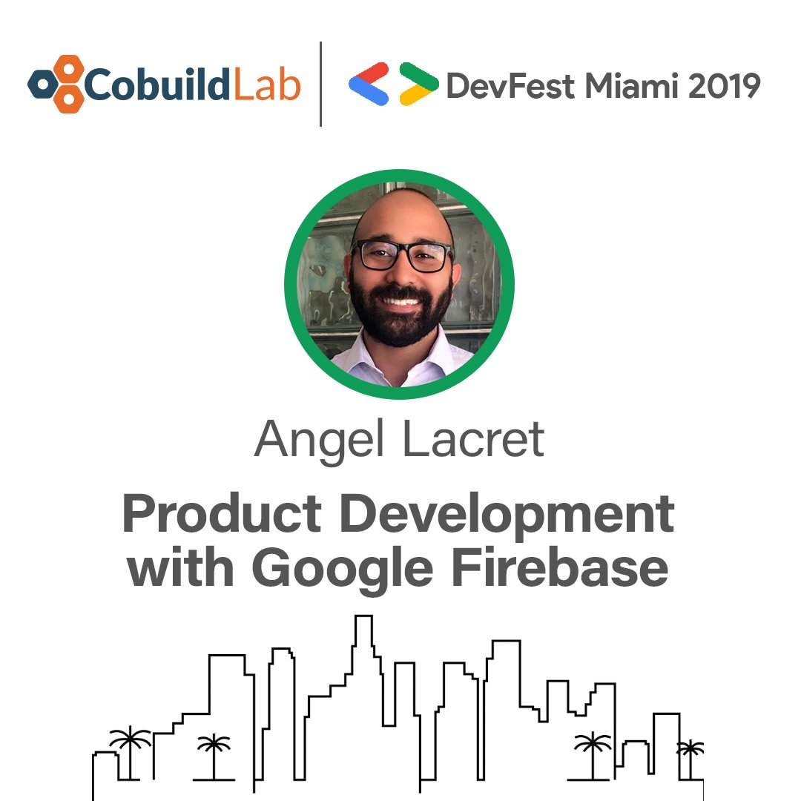
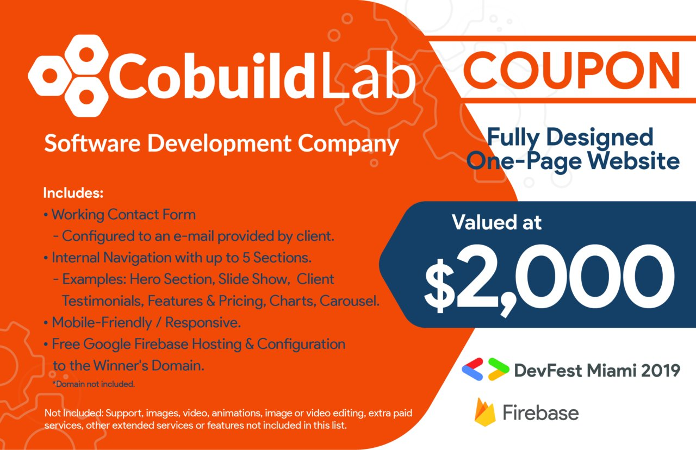

<title-2>WE ARE NOW SPONSORS OF THE 2019 DEVFEST MIAMI!</title-2>

<title-5>On September 28, the annual DevFest will be taking place at the Wix.com offices in South Beach, Florida!</title-5>  

GDG DevFests are large community-run events across the world that can offer speaker sessions from multiple product areas, all-day hack-a-thons, code labs, and more. It is an opportunity for members of the tech community to gather, learn, network, and grow from each other. It will also be a great event to meet new people.

DevFest Miami is organized by different Google Developers Groups (GDG) across the country focused on community building and learning, and exchanging knowledge and experiences about Google’s technologies.

Each DevFest is inspired by and uniquely tailored to the needs of the developer community and region that hosts it.
For this Miami 2019 edition, will be hosted at the Wix.com offices, on September 28 from 9:00 am to 5:00 pm.

Cobuild Lab, as a sponsor of DevFest, is excited to announce that founder, Angel Lacret, will be one of the speaker attendees, sharing his experience as a technical Product Manager. Also, we will be giving away a coupon for a Fully Designed One-Page-Website Valued at $2000!

This event is Sold Out!

<youtube-video id="https://www.youtube.com/watch?v=hTJ_-MxHKMY"></youtube-video>
