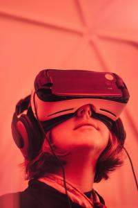
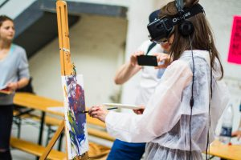
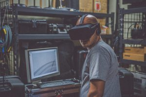
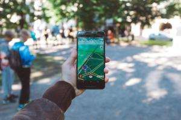
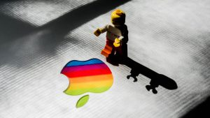
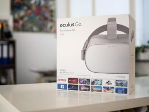

<credits>Photo by [Samuel Zeller](https://unsplash.com/photos/VK284NKoAVU?utm_source=unsplash&utm_medium=referral&utm_content=creditCopyText) on [Unsplash](https://unsplash.com/search/photos/vr?utm_source=unsplash&utm_medium=referral&utm_content=creditCopyText)</credits>

This **technology** is changing the way we look. The **VR** and **AR** have been a big impact on the **world of gaming**, but today it is used to immerse in **manufacturing, healthcare, complex training**, and many facets of consumer experiences. Let’s talk about it! 

The **virtual reality** **development** goes back many years that you can imagine, we are talking about 85 years ago when **engineers** were thinking of **developing** this type of **futuristic technologies**, to give people new **simulations** experiences. **Virtual reality** has an extensive history; at the moment you know it you will see its incredible **evolution**. 

First of all, we will clarify the difference between **virtual reality (VR)** and **augmented reality (AR)** there are many people confuse these two technologies and although these have certain similarities we will see the advantages of both, areas where they apply and their benefits.

<title-4>VIRTUAL REALITY?</title-4>

Virtual reality consists of a new world sensory immersion, based on real or not real environments perceived thanks to virtual reality glasses and their accessories like gloves and hearing aids. The objective, create a fictional world where You can be part or be the protagonist because thanks to a series of sensors you can move and the environment will adapt since everything has been recorded in 360 degrees and with very realistic sounds. 

<credits>Photo by [Billetto Editorial](https://unsplash.com/photos/YvLd3xbo0ac?utm_source=unsplash&utm_medium=referral&utm_content=creditCopyText) on [Unsplash](https://unsplash.com/search/photos/vr?utm_source=unsplash&utm_medium=referral&utm_content=creditCopyText)<credits>

Some examples of this technology are:

<title-4>THE WILD IMMERSION</title-4>

DR. Jane Goodall a scientist and conservations is a supporter of a new project called The Wild Immersion, the idea is that they make you feel that you are closely interacting with the wildlife. She hopes that it will encourage people to care more about areas of the world that they haven't been to, for that reason they have been recording on five continents over 120 days, the films try to capture what it is like to actually be in different natural worlds. [WILD IMMERSION –Samedi de la VR – Bande Annonce](https://youtu.be/8EeqEG7FvEk) or [Wild Immersion](https://youtu.be/fHhakHLLcX4)

<title-4>PIXO</title-4>

PIXO was one of five companies selected to demonstrate the range of virtual reality (VR) options for training emergency responders in effective crisis management.

<block-quote>“Training in virtual reality allows_ _first responders_ _to react in real time to a variety of scenarios,” “Virtual reality simulations are the safest and most effective way to reduce injury and eliminate harmful exposure in training. VR is also the most cost-effective way to train for high-risk, low-frequency events.” 
**Sean Hurwitz, PIXO VR’s CEO.**</block-quote> 

<credits>Photo by [Eddie Kopp](https://unsplash.com/photos/ZkRVjJivs9Q?utm_source=unsplash&utm_medium=referral&utm_content=creditCopyText) on [Unsplash](https://unsplash.com/search/photos/vr?utm_source=unsplash&utm_medium=referral&utm_content=creditCopyText)</credits>

Also in the future, people will be able to show photos to friends wearing hybrid VR glasses, and expand those pictures in front of their friends’ faces, Zuckerberg explained.

<block-quote>_“This is a kind of social experience you can’t have on any existing platform today,”_ **_Zuckerberg said._**</block-quote> 

<title-4>AUGMENTED REALITY?</title-4>

The augmented reality is to observe through a screen of mobile devices images and virtual information in form of holograms that overlap on physical images, thus creating images in the third dimension that overlap in our environment. In this way, the physical elements are combined with the virtual ones. 
  
Some examples of this technology are:

<title-6>POKEMON GO</title-6>

The augmented reality it became known strongly in July 2016 with the game Pokémon Go developed by Niantic for both iOS and Android devices, you must turn on the GPS of the phone and camera. The game consists of locating and catch Pokémon’s, then while you were walking and focusing the camera of the phones to different places you managed to visualize Pokémon’s (in this case the virtual images) about the areas or places like parks, shopping centers (physical images) where you are, even your own house. If you never saw or played this game, I invite you to watch the promotional video on YouTube Pokémon GO – [More Pokémon, More Adventure. Now with Dynamic Weather Gameplay!](https://youtu.be/dUztYCMZYls) 

<credits>Photo by [David Grandmougin](https://unsplash.com/photos/Am1io6KusFM?utm_source=unsplash&utm_medium=referral&utm_content=creditCopyText)on [Unsplash](https://unsplash.com/search/photos/pokemon-go?utm_source=unsplash&utm_medium=referral&utm_content=creditCopyText)</credits>

<title-6>APPLE ARKit2</title-6>

This is a platform created by Apple that allows developers to integrate shared experiences, persistent AR experiences tied to specific location, object detection, and image tracking to make AR apps more dynamic, allowing multiple users to play a game or collaborate on projects like home renovations.

<block-quote>_"VR, I think, has some interesting applications, but I don’t think it’s a broad-based technology like AR,"_ **said Apple CEO Tim Cook**</block-quote> 

With ARKit 2 apple create a new app in iOS 12 called Measure that automatically provides the dimensions of objects like picture frames, posters, and signs… Also, LEGO AR City uses ARKit 2 features including shared experiences, persistent AR, and 3D object detection to bring LEGO creations and characters to life.

<credits>Photo by [Rishi Deep](https://unsplash.com/photos/QtnUbHeiOE0?utm_source=unsplash&utm_medium=referral&utm_content=creditCopyText) on [Unsplash](https://unsplash.com/?utm_source=unsplash&utm_medium=referral&utm_content=creditCopyText)</credits>

<title-6>HAVE YOU HEARD ABOUT OCULUS?</title-6>

Oculus is the most advanced platform that has been built for virtual reality, currently belongs to Facebook. Consists of several devices connected to each other, with a vision module with special lenses, sensors, and a special display, which together give you the sensation of depth and movement, as this device follows the movement of your head, the turn, and the tilt. This is not only for video games since it seeks to be a simulator that can be adapted to any use that you want to give, virtual tour, training, or medical treatments and therapies can be implemented with this device. 

Whoever wants to develop or give different applications to this technology should only acquire the development kit and start creating their own applications. This can be very useful in engineering applications, the possibilities are great, remote management, robot control, drones, simulation, among others...

<credits>Photo by [Marc Mueller](https://unsplash.com/photos/a2qx_2xhPnM?utm_source=unsplash&utm_medium=referral&utm_content=creditCopyText) on [Unsplash](https://unsplash.com/search/photos/vr?utm_source=unsplash&utm_medium=referral&utm_content=creditCopyText)</credits>

The future of VR and AR looks very bright and with so many new devices in development is a trend that's not going away anytime soon. Tell us what is your opinion, what uses and applications would you give to these technologies