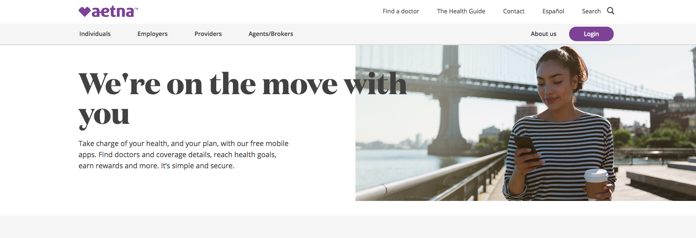
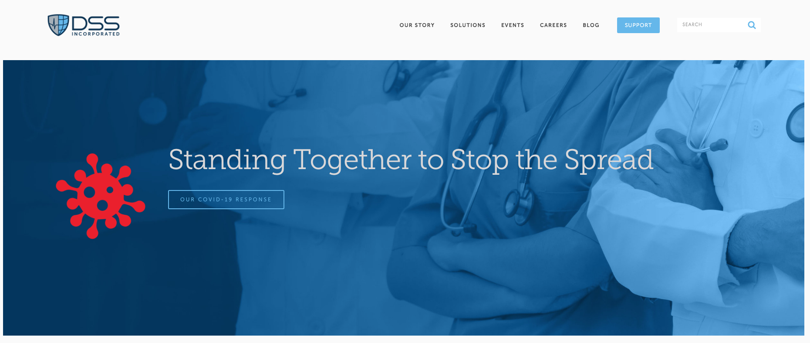
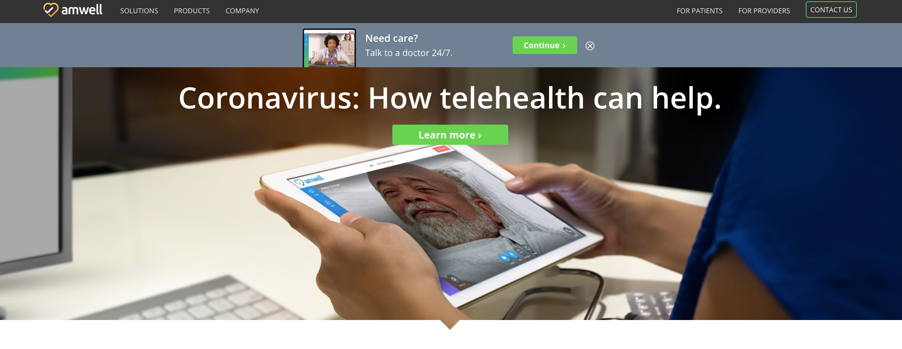
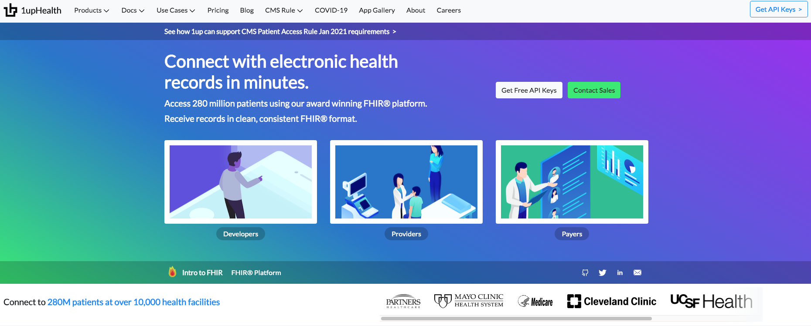
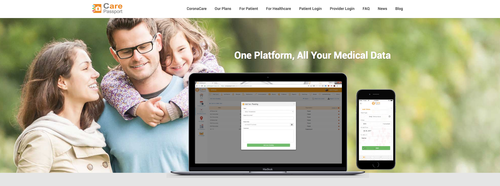
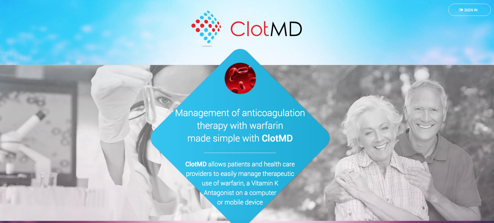
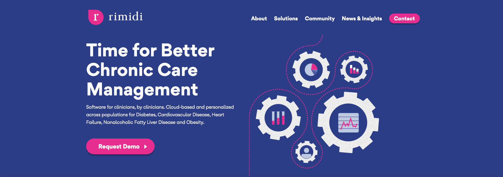

The **[healthcare industry](http://curogram.com/blog/telehealth-florida)** before Covid-19 was in full development, and with the pandemic we open the following question: is it time to increase efforts and develop this industry further? Many of us think so. Technology has long complemented and enhanced aspects of our daily lives.

The difference here is that we need to develop healthcare software now. And we have to make decisions like making a [mobile or web application](https://cobuildlab.com/blog/mobile-apps-web-apps-or-cross-platform-what%E2%80%99s-the-best-for-my-small-business/) for it.

Here, we’ve decided to gather the benefits and pros that we consider that each type of application can bring to a startup, new product, or even process automation for healthcare companies and professionals.

 

 

<title-2>The need is in front of us</title-2>

 

And we say this not only as a company that provides SaaS (software as a service) but also as humans.

Being better prepared to face health problems can even be the difference between moving the world economy forward and even for preserving the existence of humanity.

Here, you have the opinions of some experts, which complement this idea.

 

<youtube-video id="UGZCJvpAgZc"></youtube-video>

 

<title-2>Benefits of Increasing Efforts in Process Automation or App Development for the Healthcare Industry Today</title-2>

 

1. Bringing healthcare to remote areas

2. Providing immediate access to healthcare

3. Reducing  medical expenses and bills

4. Allowing the personal monitoring of health

5. Giving secure payment options

6. Providing real-time communications

7. Facilitating custom design remedies

8. Alleviating hospital service demand during the global pandemic

9. Helping doctors provide their service to more patients through the app

10. Generating more resources in the industry

 

<title-2>What about mobile applications in the Healthcare industry?</title-2>

 

<title-3>Pros of a healthcare Mobile App (for customers)</title-3>

 

1. One of the advantages of healthcare mobile apps is that they are usually faster than web apps because they bring many of the functions included in your phones such as location services, microphone and camera, this simply makes them faster.

2. Another advantage of healthcare mobile apps is that they are constantly sending notifications to your phone so you can stay more up to date with your health.

3. This type of application is usually more interactive and user-friendly, so it will be more sought after than a healthcare web app.

4. It is sometimes possible, depending on the function, to use it offline, because when you download the application to your phone, many functions are saved and an internet connection is not necessarily needed.

 

<title-3>Pros of a healthcare Mobile App (for owners)</title-3>

 

1. The application would be specialized, and you could even access the device's hardware to use for medical consultations or check-ups.

2. The app you develop is more secure because it must meet the many requirements that mobile application stores have. Security is an essential issue in the healthcare area.

3. The paid apps on mobile tend to have better reception by users when entering their bank details.

 

<title-3>Cons of a healthcare Mobile App (for customers)</title-3>

 

1. You have to download it and keep it on your phone occupying storage, although this issue has already improved with the new mobiles that have come on the market with ample storage capacity.

2. You may not be able to cover 100% of your medical needs, and because of your pathology, you may need to visit the doctor. It will all depend on the scope and feasibility of addressing a distance health care issue.

3. There’s obviously a margin of error in diagnosis that could occur when treating a pathology at a distance. However, this weakness is not only particular to mobile apps, but also web apps would have this problem.

 

<title-3>Cons of a healthcare Mobile App (for owners)</title-3>

 

1. Another significant disadvantage of mobile healthcare applications is that they must constantly be updated, which raises the cost of maintenance.

2. Undoubtedly the cost of development of mobile applications tend to be higher, as they are more sought after by users, a possible solution for this is to encourage the development of cross-platform apps. That way, you don’t have to develop two different applications for both android and ios. With cross-platform applications, you only have to develop one.

3. A possible disadvantage is that users must install your app on their phone, as you may not share the idea of having to download the application to your phone, but this could also be an advantage, as once it is downloaded you do not have to memorize the name. The marketing investment would be less, but the quality must be guaranteed to the point where the user wants to download the app and keep it installed on his phone.

 

<title-2>Now, What about web applications in the Healthcare industry?</title-2>

 

<title-3>Pros of a healthcare Web App (for customers)</title-3>

 

1. The web apps offer greater accessibility to the user, since they can be accessed from any operating system, without limiting any of their functions.

2. It's easier for your users to find you through a search engine like Google. Although they will need to remember your name and link address.

3. You can access the device hardware and make live video contacts, for example, thanks to technologies such as [WebRTC](https://webrtc.org/).

 

<title-3>Pros of a healthcare Web App (for owners)</title-3>

 

1. Updating these applications is much easier and faster, programmers only have to change the common code base a little.

2. Your users can find you easier through a search engine like google. Although they will need to remember your name and address, this means that you need to refocus your branding and marketing efforts with the goal of positioning your app in the users mind. Although this already obtained a solution with the [Progressive Web Apps](https://web.dev/progressive-web-apps/) that allow you to download a file in the browser, so you can access without having to remember the exact link.

3. Developing a web app is less expensive than a mobile app.

4. They’re also a little faster to develop.

 

<title-3>Cons of a healthcare Web App (for customers)</title-3>

 

1. In the disadvantages, we have that web apps have limitations in mobile devices since many of their functions are not compatible with these.

2. Similarly, constantly changing search engines can be a problem for web apps because of constant updates.

3. Web apps cannot be used offline, like some mobile apps, so an internet connection is necessary.

 

<title-3>Cons of a healthcare Web App (for owners)</title-3>

 

1. Progressive Web Apps indeed help you a lot to solve the issue of users remembering 100% the exact name and web address to access your product, but it also has its disadvantages. For example, if you discover in a study that your users use mostly [iOS devices](https://cobuildlab.com/blog/ios-app/), this will not be feasible for you because this technology is only available for [Android users](https://cobuildlab.com/blog/android-app/). This issue is very influential when you are in the United States, where the use of Apple devices is higher.

2. WebRTC technology would allow you to make live video contacts, for example, you are going to have the advantage that it only has support for computers and not for mobiles, therefore, your users will not be able to access this functionality from their mobile.

 

<title-2>Some Successful Healthcare Apps today</title-2>

 

<title-3>Mobile:</title-3>

 

[**Aetna**](https://www.aetna.com/individuals-families/using-your-aetna-benefits/aetna-mobile.html)

 

 

This patient-facing mobile app lets you find information on your health conditions and gives you step-by-step guidance to treat any condition in the most effective way. ITriage gives patient directions on whether their conditions require a visit to the emergency room, turn-by-turn navigation to the appropriate provider, and a map of facilities in their Innovation Health insurance network. It allows you to review previous claims and securely store health information.

 

[**Cerner**](https://www.cerner.com/)

 

 

CareAware Connect offers health providers like doctors or hospital administrators an easy-to-use mobile solution to complete tasks and workflows while supervising staff communications on a handheld device. Multiple teams — from care teams to ancillary staff — can collaborate and communicate with the objective of improving care coordination. Users can also access patient data from a list that includes vitals, measurements, allergies, and orders on medication and care services. It can be used with barcodes to manage medication administration and similar tools to associate patients in a mobile directory.

 

[**DSS Inc**](https://www.dssinc.com/)

 

 

DSS Inc. gives providers a suite of EHR-based mobile features that enhance care coordination, patient care and safety, and provides interoperable workflows aimed at reducing administrative costs. DSS provides both clinical and administrative tools that range from emergency room and home health mobile care management to automatic billing systems and scheduling tools. Recently, DSS was awarded the Faster Care for Veterans Pilot Contract for a mobile scheduling tool veterans can use from a PC or any mobile device.

 

<title-3>Web Apps</title-3>

 

[**Amwell**](https://business.amwell.com/)

 

 

Amwell is a global telehealth platform based in the US that connects and enables providers, insurers, patients, and innovators to deliver improved access to more affordable, higher quality care. The Company offers a single, comprehensive platform to support all telehealth needs from urgent to acute and post-acute care, as well as chronic care management and healthy living.

 

[**1upHealth**](https://1up.health/)

 

 

It’s a provider application that helps aggregate patient data from external health systems into one place. Providers can view the data sources that patients have connected via the 1upHealth patient application. This type of systems are key in reducing the critical time spent tracking data from previous clinics and referral sources from patients. Also, updates from external systems can trigger alerts in the event of a ER visit, a likely readmission or any relevant encounter.

 

<title-3>Web Apps</title-3>

 

[**CarePassport**](https://carepassport.com/)

 

 

CarePassport is a universal patient engagement platform that allows patients to have full access to their medical data all across the globe. CarePassport brings radiological images, appointments and medical records from participating hospitals or medical facilities worldwide right to the patient's smartphone or desktop automatically and before leaving the hospital via FHIR/HL7 integration to the electronic medical record EMR and PACS.

 

[**ClotMD**](https://clotmd.com/)

 

 

It lets patients and health care providers manage in an easy way the therapeutic use of warfarin, a Vitamin K Antagonist from any platform. Healthcare providers can manage on-site testing or home INR monitoring while enhancing patient medication adherence and improving their business. With this app, providers have access to a fully integrated Warfarin monitoring solution, allowing patients to engage actively in their health for an improved outcome from any computer or mobile device.

 

[**Rimidi**](https://rimidi.com/)

 

 

Is a proprietary software platform that empowers patients and providers to identify gaps in chronic illness management. It also helps them identify the necessary steps to close those gaps, meet patient glucose targets and create a more efficient cycle of care from any mobile device or computer.

 

<title-3>What’s the Next Step?</title-3>

 

As you can see, the options at hand are wide and can be perfectly tailored to your needs as an enterprise.

Technology is a powerful ally in times such as these, and we have to find the best ways to make the most of it in such a critical area as the healthcare industry.
We are focused on ensuring compliance and building in flexibility to expand and transform custom medical software very shortly. Our purpose is to continuously grow in our understanding of the needs of healthcare clients and patients alike. We believe that our collaborative approach it’s best suited to facilitate the development process and make sure that what is built is what best serves your goals as our client.

 

<youtube-video id="1yVm1MQ_kPE"></youtube-video>

 

Now is the time to decide how you want to improve the **healthcare industry** in the country, with a web or mobile application? Contact us for more information.
