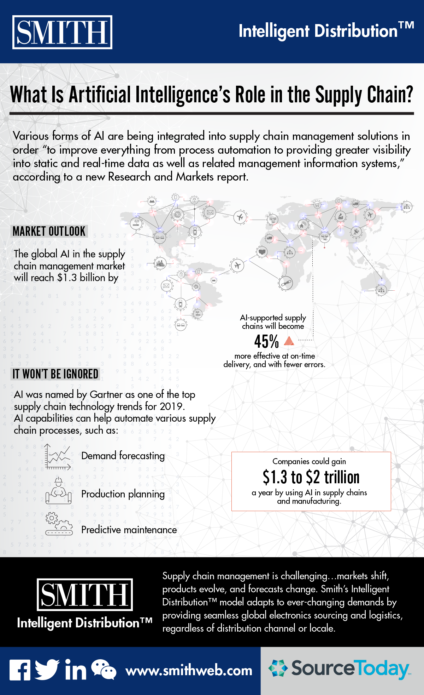
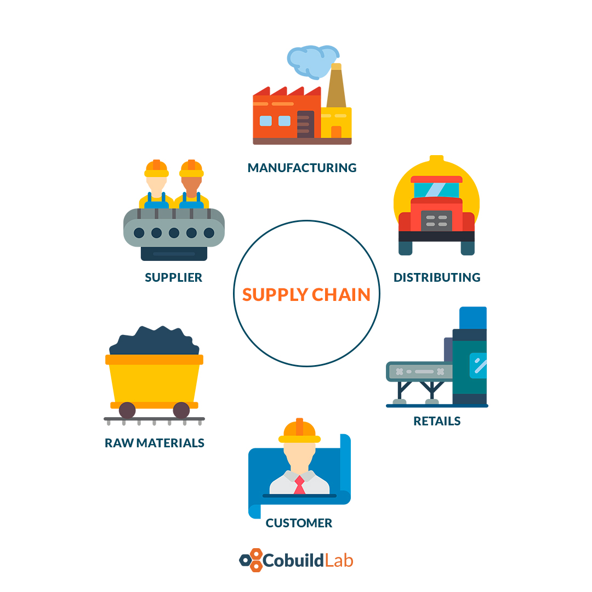

As you know, artificial intelligence is found in many aspects of our daily lives today. We can tell you that currently, the supply chain sector is one of the sectors that demand more of this kind of technology as a result of a world that moves and changes faster than ever. So you need to be fast and accurate in making decisions. So come and learn more about how artificial intelligence impacts the supply chain business. 

Artificial intelligence has some functions or applications within the supply chain companies including Detailed data analysis, information extraction, study and analysis of supply and demand in the supply chain market, management of each of the warehouses, and in some cases the monitoring of autonomous cars.

 

<title-2>Why You Should Implement AI Supply Chain</title-2>

 

<title-3>**Reduced operational costs:**</title-3>

 

The reduction of operational costs in any company in the world is a very important issue, and you can resolve it with the help of AI. The AI can intervene in each of the tasks of the process chain, from customer service to the warehouse.  The trend over time is to decrease the workforce and use intelligent and automated machines that speed up processes and are more efficient.

 

<title-3>**They increase safety:**</title-3>

 

AI lets you analyze each one of the supply chain processes within the company, planning safer operations for the personnel, and also protect all the materials used in the process chain. Similarly, the AI is responsible for verifying all safety data and certifying that every aspect of both technical and legal safety is up to date, even being able to make projections so that manufacturers can make changes in their products and improve the efficiency of it. 

 

<title-3>**Timely delivery:**</title-3>

 

It significantly speeds up delivery times due to the fact that AI can reduce human effort, providing better delivery routes, notification of missing and completed deliveries, analyzing each of the data processed during delivery, among others.

 

<title-3>**Better Customer Service:**</title-3>

 

Of all the areas of the IA, this is the field where it has developed the most. Today all the service pages are integrated with chatbots or some computer with whom you can have an interactive conversation, about the products and services that the company offers. Chatbots provide many benefits to businesses, including increased customer satisfaction and brand loyalty, as well as a reduction in transaction costs and sales cycle time. 

 

<title-3>**Warehouse Efficiency:**</title-3>

 

Within a warehouse, there can be misunderstandings regarding the inventory, the position of a product, reporting some event out of the normal within the process chain, among others. Thanks to the IA these problems decrease, the IA allows us to identify at an opportune moment the product we are looking for and much more. 

 

<title-3>**Ability to Predict Industry Trends:**</title-3>

 

The advantage that you can have if you implement IA technology in your company is that it can give you a prediction of the future of the market since it takes into account data such as emails, messages with customers, videos, user comments and what people prefer and how they prefer it, allowing you to rethink or simply improve your business plan, always looking for the quality and convenience of consumers. 

 

<title-2>Prediction</title-2>

 

According to a new Research and Markets report, the global market for AI in supply chain management will <a target="_blank" href="https://www.prnewswire.com/news-releases/artificial-intelligence-ai-in-supply-chain-management-scm-market-2019-2024-focus-on-automation-planning-and-logistics-inventory-fleet-freight--risk-300830706.html">  reach $1.3 billion by 2024 </a>. It's important to know that various forms of AI are being integrated into supply chain management solutions to improve everything from process automation to the delivery of greater visibility into static and real-time data.  

 

 

<title-2>Challenges of Using AI in the Supply Chain</title-2>

 

AI systems must be synchronized with other programs within the supply chain, so you can analyze the data these processes produce and refine them over time. From time to time the SCM (Supply chain Management), must use algorithms, as these are the ones that lead and everything works properly. 

 

 

We’ve reached the end of this very informative post where you’ve learned how important artificial intelligence is in our lives and the world of the supply chain. Without a doubt, AI empowers our business, allowing us to see beyond our borders and deeply analyze every aspect of our process chain. Don't miss the opportunity to invest in these technologies for your company, which will undoubtedly boost your business and take it to another level.   
