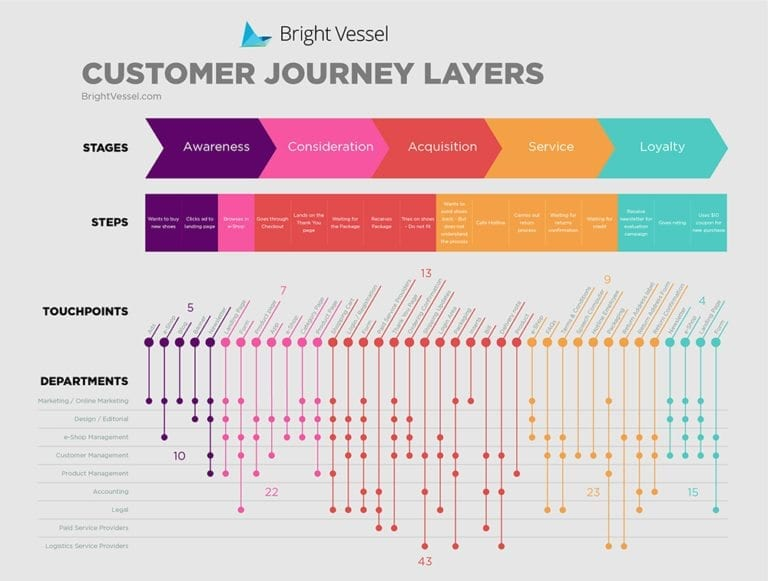

It's time to start a business. You have a great opportunity within this pandemic  challenge, and here we’ll prove it. 

 

<title-2>What do you need to know to start a business in a pandemic?</title-2>

 

The Covid-19 has been a great challenge for this generation, entrepreneurial and productive, this is a crisis that affects every person in the world, especially owners of small and large enterprises. 

However, entrepreneurs have discovered that the only way to move their businesses forward is to adapt to safety measures during the pandemic, and know what problems or limitations have their consumers during the pandemic and take the opportunity to raise a solution to make it a profitable business.   

You need to know that the economy with or without a pandemic is always in constant change, so you should not always rely on one time or another to start your business or get ahead. When you start this project we recommend that you open up, take a look inside, and ask yourself some constructive questions such as:

1. “What does my product or service offer customers, and who is going to buy it?”

2. “What’s the compelling story here for someone to want to buy this product or service—and why now?”

3. “Why am I confident I can solve this specific problem, or deliver this specific service, better than anyone else and stand out against the competition?”

4. “Do I have the right team to succeed?”

Here is an example of a problem in this pandemic, and how you can apply the technology in the processes within your company to get ahead without slowing down because of the pandemic. 

 

<title-3>1. Logistical Problems in your Company</title-3>

 

One of the biggest problems today during the pandemic is the logistics of companies both in the fulfillment of each of its processes within the company as orders to their suppliers and deliveries to their customers. Ensuring that each of these tasks is fulfilled is of paramount importance because it’s the only way you can achieve your company’s goals successfully, and can get started or endure during this pandemic.

Let’s take a more detailed look at the logistical problems your company may be facing:

 

<title-4>* Poor coordination</title-4>

 

Poor coordination originates when your product has to go through several processes, but there is a great fragmentation along these since manufacturers, stockists, drivers, managers, and final users are involved, so it is complicated to have the control of each step of the product and to have the certainty that the product goes through each one of the steps. 

 

<title-4>* Errors within the warehouse</title-4>

 

Inside the warehouse there can be lost items and errors in the accounting of the supplier's dispatches among others. 

 

<title-4>* Lack of communication</title-4>

 

Internal and external communications are essential. And for that same quality, they can be a challenge to overcome if we start or change our business model today. 

We can't move freely, some companies and suppliers are working half-heartedly, customers are a little busier and scattered by the pandemic issue. How do we make it easy to maintain communications effectively? With many tools to facilitate this process. 

Slack, corporate emails, social platforms like Facebook, WhatsApp Business, Telegram are great tools that can help you with this. 

These options work very well for the beginning. But you can go a little further, develop customized software for your internal and external communication, much faster you can solve any situation of this type. 

By hiring an external software team, you can achieve this goal in a short time, especially if you work with agile development methodologies, such as SCRUM, among others. 

Always a customized tool will solve effectively any issue relative to your business.

 

<title-4>* Lack of Connection With End Customers</title-4>

 

The relationships with the client are very diverse, and they give us information about what he wants, what he needs, and what we can offer according to his life.

Every company needs to keep track of every interaction it has with customers. When we work with masses, this could be a little complicated unless we use software tools to help us. For what? To manage and handle our relations with the final customer, and even with leads, who contacted us, have the intention to buy, but for some reason (which we must discover) haven't done so. 

Many tools help you to manage a CRM (customer relationship management), and today, we use technologies such as big data and blockchain for the management and storage of data from our customer relationships in a safe and accessible mode for commercial use.

 

<title-3>2. Possible Solutions to your Logistics Problems</title-3>

 

A possible solution to some of these problems is to incorporate the inventory management on a warehouse level platform, and that it stays there at the moment of leaving the company and also while it’s moving out until arriving at the final destiny, this with the purpose of to make agile the logistic processes and to improve the productivity of your company. 

To this platform, you can add features, such as the quantity of the product at the time of leaving the company, and likewise connect the final consumer with this platform so that they can verify in this digital tool that they are receiving exactly what they asked for.  On the other hand, for those in charge of enforcing the deliveries we can add a GPS program that works in conjunction with the platform, this helps them find the best route to make their deliveries, and reduce delivery times.

 

<title-3>3. Big data in Logistics Solutions</title-3>

 

As you have seen in this example of a company with logistics problems, you can deduce that all these problems are caused by an error in the handling of data and information.  

In these cases we must implement technologies such as Big Data, as it allows us to collect all this information and order it by priority or as we want it to be, and based on this we can easily predict the future and determine how we can be a more efficient and profitable business. By correctly managing the data we can optimize traffic and delivery routes, identify risk operations in the process or maximize the utilization of available assets. Another aspect is that by knowing how to interpret data on consumer buying habits we can estimate the optimal inventory level in different periods. 

 

<title-3>4. Your Business Model</title-3>

 

The business model is a mechanism used by companies to generate their profits, the business model is at the heart of the business plan.

The business model allows us to see how the company is positioned within this industry, and how it organizes its relationships with its suppliers, customers, and partners to generate profits. 

The most important aspects of your business model are:

- Production
- Raw material or needs
- Profit
- Marketing or advertising
- Subscription (if it is necessary)
- Distribution and massification

 

<title-3>5. How to validate your business model</title-3>

 

<title-4>Validation Board</title-4>

 

[Validation](https://cobuildlab.com/blog/practices-for-validating-your-business-idea-for-your-software/) is one of the most important moments when starting a company as you can see below because you must take into account the following aspects: 

Customer segments
Value propositions
Channels
Customer relationships
Revenue streams
Key resources
Key activities
Alliances
Cost structure 

 

 

<title-4>Osterwalder</title-4>

 

The Osterwalder business model, today is widely implemented by companies to help in their business projections. This business model uses a management template (Business Model Canvas), which helps companies to describe, design, and analyze their business models.

This model has a graphic representation that allows companies to describe the value proposition of an organization, its infrastructure, market, and finances. It always aims at aligning the activities of a company by illustrating the possible trade-offs. 

This business model is in charge of evaluating: 

The business value proposition
Infrastructure
Cost structure
Clients
The revenue streams

 

<youtube-video id="JuznUr5qF2A"></youtube-video>

 

<title-4>Customer journey map</title-4>

 

Customer journey mapping (also called user journey mapping) is the process of creating a customer journey map, a visual story of your customers’ interactions with your brand. This exercise helps businesses step into their customer’s shoes and see their business from the customer’s perspective. 

When making a business model with a journey map, the objective, context, detail must be taken into account. The important aspects to take into account in a journey map are:

stages
steps / titles
storyboard with photos and other images
texts and descriptions
channels of communication
emotional values
dramatic arc

 

 

<title-3>Hire the right remote software team. How do you know if it is?</title-3>

 

As for deciding whether to hire a team or develop this project internally, it is better and more effective to hire an external contractor, as it allows you to focus on other aspects of your business and you can be sure that your software is being developed by experts. An external development allows your company to grow more easily in this turbulent economy and ensure its success in this pandemic.  

Some of the advantages of hiring a remote team to develop your platform are 

- Productivity
- Find the right talent
- Low Infrastructure Expenditure
- Low Employment Expenditure
- Motivate to Work more
- More Work at same Time
- Remote Work as a future
- Communication and Collaboration 
- Growth of digital marketing

Don't miss the opportunity to **start your business in a pandemic**, always looking for ways to adapt your product or your services to the current economic climate. With this post you can learn how to start, how you can make your business model and how you can verify by various methods. Don’t waste time, start your project now hand in hand with the latest technology.    

