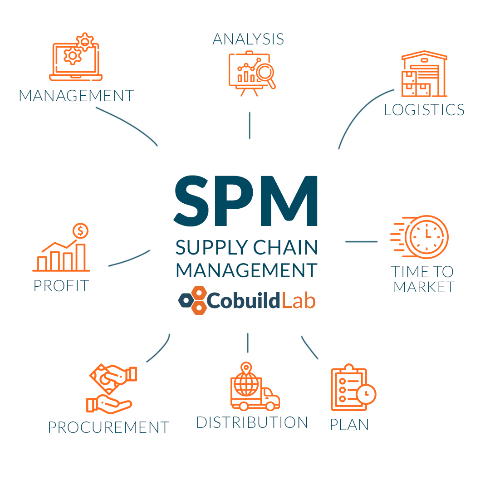
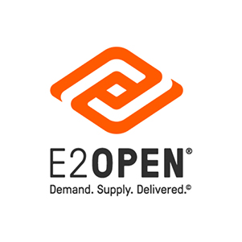
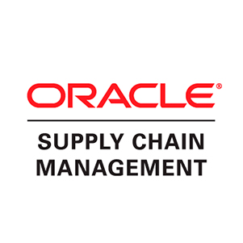
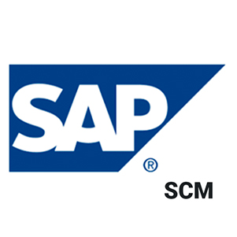

Today for companies worldwide it is of utmost importance to take good control of every one of their operations in order to ensure great efficiency and increase their productivity every day. That is we will tackle the subject of **supply chain management**, its advantages, and everything you need to carry out a development like this for your company. 

Companies need to keep track of their process chain from start to finish. We can achieve this with the help of supply chain software, managing information such as the routing of material as it passes from one state to another until it is ready to be delivered to the customer or interested party. Then there is the logistics of getting the finished product from one place to another. For this reason, it is necessary to have an exhaustive control with each one of the processes in the production and delivery chain.

 

<title-2>The Right Supply Chain Management Software Should Solve</title-2>

 

 

<title-2>Why is Supply Chain Management Software Important?</title-2>

 

Supply chain management is very important for a company because usually, companies have more than one process for their product from the beginning of production to the end, which in this case would be the reception of the product by the user. Among some of the benefits for the company we have: 

- keeps Businesses Competitive
- Keeping pace with technology
- Creating Productive Environments
- Proactive Strategy
- More Satisfied customers 
- Reduced Operating Costs

 

<title-3>1. Help Control and reduce costs</title-3>

 

Today all companies worldwide look to reduce their operating costs to the maximum to make a big profit, now the big question is how supply chain management software can help your company reduce its costs.  We can tell you that an SCM software analyzes each of the aspects and procedures of your company in-depth, which allows you to see from above each of the processes detecting and eliminating waste and costs, without really changing the way your company operates.

With this monitoring of each one of the processes, and detecting the errors you will be able to make the necessary corrections or changes throughout your supply chain with the main purpose of reducing costs, and eliminating errors, improving productivity.

 

<title-3>2. Alleviate late shipments and logistical errors</title-3>

 

This is one of the most important factors within your company since only then you can keep your company active with its production, and keep the consumer happy. With the help of our SCM software, you can ensure the correct functioning of your shipments and reduce your logistical errors. In this SCM software, you can schedule the shipments and each of the tasks and activities to be performed and it will notify you at the time and day necessary. 

 

<title-3>3. Improve customer service and communication</title-3>

 

The communication of your company with your consumers is a very important issue since you manage to break the ice and they will feel comfortable communicating with your company. SCM software allows not only to improve communication with your customers but also within your company, this enhances the processes within them and improves productivity, which in one way or another increases collaboration between your team. 

Customers always want to be in constant communication with the company because they want to know about new products and the status of their shipments. Enabling them with an SCM tool can lead to a higher retention rate as many satisfied customers can come back and buy from you again.  

 

<title-3>4. Help with forecasting and decision making</title-3>

 

Since SCM software analyzes every single process within a company in greater depth, this allows for improved decision making in the long run, and in short, can get straight to the point. 

It certainly helps to prevent errors, reduce losses.  

 

<title-2>Some Supply Chain Management Software:</title-2>

 

<title-3><a target="_blank" href="https://www.e2open.com/">   E2 Open </a></title-3>

 

 

E2open, LLC is a business-to-business provider of <a href="https://currentscm.com/intro-to-cloud-procurement" target="_blank">cloud-based</a>, on-demand software for supply chains for computer, telecom, and electronics systems, components, and services. E2open offers its products across a variety of industries, including high technology industrial manufacturing, telecommunications, life sciences, oil and gas, consumer electronics, aerospace and defense, and consumer goods. 

 

<title-3><a target="_blank" href="http://www.oracle.com/us/products/applications/ebusiness/value-chain-management-217208.pdf">   Oracle SCM </a></title-3>

 

 

Oracle Supply Chain Management (SCM) is a comprehensive suite of applications with open and flexible architectures, best-in-class capabilities, complete functional coverage, and both integrated and modular deployment options. With Oracle SCM solutions companies can:

- Sense, shape, and respond to demand using best-in-class demand management and a complete suite of value chain planning applications
- Adapt and fulfill demand with best-in-class transportation management and a complete value chain execution suite of applications
- Accelerate innovation with best-in-class product lifecycle management and complete product value chain management
- Drive functional, enterprise, and value chain alignment with best-in-class sales and operations planning and integrated business planning

 

<title-3><a target="_blank" href="https://www.softwareseleccion.com/sap+supply+chain+management+scm-p-4220">   SAP SCM </a></title-3>

 

 

SAP Supply Chain Management is more than a management package, it is a software tool that allows you to plan, execute and coordinate your supply chain in real-time

This system is part of SAP Business Suite that provides companies with the unique ability to run their core business processes with modular software designed to work with other SAP or non-SAP software.  

 

<title-3>In conclusion</title-3>

 

<youtube-video id="bwl5ohf1qsg"></youtube-video>

 

So don't waste any more time and start developing your **Supply Chain Management Software** to activate your company to the maximum and increase its productivity day by day. In Cobuild lab we can help you with the development of this SCM as your remote work team, so don't miss the opportunity and ask us how you can do it.    

