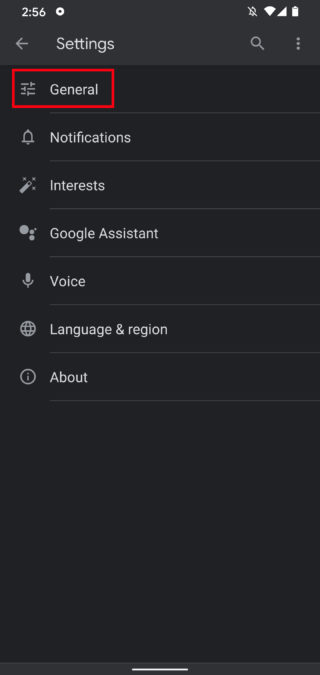
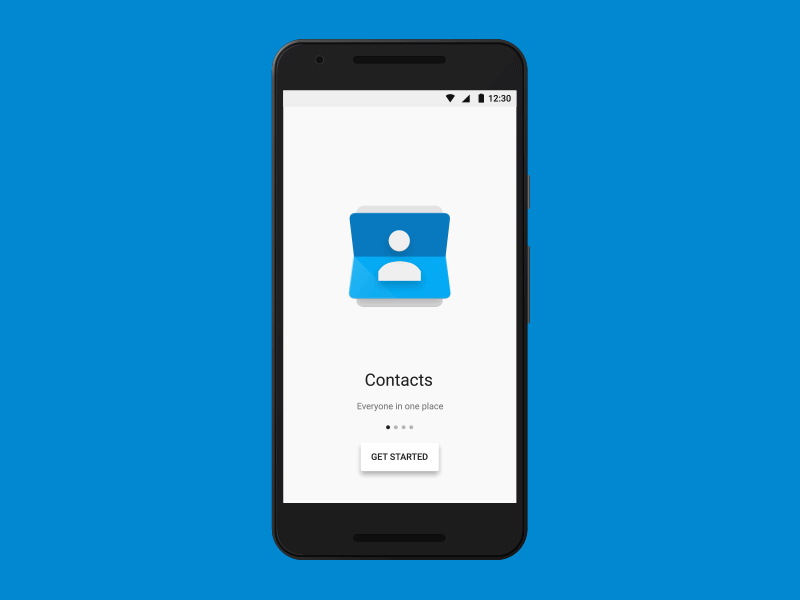
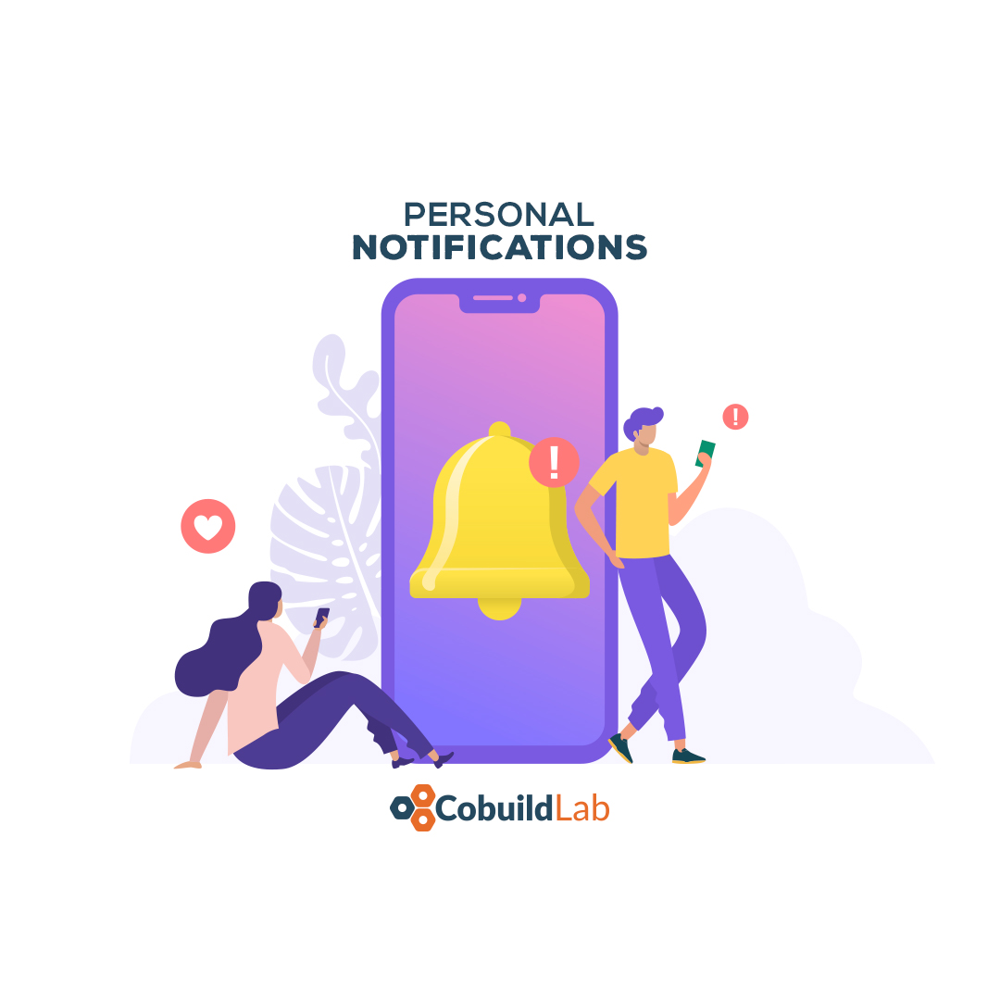

The **development of a mobile application** needs much more anticipation than simply deciding what colors and fonts to use for the interface. You must take into account your users and what you’re trying to achieve to please them. There are several issues you should consider before embarking on the path of mobile application design.

 

<title-2>Some trends for mobile apps</title-2>

 

<title-3>Voice-enabled Search</title-3>

 

 

There are many reasons to use voice search for your mobile application. The implementation of voice search is important for users as it facilitates their search and helps them save valuable time. Today there is a greater demand for better user interfaces, as customers who do not want to rely completely on a touch screen function want to communicate with their smartphone and want to have mobile phones with voice recognition. 

This functionality has detractors because of the issue of cybersecurity, but Google is getting more and more, and therefore other SaaS companies incorporate this functionality in the development of their mobile applications.

 

<title-3>Dark Mode</title-3>

 

 

Whenever a popular device or app moves to the dark side (i.e. Dark Mode), it’s always big news. Whether or not you like dark mode or dark color combinations, there's no denying how excited app users get when they go into the dark mode, which is why mobile app companies and developers will have to support this mode in their future apps.

People love it because the dark tones relax the view and also give the user the autonomy to decide the interface he'll have in your mobile application. 

This factor becomes even more essential when it is intended for consumers to spend many hours interacting with the interface of your app. 

 

<title-3>Better Onboarding</title-3>

 

 
 

 
  
  
 

 

The onboarding process is one essential feature that a mobile application would have since it allows the new user to know more about the benefits that this platform offers. How to register their data, how the application protects their personal information, and the most important thing is how the application is joined, step by step, making the person feel satisfied with their mobile app. 

 

<title-3>Post Personal Notifications</title-3>

 

 

The in-app notifications are a great advantage for the users since it keeps them alert of everything that is happening with this application, be it new messages, promotions, warnings, information about the weather, about your health, last-minute news, etc.

 

<title-2>Other Facts you should Know When Developing a Mobile App</title-2>

 

In this 2020 you must take into account some crucial factors to develop the app you need and being able to meet the needs of users. We list some of them below:

 

<title-3>Concept Proofing</title-3>

 

 

At the beginning of this process, you should consider what scope you want your mobile app to have, visualize multiple factors both positive and negative, think about a problem and see if this application really helps the user to solve it.

The conceptual part of an application defines the time management, the tools, the scope, and all the information you need to manage the project and finish it successfully, in the estimated time and with the least amount of resources. 

When the concept isn't clear, there is an opportunity to make significant changes during the development, and the team would have to rework on what was already. It creates confusion and errors.

The concept is the key. That's why we talk about [UX UI design](https://cobuildlab.com/blog/user-experience/), functionality definition,  [software architecture](https://cobuildlab.com/blog/software-architecture/), [tech stack](https://cobuildlab.com/blog/key-elements-that-you-should-consider-to-select-your-technology-stack/), and many basic concepts before starting the development. 

 

<title-3>Target Audience</title-3>

 

 

When developing your mobile app you must identify the class of users your application is aimed at, this is a very important factor since users are the ones who determine if it will become a successful app. Once you have identified the public, this is where the marketing work starts to make your app known and make users believe that they need it even if they don't.
Let's suppose you have a transport company and you develop an app to interact with your final customers so that they can know the status of their shipments. 

You must transmit seriousness, commitment, solidity, etc. 

Some colors and shapes convey these emotions or sensations. It isn't recommendable that your application uses fine typography or italics, or that colors were very incandescent. 

Another example would be that your target is elderly people, and you use small icons that make navigation difficult for your final consumer.

Those little details make the difference.

 

<title-3>Database</title-3>

 

 

This is one of the most important factors because it directly affects the performance of your app, if not you could lose your users and they would migrate to other platforms that offer services similar to yours. To choose a good database you must take into account: Data structure; the size of data to be stored; speed and scalability; accessibility of data; safety and security of data.

Find out more trends in the following video, which we know you'll find useful:

 

<youtube-video id="ub6xtrkIgKg"></youtube-video>

 

There are many factors, trends, characteristics, and styles to consider when we start the **development of a mobile application** so we can ensure its success in the future. As we’ve seen over the years, the styles and characteristics of the apps have changed both in security and performance, among others, tending to be increasingly more user friendly. Are you encouraged to discover the scope of the app you have in mind? Let's start designing and developing it together. Contact us.  
