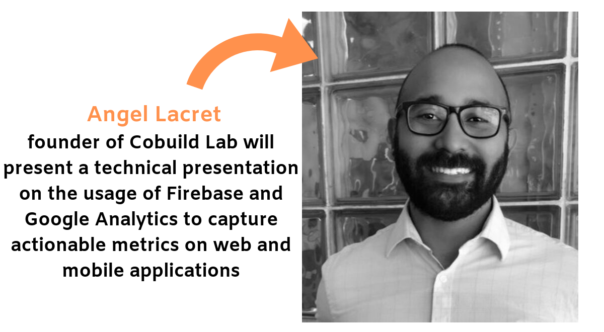

<title-4>On September 24, Miami Software Developers Monthly Edition Meetup will be taking place at The Venture City,  focusing on Actionable Metrics on Web and Mobile Applications.</title-4>

Miami Software Developers group aims to accelerate the process by which people who want to be developers, become potential candidates for jobs offered by small and medium enterprises. 

With a very topic-oriented program, Miami Software Developers provides weekly meetups every Monday creating a space for developers to learn, connect, and share. Their calendar also includes a monthly event where the right tools are given to participants to help them grow in their tradecraft.

September Monthly Edition is focused on best practices and technologies for capturing metrics on Web and Mobile Applications from both a technical point of view, as well as practical.

Want to [become a member](https://www.meetup.com/Miami-Software-Developers/discussions/)?Just bring your laptop and whatever problem you are working on! They will help you in any way they can. Become a developer with Miami Software Developers!  

(/media/monthlyseptember4.jpg)
[Monthly Edition: Actionable Metrics on Web and Mobile Applications](https://www.meetup.com/Miami-Software-Developers/events/264621834/)

