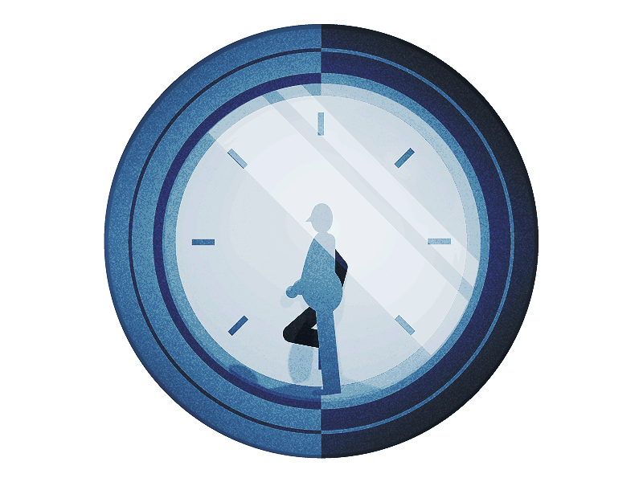
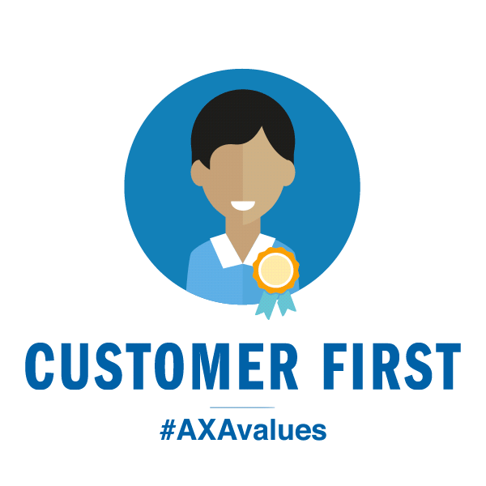

**Deliveries of your product**. This topic was one of the protagonists this 2020. Although it has been part of the logistical process of all companies for many years, it has never been as important as it is today thanks to the pandemic. The temporary closure of businesses and the difficulty of moving supplies and your products or service personnel made it essential.

The number of parties for this concept has increased significantly, and that is why we believe it is desirable to dedicate some content to know it better. At least the essential aspects that you must take into account to have and provide a good delivery experience. 

 

<title-2>What is the Delivery Economy?</title-2>

 

More than a market, or a link in a company's logistics process, it is a feeling owned by the end consumers, and it doesn't matter if you have a B2B or B2C business. That is to say, if it is a person or a company. 

Customers expect effective delivery, in a short time, economical and above all highly transparent, that they are informed about the status and that they can indeed access it without any further complications. 

In a recent series of reports, <a target="_blank" href="https://www.project44.com/resources/aligning-the-supply-chain-in-the-age-of-the-delivery-economy">   project44 surveyed 300 supply chain professionals to explore the impact of the Delivery Economy</a>. In this age of the delivery economy, 73% said they’re experiencing pressure to improve and expand their capabilities in the area as a result of the feeling of final customer satisfaction.

 

<title-2>Here are some Steps that Can Help You with Your Delivery Process</title-2>

 

<title-3>1. Real-time Transport and Logistics Visibility</title-3>

 

 

Some companies like Uber already have this service, but they are not the majority. 

One of the aspects that customers currently value most is transparency and access to information. 

Where it is, the day of delivery, knowing exactly how it is going. Some integrations with Google Maps can help you if you are a provider of this service. Now, if you are part of the small businesses that are looking for a provider for this service, demand this information from your provider because it will add points with your final customer. 

You can use email, a mobile app, documents in Drive, but the important thing is that this essential aspect is present in the process of delivering your product and supply. 

Currently, there are technologies such as <a target="_blank" href="https://cobuildlab.com/blog/artificial-intelligence-for-enterprise-software/">   artificial intelligence, </a> which could even make you a predictive analysis of the delivery. 

 

<title-3>2. An Open Line for Communication</title-3>

 

 

What your company has with its suppliers or the final customer are human relations, and we well-know that the basis for a human relationship is communication. 

It promotes the channels for communication between all the people or instances involved in the delivery process. This helps with transparency, allows solving any setback that may arise, or at least to inform, in order to build confidence and avoid conflicts. 

 

<title-3>3. Customer's Place is Important. Be Careful with Expectations</title-3>

 

 

As we told you before, delivery is an experience, a complete feeling that has expectations from the client, and objectives from your position. 

Set real goals so you don't fail to meet the customer's expectations because that would be the worst failure of the delivery process. 

<a target="_blank" href="https://www.project44.com/resources/aligning-the-supply-chain-in-the-age-of-the-delivery-economy">  In the same Project44 report, 74% of clients said that when a package is not delivered when expected </a> it hurts their impression of the company as a whole. Meeting delivery expectations is no longer just a logistical challenge; it's a brand imperative because it affects their reputation and the perception of even the product. 

The same is true when you are the beneficiary of a supply provider. It is feasible for you to have expectations, and your supplier is under obligation to meet or exceed them or at least be clear on delivery times and goals as a supplier. 

 

<title-3>4. The Supply Chain and All Your Logistics Processes Must Be Strengthened</title-3>

 

 

It is like a clock. When one part does not work properly, it breaks down the rest or completely alters the operation of the device. 

The delivery process depends on other logistic processes. If any of them fails, this will have an impact on the delivery, and your customer's satisfaction will not be possible, affecting the reputation of your business. Everything is connected, so we can not devote ourselves to a specific area, but rather seek support and improve the whole. 

These are 4 essential aspects and macros for the **delivery of your product** or your receipt of supplies. More detailed aspects will be discussed in later contents. We hope you start thinking about it, add the people to your team that can help you with the Economy of delivery, and add to your technology stack the tools and technologies needed to achieve your growth. With the last item, we can support you, contact us at the button and get your consultancy. 
