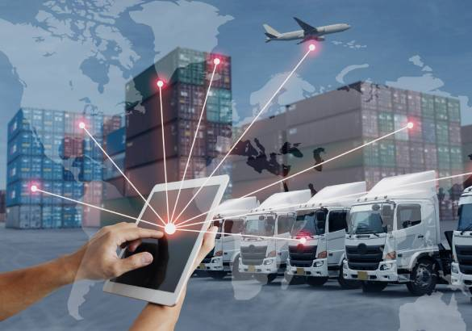
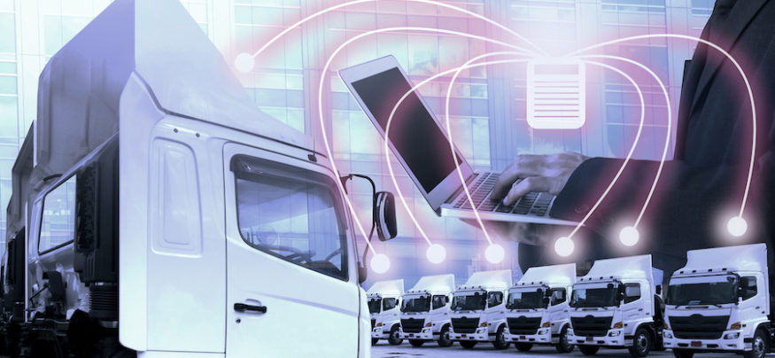

Do you believe everything you hear about fleet software products and solutions? Unfortunately, there are plenty of myths floating around out there on the topic, some more pernicious than others. But many are not unique to the fleet management field. Instead, common misconceptions are based on an innate human resistance to new technology. Some people cling to the old ways and portray every tech solution as being unduly costly, too hard to understand, and not attentive to consumer needs. Or, sometimes you'll hear naysayers grudgingly admit that new developments are worthwhile but simply aren't a good fit for smaller companies. Here's more about the most common fleet software myths, along with a short dose of reality to dispel each one.

 

<title-2>The Old Way Still Works</title-2>

 

 

Not only do the old ways no longer work, but they're actually illegal in some instances. A case in point that many jurisdictions require the use of ELDs (electronic logging devices), so if you prefer to keep written logs instead, your company could fall victim to <a target="_blank" href="https://www.linkedin.com/pulse/practical-tips-how-keep-up-regulatory-changes-ina-kroi-ll-m-/"> costly fines and penalties </a>. Additionally, today's consumers expect high-tech services like real-time tracking of ordered goods. Outdated systems just won't do. And, while you might be able to get away with best guess tracking for a while, eventually the majority of your customers will find a merchant that offers instantaneous, to the minute product tracking data.

 

<title-2>Fleet Management Costs Too Much</title-2>

 

 

It pays for itself, entails low up-front costs, and solves multiple transport management problems at once. The only people who subscribe to this myth are those who haven't tried any of the hundreds of marketplace products, systems, programs, or stand-alone devices, nearly all of which are user friendly and cost efficient. For example, if your business fleets utilize refrigerated vehicles, one of the simplest ways to implement cost savings across the board, and maintain compliance, is with a reefer monitoring solution. It not only It pays for itself, entails low up-front costs, and solves multiple transport management problems at once. The only people who subscribe to this myth are those who haven't tried any of the hundreds of marketplace products, systems, programs, or stand-alone devices, nearly all of which are user friendly and cost efficient. For example, if your business fleets utilize refrigerated vehicles, one of the simplest ways to implement cost savings across the board, and maintain compliance, is with a reefer monitoring solution. It not only <a target="_blank" href="https://www.samsara.com/products/equipment-monitoring/reefer-monitoring"> eliminates manual recordkeeping </a> but prevents spoilage, and offers a vast array of data in real-time for every truck you have on the road.eliminates manual recordkeeping but prevents spoilage, and offers a vast array of data in real-time for every truck you have on the road.

 

<title-2>Small Companies Don't Need Digital Solutions</title-2>

 

 

Organizations of all sizes need these kinds of systems. Otherwise, when the <a target="_blank" href="https://www.google.com/url?q=https://www.cobuildlab.com/blog/Planning-a-Digital-Marketing-Strategy-key-to-success-for-your-New-Software-Application-or-Small-Business-in-the-US-during-COVID-time/&sa=D&source=editors&ust=1632971370991000&usg=AOvVaw0NhFiBvcGFDuznAsr-7udX"> time comes to expand </a>, you'll be completely unaware of how to use the technology. More importantly, small businesses can afford today's vehicle tracking systems and start saving money on transport costs immediately. For cash strapped startups, digital solutions are not only a good idea but a necessary way of growing the client base.

 

<title-2>Software Has No Effect on Customer Satisfaction</title-2>

 

 

Maybe you've heard that customers don't know or care about the tech used on vehicles. That might be true, but it misses a key point. Customers do <a target="_blank" href="https://www.thebalancesmb.com/how-do-i-measure-on-time-delivery-2221412"> care about on-time delivery </a>, the ability to receive real-time tracking data, and packages that arrive in one piece. Digital programs make sure all those goals, and more, are met seamlessly and consistently. Sure, customers might not know how you do your job, but they care a lot about timely delivery and receiving exactly what they ordered. Consider the fact that every major business that does last-mile shipping uses sophisticated fleet management software.

