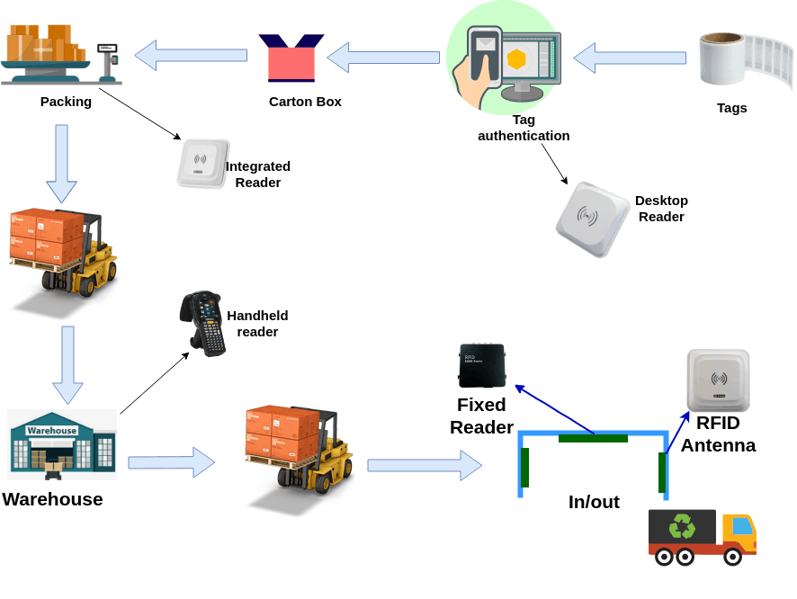
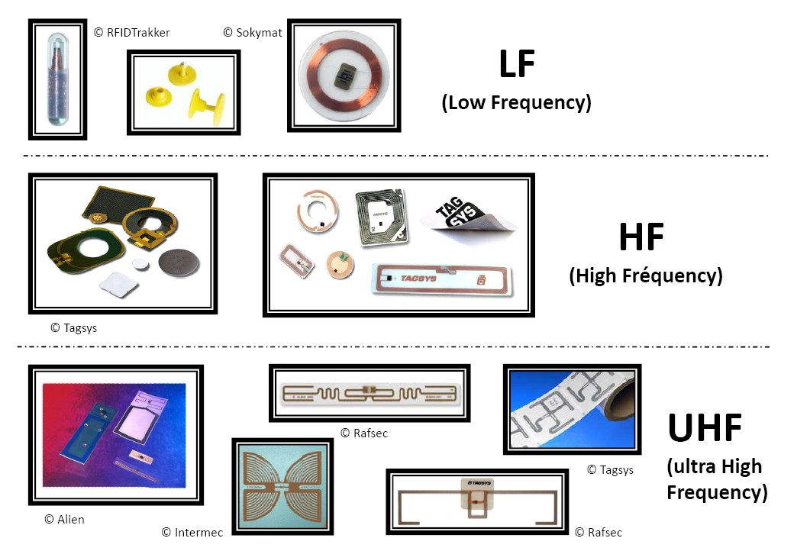

You should know that nowadays, the management of a warehouse and its inventory can be a titanic task due to the enormous volumes of merchandise and the amount of both physical and virtual purchases. But if this is your challenge, we'll show you how **RFID technology** is changing the entire supply chain world, making this easier for workers and businesses. 

 

 

Source: <a target="_blank" href="https://silentinfotech.com/blog/how-to-use-rfid-for-inventory-warehouse-management/">  SilentInfoTech</a>

Fortunately, RFID technology has entered the scene with the power to decrease human error and streamline warehouse operations. RFID has become one of the most important tools of the supply chain manager. But to know a little more about this technology you must know what it is and how it works.

 

<title-2>What is RFID?</title-2>

 

The RFID or radio frequency identification is just a technology used to transfer data of any kind wirelessly through electromagnetic fields. This technology is now used in warehouse and inventory operations to track and identify a product or raw material in real-time. 

 

 

Source: <a target="_blank" href="http://mediacircus2.blogspot.com/2012/12/mc2-post-1463-how-rfid-chips-work-and.html">   Keyword </a>

RFID works with some devices known as tags, which allow the correct functioning of this technology inside the warehouse and the operations of inventory. These tags can be passive or active.

 

<title-3>1. Active Tags</title-3>

 

Active tags usually bring their energy source and their transmitter that is responsible for sending the electromagnetic signal. These can be divided into two. The transponders are activated only when they detect a receiver tag to extend the life of your energy source. 

And the beacons emit a signal each determining time. These are useful for the It is used to locate any object in real-time, so it is widely used in warehouses and inventory operations.  

 

<title-3>2. Passive Tags</title-3>

 

The reader and the reader's antenna send a signal to the tag, and that signal is used to turn the tag on and reflect the energy to the reader. Among some passive systems, we have the HF, LF, and UHF. These types of tags are usually smaller so they are more economical and versatile than the active ones.

 

<title-2>The big question: What is the scope of this technology?</title-2>

 

The scope of RFID technology will depend on its frequency, as shown below:

* **Low Frequency (LF) RFID**: operate in the range of 30 kHz to 300 kHz, and have a reading range of up to 10 cm.

* **High Frequency (HF) RFID**: HF systems operate in the 3 MHz to 30 MHz range and provide reading distances of 10 cm to 1 m. Common applications include electronic ticketing and payment and data transfer. 

* **Ultra-High Frequency (UHF) RFID**: These systems have a frequency range between 300 MHz and 3 GHz, offer read ranges up to 12 m, and have faster data transfer rates. These are the most widely used in the supply chain industry within warehouse and inventory operations.

 

 

Source: <a target="_blank" href="https://rfidworld.ca/rfid-technologies-lf-hf-uhf-ble-nfc-and-active/2888">  RFID world </a>

 

<title-2>RFID Benefits</title-2>

 

1. It has a high degree of accuracy, since they are responsible for exchanging information by themselves, this greatly reduces human error and makes companies more effective in their deliveries and inventory management.

2. We can obtain the required information immediately, as it is updated in real-time, so you can better use your time to search for something in the store or monitor when it came in and what it came in. This gives us a broad picture of everything that happens within the store.  

3. Significantly increases efficiency, as you automate processes and streamline them, you even know what status the product or material has within the warehouse or outside it.

4. Reduce labor costs from the warehouse workers.

5. Reduce inventory levels by improving stock visibility and demand generation.

6. Improve customer satisfaction by ensuring that the right goods reach the right customer at time.

 

<title-2>Market of RFID</title-2>

 

The global radio frequency identification technology market size is estimated to reach USD 40.5 billion by 2025, expanding at a CAGR of 14.7%, according to a new report by Grand View Research, Inc. The industry is expected to witness steady growth owing to the increasing demand from the retail sector and the healthcare industry.

So you know, if you can, don't stop investing in **RFID**, as an option to manage your warehouses and take the logistics and inventory of them, this will improve your productivity as a company, and take you to another level in comparison with your competition. Come with us and learn more about this technology and how to implement it in your business.

