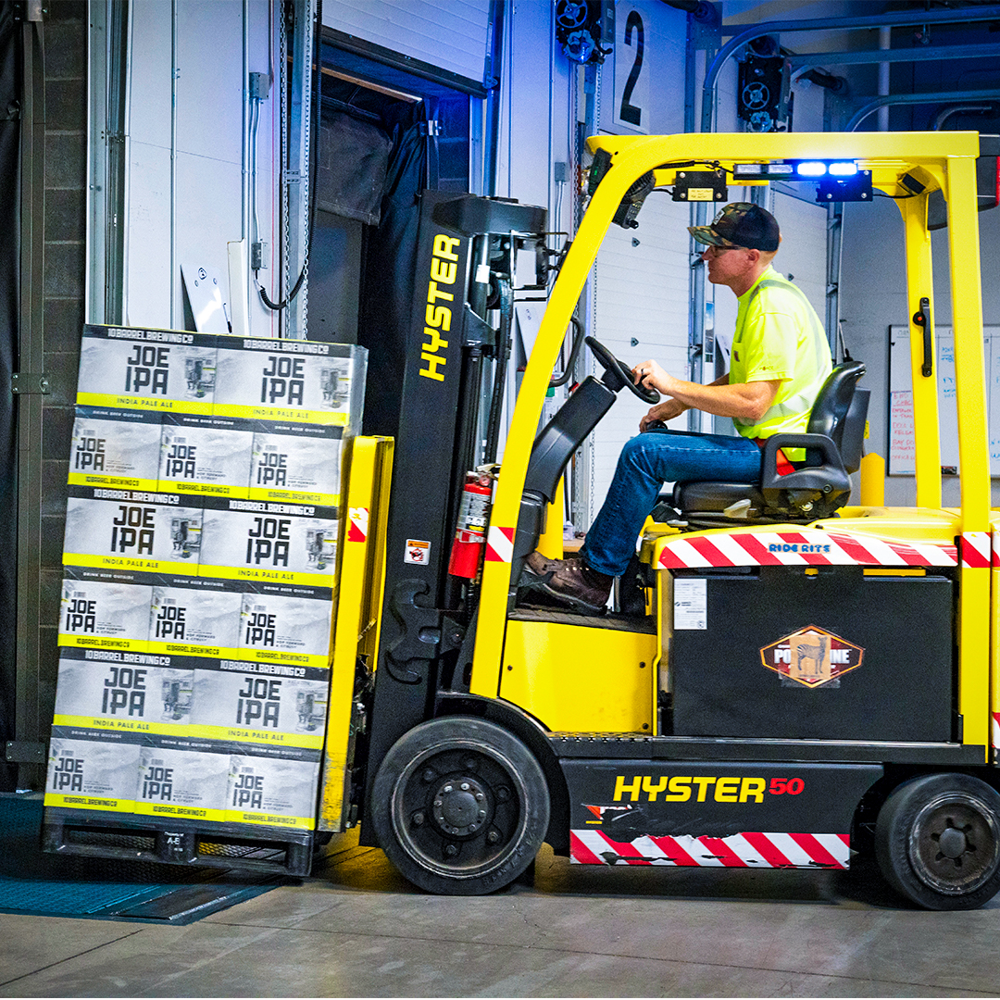

Synchronization is synonymous with digital, and both terms are increasingly used in industries and markets nowadays. Logistics and supply chain is no exception. 

That's why we want to begin by sharing with you why **supply chain synchronization** is so important today, and then a 5-step course of action to achieve it. Let's get started!

 

<title-2>As you know, supply chain synchronization is:</title-2>

 

Supply chain synchronization is related to the real-time collection, analysis, and utilization of supply chain data and information. This is achieved with an interconnected system and software tools with certain qualities that allow suppliers, employees, machinery, production, delivery times, orders, shipments, and all the elements involved to work in perfect synchrony. 

All of these components working together help push the production process along in the most efficient and optimal manner.

 

<title-3>A synchronized supply chain allows you to develop 4 capabilities within your organization:</title-3>

 

1. Getting final products to end consumers faster. This is directly linked to increasing the speed of production. 

2. Having a better capacity to react to variations in demand (positive and negative). This is possible by achieving a balance between materials, capacity, and finished products.

3. Increasing the ability to predict your needs (raw material, suppliers, materials). Better inventory management. 

4. Developing new alternatives to improve the benefits you offer. For example, ship by <a target="_blank" href="https://cobuildlab.com/blog/benefits-of-using-custom-software-to-manage-multimodal-transportation/"> multimodal transport </a>, some variation in transshipment or warehousing, etc. 

Many companies are currently investing money in driving <a target="_blank" href="https://cobuildlab.com/blog/what-is-digital-transformation-and-how-can-small-businesses-take-advantage-of-it-this-2020/">  digital transformation </a> reflected in the synchronization of their supply chain. Here are some essential steps to achieve this.

 

<title-2>5 steps to synchronize supply chain with software development</title-2>

 

<title-3>1. Facilitate collaborative work and engagement of all actors across the supply chain</title-3>

 

 

 

Software development by itself helps you to automate and even reduce (sometimes) the number of human resources involved in a process, but those who are necessary must work together, know each activity performed (even if it is not the one they are assigned), and must have the training and opportunity to work collaboratively (suppliers and team members). 

Take into account this issue when developing your supply chain management system. You can consider it as a task and project management issue.

As a result of collaborative work, your team members will feel confident and will develop greater commitment to each instance of the process, even if it is not one they’re directly involved with. 

 

<title-3>2. Real-time data collection</title-3>

 

 

 

As mentioned above. This is a key point to achieve supply chain synchronization. 

Know who provides the data, where it can be captured, where it is stored, and where it should go so that stakeholders can access it in real-time. 

The goal is to work with a single version of information for all parties involved.

This can be achieved with an interconnected and automated database management tool that does not rely on manual activities, let alone being separated by department or team, and if so, the software checks one against the other to keep it up to date. 

 

<title-3>Visibility of processes, activities, and information</title-3>

 

 

 

Supply chains usually involve many resources, and for this reason, the systems to manage them synchronously must have a simple and clear architecture when it comes to storing important data. 

This reduces comprehension time and access and facilitates decision-making and execution. 

Map your end-to-end processes among departments and ensure that you identify and road test every process to provide exact lead times with all considerations and known buffers. Share the data with everyone and you will easily enhance visibility within your supply chain.

Source: <a target="_blank" href="https://www.planettogether.com/blog/five-steps-to-achieve-supply-chain-synchronization">  PlanetTogueter</a>

 

<title-3>4. Measure, optimize and reinvent activities within your supply chain</title-3>

 

 

 

It is interesting to incorporate these aspects into the system you are developing to synchronize your supply chain because it is what will allow you to reduce production times, increase the accuracy in deliveries to your final consumer, and optimize activities. 

This is achieved with proper database management (not only in real-time) but also with statistical performance reports (preferably customizable), and if you decide to go a step further by performing predictive analytics with the help of technologies such as <a target="_blank" href="https://cobuildlab.com/blog/artificial-intelligence-in-logistics/">  artificial intelligence. </a> 

 

<title-3>5. Advanced planning and scheduling</title-3>

 

 

 

Software is the right strategy to achieve this step in the synchronization of your supply chain. One of the types of software that you find available in the market is the famous APS or advanced planning and scheduling software. 

These tools should preferably be linked to your system that includes ERP, among other tools, and based on a compatibility issue, the least complicated option will always be to opt for a customized solution that gives you the assurance that you can seamlessly integrate one tool with another and develop a robust and interconnected system. 

You can take into account activities such as:

**“Create optimized schedules balancing production efficiency and delivery performance**

**Maximize output on bottleneck resources to increase revenue**

**Synchronize supply with demand to reduce inventories**

**Provide company-wide visibility to capacity**

**Enable scenario data-driven decision making”**

Source: <a target="_blank" href="https://www.planettogether.com/blog/five-steps-to-achieve-supply-chain-synchronization">  PlanetTogueter </a> 

After everything we discussed in this post, have you already decided to start developing your **supply chain synchronization** system? If the answer is yes, and you need support with the process, contact us, we can help you. 
