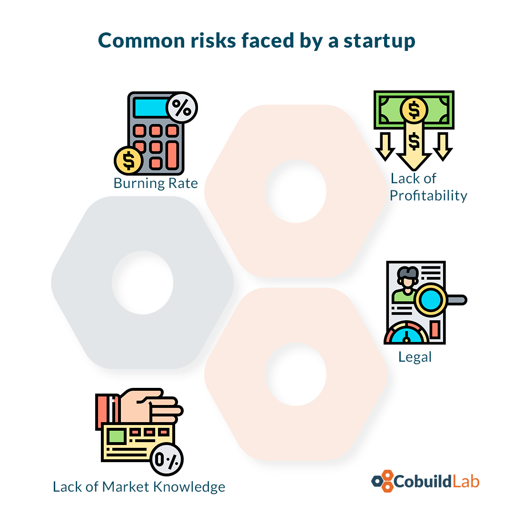

In which startup do I invest? What do I need to understand the use and distribution of my resources in the development project?  How to follow up on the development of the new product? How to recognize what points to improve in the development of a startup that I supported financially? These are questions that any investor asks himself when an entrepreneur knocks on his door looking for financial support to develop his software project. 

If you’re an investor with enough software knowledge, these tools will compliment you and help you on those projects you decide to join. Now, if you don't have much knowledge on the matter, but you want to be part of one, in this post we’ll give you very useful information for this purpose. Let's get started!

 

<title-2>1. Product roadmap:</title-2>

 

A roadmap is a tool developed by a project manager and directed to the people involved in a project who want to know how and when a product will be developed.

It includes budget, development strategies, questions, and answers that may arise throughout the project, business goals, deadlines, and much more. 

But mainly, it is done to know in a timeline each delivery of development phases, the tests, and how we can link that information with the business goals you are doing.

In that way, you can have a better understanding of how the project will evolve and when it might be ready, etc. 

In short, it is a plan, a line of action that will help you a lot as an investor and all people involved.

The roadmaps can also be used to compare your business goals or expectations as an investor with the development team plan in order to make both compatible or make adjustments if it's necessary. The final goal is to develop the software efficiently and above all, in a suitable way for all parties involved in the development.

 

<title-3>There are two types of roadmaps you should know</title-3>

 

<title-4>**Fluid product roadmap**</title-4>

 

It's a long term work plan, with each specific feature of the software to be developed over an extended period. It usually defines a full-term product. 

 

<title-4>**Agile roadmap**</title-4>

 

It is the same plan but applied to work methodologies and strategies of agile development teams. It is mainly used when several people are working simultaneously on different aspects of the application. 

In this case, priorities and strategies may be more subject to change. 

It is a short-term plan that prevents inevitable changes without neglecting the central objective of the project being developed.

 

<title-2>2. Risk and feasibility analysis:</title-2>

 

As its name indicates, this study can help you understand the real project viability (even before you join) as an investor, and in case you do, what are the risks that your capital will have because they are the same risks of the startup. 

Feasibility and risks comprise several fields associated with the company or the Saas product developed. In the area of technology, time, legal, commercial, alliances or use of tools, maintainability, operating costs, etc.

It’s objective is to know, foresee, or be prepared for any challenge or obstacle you may have with the company.

Most common risks faced by a startup and you as an investor behind it:

 

 

<title-3>Lack of profitability:</title-3>

 

Profitability is what every entrepreneur and investor wants to obtain because it is the profit of their work. This status does not always come as quickly as they expect, and that is why the lack of profitability may be one of the main reasons why a startup doesn't survive in time. 

How to prepare for it? How long is the project estimated to be profitable? When will I get the return on my investment? (ROI) All these aspects are estimated in this analysis. 

In this way, you know what to expect as an investor, and in case it does not present itself as expected, you have a starting point that can help you find the profitability that both parties want. 

Everything is born of this study. 

 

<title-3>Legal aspects</title-3>

 

This is perhaps one of the most delicate areas, taking into account that one activity can be legal in one country and punishable in another. 

Nowadays with the advances of the Internet and technology, you must be certain about the legal aspects of a country or city but if you are going to work with APIs, for example, from Facebook, you have to evaluate if it is allowed by the provider to work with them, and the scope they can have within your application.

If it’s a mobile app, it must comply with the rules of the App Store or Play store too.

These are form requirements that can make the software you are going to invest in unable to publish, or maybe when you decide to invest, it was legal, and in the development process, it stopped being so. This information is vital and is part of the risks you assume as an investor, owner, or head of the startup. 

 

<title-3>Burning rate</title-3>

 

The burning rate is the ratio of money needed over the long term to the estimated expense ratio for all months. This is where the necessary amount of investment you have to make until the startup becomes productive on its own. 

It may not be a risk factor per se but if it’s not well calculated, it can become one. The entrepreneur usually has this information calculated but we recommend that you as an investor do it too, so there is less margin for error. 

 

<title-3>Lack of market knowledge</title-3>

 

There are different opinions on this point. Some consider that investors can invest regardless of their knowledge of a market. 

Our point of view is more linked to those who think that at least a basic knowledge is necessary. You shouldn't be an expert, but know or at least carry out a risk and probability analysis study (with knowledgeable people) that allows you to understand the market you are going into, the pros and cons of the project, and then make a decision on a certain basis. 

 

<title-2>3. Soft security audit</title-2>

 

If the app you are going to finance works on the internet or even more if it works natively on a person's cell phone, it must be secure. 

Users don't joke when it comes to keeping their privacy and sensitive information safe. 

That's why this analysis will help you check if the status, at least essential, of the software is at its best. 

Certificates, backups, encryptions, everything that is necessary to guarantee cybersecurity. 

The best part of it all is that we do these 3 technical analyses for you, software investor, so you can choose the best startup to invest in, and in case you are already involved, you know what the development, deliveries, optimization of resources, and in general the fulfillment of the goals are about. 

