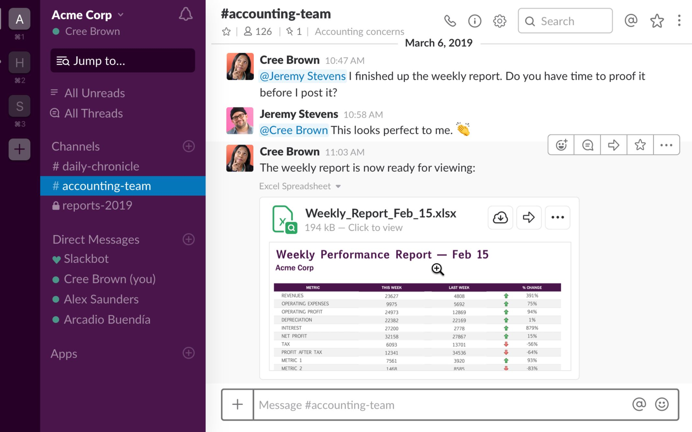
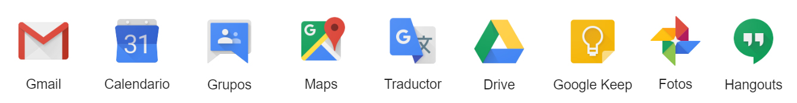

The right tool helps you get the job done, the wrong tool can complicate a simple process.
 
Every entrepreneur has to rely on adequate tools to perform successfully and keep the business afloat. So here we present some of the best tools we’ve found and even most of which we use ourselves!

<title-2>Tools for Software entrepreneursTools for Software entrepreneurs</title-2>

<title-3>1. The need to have a website</title-3>

 

<title-3>* Wix, Squarespace, or Instapage</title-3>

Those days of pulling out the yellow pages or flipping through the classified ads are gone. Instead, Internet searches with keywords are the norm. So, if you are not on the internet, you don’t exist.
 
Having a website is equivalent to existing in the market. It is safe to say that if you are not on the internet, your efforts to get customers will largely go unnoticed and your results will be very limited.
 
The Internet, for many years, has been the largest market out there, and websites are indispensably the best tools to have a presence in this online market.

You can contact a software company service for this, but if your budget is limited, some tools such as [Wix](https://www.wix.com/) or [Squarespace](https://www.squarespace.com/) can help you to create your very own website.

Some of them will include the hosting and domain service, while others even help you with the design and give you some templates.

<title-3>2. The need to organize and manage your team's tasks</title-3>

 

<title-3>* Trello or any Workflow Tool</title-3>

[Workflow](https://cobuildlab.com/blog/workflows-in-your-business/) tools are necessary and essential. Using them will allow you to have the opportunity to control, manage, and have a better distribution of time, activities, responsibilities, and every process you desire.
 
For entrepreneurs, this kind of tool can help to improve efficiency and effectiveness. Also, it helps to increase team productivity and organization, as well as assist with many other tasks relating to running a business.
 
We recommend Trello, one of the most famous entrepreneur tools in the world. There, you can create, share and edit dashboards, enabling you to organize everything you need, from your day-to-day to your next family vacation, as well as where all activities, descriptions, processes, responsibilities and the complete information of each method is stored. Both mobile and web versions are available, so you or any member of your team can collaborate by creating tasks and lists; upon completion of an activity, they can eliminate or mark the event as solved, from the palm of their hand.

In this sense, when finishing each and every activity, you or any member of the team can change the status of such activity upon completion. This is the main working principle of the app.
 
If you are [developing a software product](https://cobuildlab.com/blog/software-development-for-new-products/), you need it, similar to how humans need oxygen,  because without sufficient organization, even the [software development process](https://cobuildlab.com/blog/best-software-development-process/) is not linear and your project will go through hell. Every step must be documented, and these tools for managing a software project will help make documentation easier.

The good thing about using Trello or another Workflow tool and the respective documentation of every step and phase of your software development process, is that anyone that comes and participates in the process or comes to review what the team has developed, will find it easier to access and view this information on the dashboard.  So, know it, use it and take advantage of it.

<title-3>* The Estimate App</title-3>

[Estimate](https://estimatemyapp.com/) is a web app that helps you to estimate the time you will use to develop your software.
 
If it is a web app, an Android App or an iOS app; the UI, UX and every detail you want to include in the project, this software will calculate the investment your app can take. This helps to be with feet on earth, and will allow you to plan what, when and how to do the essentials in the future.

<title-3>3. The need to communicate with each other</title-3>

 

<title-3>* Slack or a communication tool</title-3>

Communication is essential for every interaction in this world: relations, partnerships, teams, processes and all things related to human interactions. That is why you have to improve it within your team, not only in person or e-mail.

You have to think about tools for video conferences, meetings, corporative chats (private and public) and many actions that involve communication inside of your team, and with external personnel. [Slack](https://slack.com/intl/en-ve/) is one example of these tools that incorporates all of that functionality. It has a paid and free version, and is a tool that has become popular over the last few years across the world. We use it, and we recommend it.
 
Alternatives include Facebook Workplace, and Microsoft Teams.

<title-3>* Google is your best friend</title-3>

Google is not only a powerful company, but as an entrepreneur, trust us; this technology giant also will be your best friend.
 
They are known for their excellent products and services. The founders were initially young entrepreneurs and now they still continue to develop a lot of tools ideal for software entrepreneurs as them.

* Google Drive: Cloud storage for all your files that you can easily access from anywhere and collaborate in real time with the rest of your team
* Google Docs, Sheets, and Slides: A free “Office” alternative that works perfectly in the web with a full suite of options, and easily shareable with teammates and external collaborators
* Google Calendar: Syncs perfectly with your gmail and you’ll be able to easily access it on your phone, web, or even desktop. If you wish it can also read your invitations from your e-mail or events such as trips or meet-ups and adds them to your calendar automatically.
* Other Google Apps: Chat, Video Hangouts, Contacts Manager, and more.

A positive aspect of this tool is that it has a free and a paid version, and both of them are good. Also, it provides you the opportunity to choose if a personal option works for you or if you need G-Suite to be able to better collaborate as a business. 

<title-3>3. The need to analyze and connect</title-3>

 

<title-3>* Ads and Analytics Platforms</title-3>

 We can’t forget to  mention [Google Analytics.](https://analytics.google.com/analytics/web/#/)
 
We agree with that. Even if your product or business is not related to software or technology, you must be online, and you have to work at being the first or one of the first.
 
This goal is achieved with different web positioning techniques. The most well known free technique is called [SEO](https://cobuildlab.com/blog/seo-tips-that-will-increase-your-position-in-search-engines/) (Search Engine Optimization), and it’s paid counterpart is  [SEM](https://searchengineland.com/guide/what-is-paid-search) (Search Engine Marketing), where many paid advertising tools, and [ads campaigns](https://cobuildlab.com/blog/Planning-your-ads-campaign-on-10-steps/) are included.

This is also possible with information. It provides analytics of the performance of different web platforms, to know what people like most, what users are interacting with more and thus, enable you to optimize your web presence and improve your positioning.

Google has developed many tools that offer support with this issue, such as the [Google Marketing Platform](https://cobuildlab.com/blog/google-marketing-platform-another-way-of-google-advertisement/) and [Google Ad Manager](https://cobuildlab.com/blog/google-ad-manager-the-platform-to-track-your-ad-campaign/), among others.  However, the most popular analytics tool in the market is [Google Analytics](https://cobuildlab.com/blog/become-a-google-analytic-master/), where even in real-time, you can evaluate, measure and track the performance of your website or many other  digital platforms.

In this sense, we consider that it is a tool that should not be missing in your entrepreneurial toolbox, because it will help you maintain and improve your website reputation providing keywords and information about metrics in the internet environment.

<title-3>* Do not forget Social Media Platforms</title-3>

Social media platforms are part of our daily life. That is not an exception for businesses or entrepreneurs. The goal of your business must be to reach people, customers who will use your product; and those people are on social media. These tools are not fully necessary in the first stages of your project, but they will be significant later when you release your software product.
 
Think of your app name as early as you can, because you have to check for its availability on social media platforms, for the domain, etc. That would be a way of securing social media presence from the moment of the product conception.
 
When you have to think about where you will present and offer your software product, it will be necessary to know the social media platforms that you can use to reach your potential customers and choose what you will use based on this.

<title-3>4. The need to manage your applications data</title-3>

 

<title-3>* Another excellent Google Tool for software entrepreneurs themselves is [Firebase](https://firebase.google.com/?gclid=EAIaIQobChMI6JqIze3r4wIVgpyzCh19-Ar1EAAYASAAEgLDjPD_BwE)</title-3>

With this tool, you can create mobile or web applications without having to manage the infrastructure (servers, etc.).
 
This  is a [server-less](https://martinfowler.com/articles/serverless.html) platform, a technology that’s here to stay in the [software development](https://cobuildlab.com/blog/best-software-development-process/) industry, because it makes it much easier to  [integrate the back-end with the front-end](https://cobuildlab.com/blog/key-elements-that-you-should-consider-to-select-your-technology-stack/), so easy it can be managed by a front developer. Why is it ideal for entrepreneurs? Because you will most likely need less human resources, and it will allow you to develop your product in Google's infrastructure making it more adaptive. 

