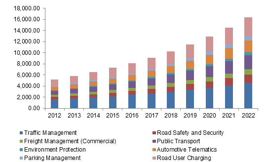
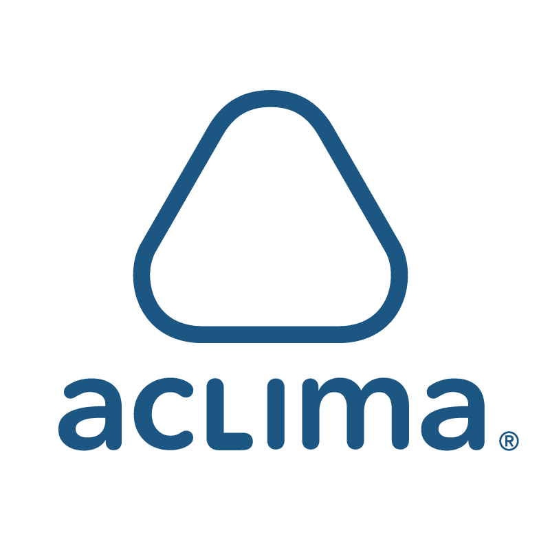
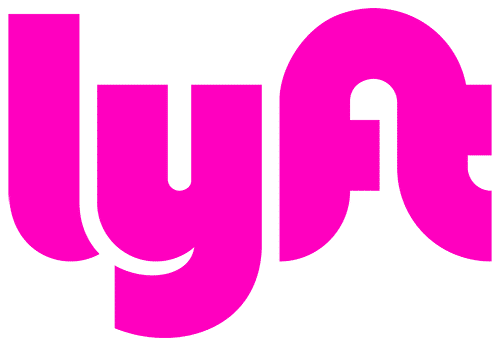
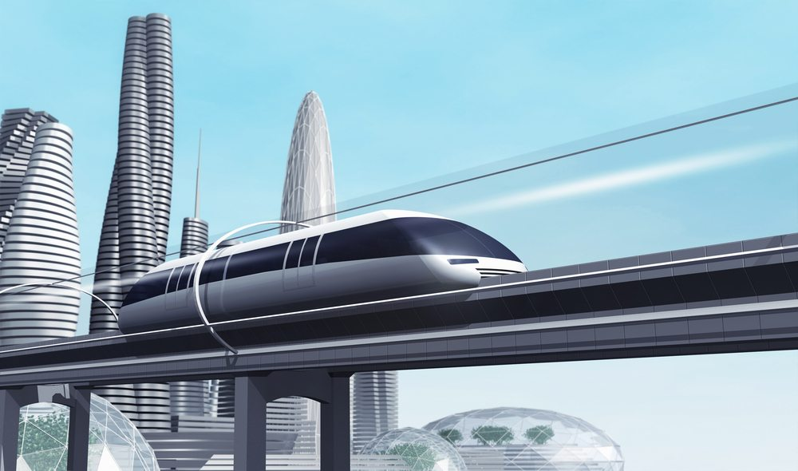
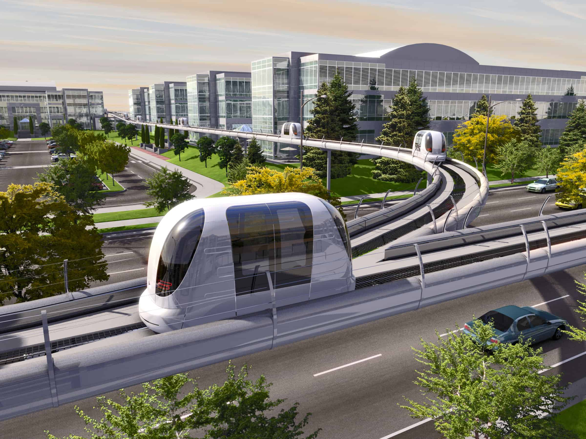
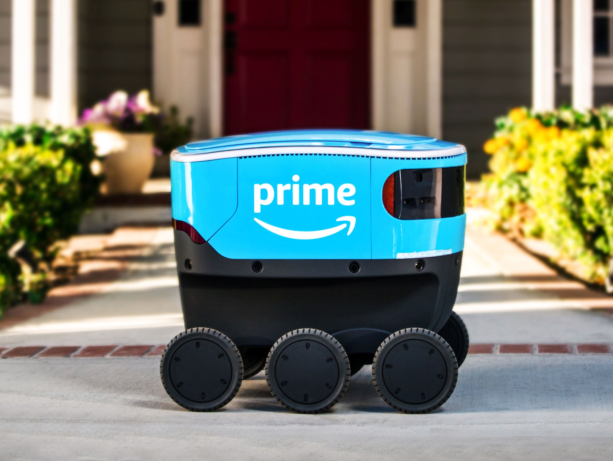
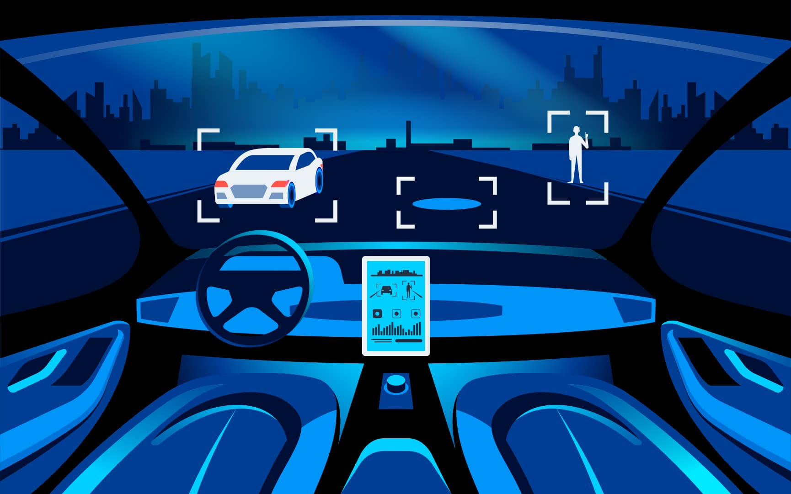

New technologies are transforming the way we plan, design, build, and operate transportation systems. 

Transport agencies use them to count traffic, detect crashes, collect tolls and fares, and manage transit operations and traffic signal systems. Travelers depend on traffic condition reports, electronic maps, on-board vehicle performance monitors, real-time transit arrival information, and a host of other services that did not exist a generation ago. Some of us are already driving hybrid vehicles or commuting in buses powered by hydrogen or biofuels. For the future, we all are counting on additional advances in transportation technology, not just to get us where we want to go, but also to reduce greenhouse gases, improve air quality, and support economic development. 

 

<title-2>Transport Tech meaning</title-2>

 

Transportation technology refers to tools and machines used to solve problems or improve conditions concerning the movement of people and goods. Intelligent transportation systems are improving driving and traffic management and are safer for everybody. All around the world, transportation innovations are rising to meet these difficulties, including associated and efficient vehicles, elective powers, keyless management and traffic investigation, and additionally neighborhood zoning and arranging strategies that bolster travel situated development.

 

<title-2>How is the transport industry growing?</title-2>

 

The business world is facing a complete overturn, and so does every industry vertical. The spending on IoT (Internet of Things) in the digital age is going to increase multifold with a net worth crossing $581 billion by 2020, as per McKinsey. Transportation and logistics are the backbones of the economy, and an integral part of almost every business is also going to spend over $40 billion on IoT platforms, systems, and services by 2020, as per Statista. These facts signify the new opportunities that the Transportation market is expecting shortly. With Artificial Intelligence, Machine Learning, New Age tech, and more modern innovations, the transportation industry is also experiencing new market players, a broader spectrum of services, new business models, and increasing customer expectations. 

Internet of things, big data, analytics, and mobile technology have significantly marked their presence across various industries. The automotive industry, which is booming with the rapid increase in population is now much of a technology revolutionized space. With the growing number of vehicles, there has been an immense demand for road safety and traffic management to enhance the user travel experience. This rising demand to improve transport efficiency has positively impacted the growth of Intelligent Transport Systems in the automotive industry.

ITS or Intelligent Transport Systems market is anticipated to grow significantly in the coming years, hitting revenue of [USD 47.6 billion by 2022](https://cagrvalue.com/asia-pacific-market-witness-highest-growth-intelligent-transport-system-industry-cagr-13-9-2015-2022/).

 

 

<title-2>Companies Investing in Transport Tech</title-2>

 

<title-3>Swiftly</title-3>

 

[Swiftly](https://www.goswift.ly/) has created the first platform designed explicitly for transportation data and operations. With Swiftly, transit professionals can easily manage the efficiency of their transit systems in new ways, finding the exact points in their schedules and routes dragging down operational efficiency and service reliability. And unlike legacy transit software, Swiftly is quick, easy to understand, and focused on rider impact. Further, the platform includes a suite of APIs that enables public transportation networks to connect and integrate with infrastructure and other forms of transportation.

Swiftly works with over 60 city transportation networks around the world, including MBTA in Boston, Capital Metro in Austin, VIA in San Antonio, VTA in San Jose, and MDOT MTA in Baltimore, supporting over 2,500 transit agency professionals and impacting over a billion passengers per year. Swiftly has helped customers improve arrival predictions by up to 30% and complete planning projects up to 90% faster, resulting in increased ridership, fewer passenger complaints, and more efficient transit operations.

 

 

<title-3>Wheeli</title-3>

 

[Wheeli](https://www.wheeli.us/) is a college-focused ride-sharing startup billed as "the carpooling app for college students." Like with Facebook's launch, the team uses ".edu" email addresses to provide a layer of safety and security.

Wheeli has gotten some pretty excellent traction after launching at the University of Vermont in January 2016 and the University of Massachusetts Amherst in September 2017. Co-founder and CEO Jean-Pierre Adéchi said it had captured 25 percent of the Vermont campus, and the Amherst network is growing three times faster than the one in Vermont.

 

 

<title-3>Aclima</title-3>

 

This startup that pitched, [Aclima](https://aclima.io/) makes a sensor and software system (as small as a shoebox) that collects granular and localized data about air pollution. The company already works with Google, which has installed the hardware on 50 of its Google Street View cars. The type of data that Aclima's technology can collect will be beneficial for programs in California looking to reduce transportation-related emissions in underserved communities.

 

 

<title-3>Lyft</title-3>

 

[Lyft](https://www.lyft.com/) is an on-demand taxi-hailing app. Lyft community drivers are background-checked and interviewed. Gradually evolved from ride-sharing services to taxi booking services. Offers taxi-hailing service, Lyft and Lyft Plus and Intra-city ride-sharing via Lyft line.  Have entered into a partnership with India's Ola, China's Didi Kuaidi and Malaysia's GrabTaxi, which will allow passengers to book rides on any of these cab services using just one app, a move designed to counter the global reach of their main rival Uber.

 

 

<title-3>Aptiv</title-3>

 

In May 2019, self-driving software company [Aptiv](https://www.aptiv.com/) and ridesharing company Lyft announced a significant milestone: the companies, which had been collaborating on free passenger service in Las Vegas for more than a year, had completed the 50,000th ride of the partnership.

The program features a fleet of BMW 540s, retrofitted with Aptiv’s autonomous tech but with a safety driver present in the car. Reception to the application has been positive: Lyft reports that the rides average a 4.7-star rating from passengers, with 92% stating that they felt safe during the trip.

The Lyft partnership is just one of several programs that Aptiv has underway with its self-driving software. The company currently has autonomous driving operations in four markets: Boston, Las Vegas, Pittsburgh, and Singapore. In spring 2019, the company announced it was adding a fifth city, Shanghai.

The expansion into China is a significant strategic move for Aptiv. China is expected to account for more than two-thirds of autonomous miles driven worldwide by 2040, according to McKinsey.

 

 

<title-2>Prototypes of the Future</title-2>

 

<title-3>Hyperloop</title-3>

 

The  Hyperloop concept was introduced by prolific inventor and entrepreneur Elon Musk in 2012 when he announced engineers from his Tesla and SpaceX companies would begin work on a demonstrator. This promising, high-speed innovation is composed of reduced-pressure tubes that contain pressurized capsules with the ability to transport passengers from San Francisco to Los Angeles in a mere 35 minutes at speeds of up to 700mph.

 

 

<title-3>Urban transport pods</title-3>

 

The pods seat one person and move on their own over a pre-described route. The idea is that the human operator interacts with the pod using a touchscreen in the windshield. You swipe to select a destination, and you can read the daily news, check your e-mail or even play a video game during the trip. There will be a built-in wireless hotspot to connect your gadgets. The pod operates on its own, showing its current route.

 

 

<title-2>Relationship between transport tech and AI</title-2>

 

The very idea of a driverless vehicle rolling around on the streets seems incredible. And yet, we may be close to seeing such cars on the road around the world, thanks to artificial intelligence (AI), among other driving forces. In the recent past, there have been some fantastic advances in autonomous vehicle technology which indicate the dream is inching toward fruition. It seems that the framework of autonomous vehicles is finalizing. Subject to legal and administrative approvals, driverless cars will be a common sight on the roads soon.

 

<title-3>Delivery Vehicles</title-3>

 

Now, we could see the same task done by driverless vehicles – and with higher efficiency and swiftness. Nvidia, the leading computer graphics provider, Deutsche Post DHL Group (DPDHL), the world’s most significant mail and logistics company, and ZF, an automotive provider have teamed up to deploy driverless electric light trucks which will transport and deliver packages. The driverless vehicle will deliver packages from a central point to the destination. In the interim, it is trained to accurately assess its environment for variables such as traffic conditions, parking spot identification and parking, and pedestrian behavior. 

The truck is powered by the ZF ProAI self-driving system, which is powered by the Nvidia DRIVE PX palm-size supercomputer, but it also includes sensors, cameras, LIDAR and radar that feed the data into the system. Note that apart from the apparent benefit of relentless accuracy and no driver fatigue that the technology promises, there is also the potential of substantial cost savings because the process of delivering packages from the central point to the destination is the most expensive for logistics companies.

 

<youtube-video id="dagjQW_jgtE"></youtube-video>

 

 

<title-3>Full Autonomy</title-3>

 

Imagine luxurious driverless taxis that help passengers move between points. You can do your thing – watch a movie, work on your laptop, or listen to music – and not have to worry about the taxi safely taking you to your destination. Such taxis could soon become a reality. Nvidia’s DRIVE PX AI platform is going to usher in fully autonomous vehicles. The DRIVE PX AI platform is ten times superior to its predecessor DRIVE PX 2 and can handle over 320 trillion operations per second. This means the car will be learning and making accurate decisions about its environment on the road much faster than its predecessors.

Currently, Tesla cars are equipped with the necessary hardware for autonomous driving, but software updates are required to enable the feature entirely. While it will allow fully autonomous driving, it will also still let the human driver take control when necessary. The next generation of autonomous vehicles would not need steering wheels, pedals, or transmissions. Such cars will potentially reduce accidents, will be viable transportation options for the elderly or those with vision or physical disabilities, and could increase productivity.

 

 

<title-3>Parking</title-3>

 

Car parking is not a novel development. The advent of automated parallel parking is probably among the earliest AI exploits in autonomous driving technology. However, the concept has dramatically evolved in recent years. Parking, especially in big cities, is a significant problem because it increases emissions, wastes time and productivity, and increases stress. Bosch has developed a smart AI-based system that provides data on available parking spots, locations, and times to park. The car even does the parking itself without any accidents. As the vehicle is on the move, it receives information about parking availability at places closest to its GPS location. The parking space data is sent to many cloud servers from cars, which is then sent back to vehicles so that drivers can learn about parking space availability.

 

<youtube-video id="NzqUNYU-7_8"></youtube-video>

 

<title-3>Cars with Peripheral Vision</title-3>

 

Knowledge of pedestrians, objects, or vehicles around a blind corner is a critical factor in safe driving. Blind spots have been responsible for many accidents. A new AI technology enables cars to view and assess the distance and speed of pedestrians, objects, or vehicles around a blind corner. CornerCameras, an AI initiative by MIT researchers at the Computer Science and Artificial Intelligence Laboratory (CSAIL) enables driverless cars to identify people or objects situated in blind corners of the roads. The technology uses light reflections and does not see objects or people. From the data received, it can direct the self-driving car for a better driving experience. According to Katherine Bouman, the lead author of the paper detailing the system, “Even though those objects aren’t visible to the camera, we can look at how their movements affect the penumbra to determine where they are and where they’re going.”

 

 

In the present and the future, **transport tech** is a reality that came to make our lives easier. We can choose to enjoy it as consumers or even encourage ourselves to develop a software project in this industry, for example, in Miami. Consider it and contact us.

