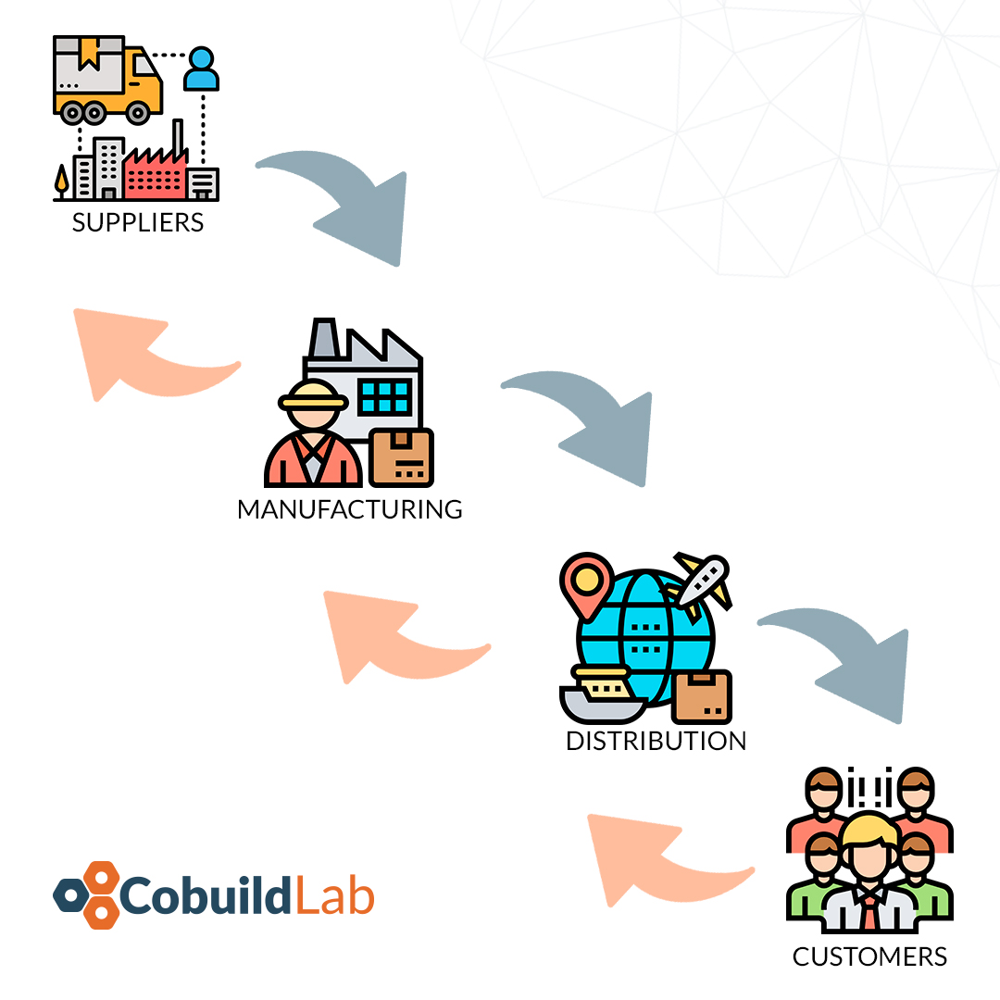

AI is already a fact and is increasingly implemented in the daily lives of people and businesses, but have you wondered sometimes how you can implement AI in the world of the supply chain? If you haven’t considered this scenario and don’t have very clear ideas about what benefits it can bring, then do not worry, we’ll show you below:    

 

<title-2>Some benefits and uses of AI in the supply chain</title-2>

 

<title-3>Systematic inventory management:</title-3>

 

This is one of the most important uses of AI in the supply chain since by accurately managing inventory, you can control the output and input of any product, or raw material, used in the process chain within the company. You may be wondering if it merely helps you with the outputs and inputs, well no, and here lies the importance of why we must implement AI in the supply chain, inventory management helps prevent overstocking, inadequate inventory, and unexpected outputs.

 

 

There are so many variables, such as receiving, order processing, and picking and packing, that usually are time-consuming and error-prone jobs. For example: if we lose a package in the warehouse, the AI can help us find its location and check what status it is in, if it was shipped or is still in the warehouse, it's that simple.

 

<title-3>Improved Safety:</title-3>

 

Thanks to AI supply chains can be more secure because it can analyze all relevant data of the product or matter in terms of safety and its handling, informing workers and consumers about this peculiar feature. With all these proactive maintenance and feedback loops, companies can react quickly and decisively to keep stores safe and compliant. 

 

<title-3>Better Customer Service:</title-3>

 

Implementing IA in the supply chain as a tool to improve the service to consumers is a great idea and more and more companies are implementing it. This brings customers closer to you and helps you know a little more about what they want and how they want it. Chatbots provide many benefits to businesses, including increased customer satisfaction and brand loyalty, as well as reduced transaction costs and sales cycle time. 

 

<title-3>Reduced Operational Costs:</title-3>

 

Using AI in the supply chain is an advantage because it reduces costs throughout the entire work and process chain, from customer service to production. Many operations are now automated, with intelligent machines replacing employees. Also, these machines can run error-free for longer, reducing the number of errors and incidents in the workplace.  

 

<title-3>Can predict the market trend:</title-3>

 

The best thing about AI systems is that they learn from every transaction, whether it is the interaction with the customer through chatbot, emails, text messages, or user comments. AI systems can keep complete records and continuously analyze data about a customer's requirements, updating the results to the specified users. 

 

<title-3>Improves delivery times: </title-3>

 

AI systems make logistics simpler and more precise, facilitating timely delivery to the customer. Automated systems speed up storage procedures, and more sophisticated systems can even take into account factors such as traffic conditions, delays, alternative routes, and weather forecasts.

So you know, start now in the world of AI implementation in the supply chain, and start empowering your company, in every aspect of its production, and the market. With a proper supply chain, you can get closer to your customers and they feel comfortable with your product, so don't give up and start now.  

