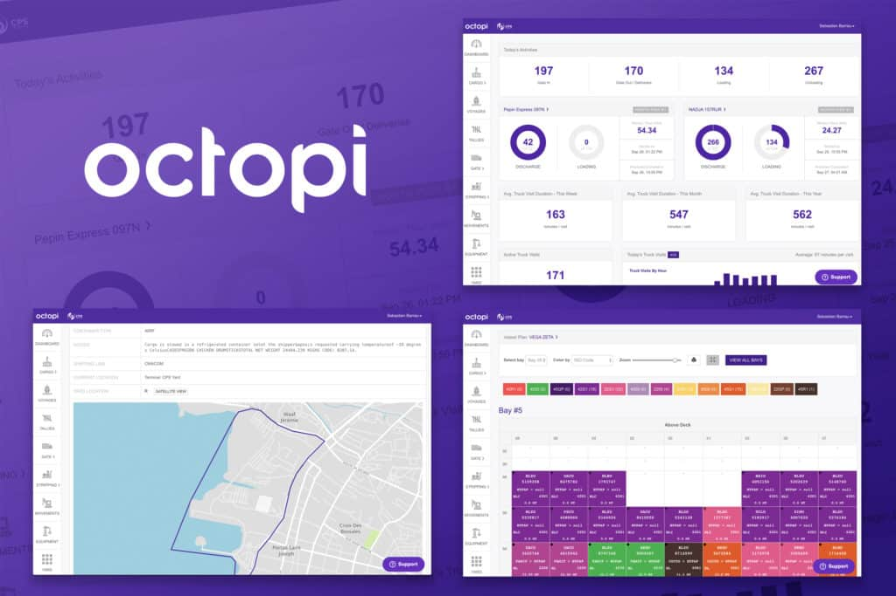
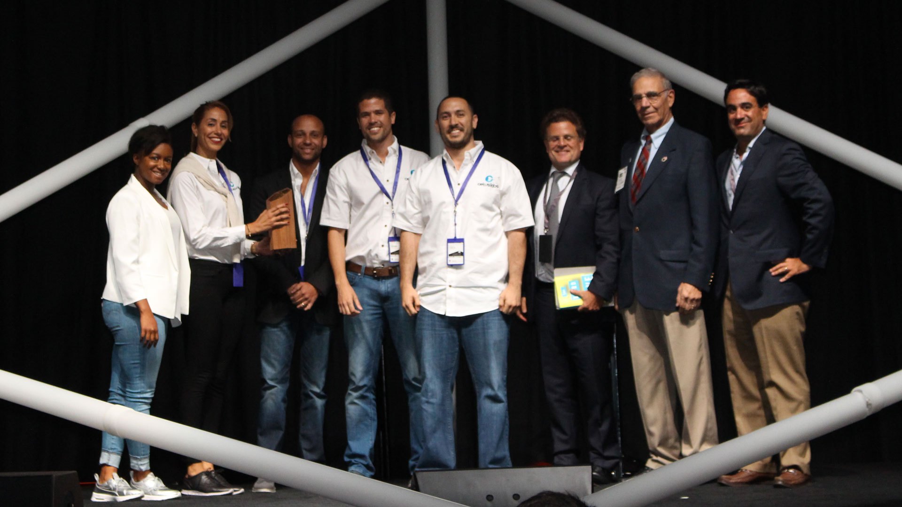

Octopi, it's a Miami-based software startup that builds and sells a modern and smart Terminal Operating System (TOS) that helps small and medium-size seaport terminal operators manage operations, track cargo, and communicate electronically in real-time with commercial partners, launched with its first customer, one small terminal in Haiti in 2015. The company's cloud-based TOS is now in use at ten terminals in seven countries.

"Our target market are the small to medium port terminal that might still be doing a lot of work using pen and paper or Excel spreadsheets because there are not good commercial solutions that fits their needs." Said Octopi's CEO, Luc Castera, for Startup Miami.

**SOURCE:** [StartUp Miami](http://startup.miami/spotlight/octopi/)

The company was founded in 2015 by Luc Castera and Guille Carlos, two software engineers with more than 25 years of combined experience in software development whom strongly believe that quality software should be elegant and easy to use. Miles Varghese joined the team to head up sales in 2017.

Octopi's CEO, [Luc Castera](http://luccastera.com/resume/), studied Electrical Engineering at the University of Virginia, and masters at Georgia Tech in the same field. After gaining experience as a Software Architect, CTO, in different companies working with customers like AT&T, Facebook, Google and SnapChat, he developed and launched projects with friends such as job509.com (which is now the #1 jobs website in Haiti) and htmlsig.com (on which more than half a million email signatures have been created).

<title-2 align=centered>*"First find someone willing to pay you for a product before you spend the time and resources to build it."*</title-2>

That was a crucial lesson Castera learned after his first attempt at starting his own company (ShareMeme). Luc quit his two years job as a Software Architect at Verizon Communications he got after graduating to start ShareMeme, even though it was not a success, this failure did not stop him to look forward to his next project. Years later he stumbled into the shipping and maritime industry thanks to a friend who was looking for a software for that industry and they ended up founding Octopi.

The largely bootstrapped Octopi won the eMerge Americas Startup Showcase early-stage competition in 2016, winning $50,000. That year it also participated in the Venture Hive accelerator class and has been growing its revenues and customer base since.

**SOURCE:** [Octopi](https://octopi.co/about_us)

On March 2019,  Navis, a California subsidiary of Helsinki-based Cargotec,  purchased Octopi.  The entire team will be staying with the company and in Miami, where the company will continue leading the product for the new owners, said Octopi CEO Luc Castera.

You could say it's a win-win situation because Navi sells terminal operating systems and focuses on the big ports of the world, but they needed an agile, cloud-based solution to serve that market.  Octopi, on the other hand,  offering a cloud-based TOS that is intuitive and quick to implement works in a very conservative industry that not trusts in small companies like them.

So Navi will tackle a market they were not able to tackle with their existing product line, and they will help Octopi scale, now being backed by a billion-dollar company.

"We think we will achieve great things within Cargotec-Navis. We love the fact that we have gotten a lot of support from the Miami tech community and we are happy that we have lived up to the expectations that a lot of people have put on us." Castera said.

**SOURCE:** [Navis](https://www.navis.com/en/about/news-events/news/exit-miamis-octopi-acquired-by-cargotec-subsidiary.-whats-ahead-for-octopi/)
