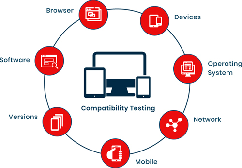

Today the digital transformation in your company and global markets are a  fact. 

These new technologies have allowed us to reach more places, improve our companies productivity and efficiency, and change the way we do business worldwide. But you may be asking yourself, Is it more convenient for me to buy commercial software or should I develop it? (thinking on digital transformation). Could my company or business achieve digital transformation through commercial software licenses? Well, here we answer that question. 

You could achieve this goal with commercial software, but we believe that it is more efficient, effective, and in the long term more profitable to start the process of digital transformation in your company betting on a remote software team that helps you develop customized tools. Continue reading...

 

<title-2>Here are some of the reasons why you should develop your digital transformation:</title-2>

 
  
<title-3>* You can take advantage of tools such as modular software architecture</title-3>

 

In software development, the ultimate goal of modular design is to maximize developer productivity. We want to create maximum software value with minimum development cost. The modular design extends developer productivity by managing complexity.

It also allows for split development, which makes it easier for developers to complete different tasks simultaneously, and shorten the development time. It detects errors in programming easier, allows the reuse of some code, improves the effectiveness of the actions, and greatly encourages collaboration between the team.  

 
  
<title-3>* You make sure that the tech stack being used is the best one</title-3>

 

Another reason why you should bet on this modality of a remote development team for the digital transformation of your company is that you must have the support of a good tech stack. This means the right programming code for your reality and needs, appropriate servers, and useful tools for the development of your software.    

 
  
<title-3>* Increased scalability and ease of adapting to abrupt changes</title-3>

 

As time goes by, the ability to adapt your software and technologies to the new realities and changes that the global market may show you becomes essential. In these pandemic times, this scalability is currently very much taken advantage of by companies, since you are the owner of your software, you have no limits, and you can adapt it to any process or reality.   

 
  
<title-3>* More security, and the best components to guarantee it</title-3>

 

One of the top advantages of custom-written software is that security, as required by your organization, can be built into the software. With custom software, the chances of intrusion are greatly reduced, as you are using a tool developed by yourself. With custom software development, you have the power to decide which data security technology or protocol is best suited for your business and then you integrate it into your software tool.

 
  
<title-3>* The easiest compatibility and integration</title-3>

 

Most organizations have an architecture model in which the outputs generated by a given process (application or software module) function as input to another process.   A smooth flow of information is vital when streamlining your business model. Creating a customized software environment can solve many types of problems related to the flow of information between successive processes.

 

 

Source: <a target="_blank" href="https://www.testrigtechnologies.com/service/compatibility-testing/"> testritechnologies </a>

 
  
<title-3>* The desire cost-effectiveness</title-3>

 

With custom software development, you can plan and stage the development process. You do not need to invest a large sum of money upfront to reap the benefits of automation. Depending on your budget and availability of funds, you can start automating individual process flows in an organized and scheduled manner over time to make development affordable through affordable software development services.  

We have reached the end of this post and you have been able to see some benefits of investing in the **digital transformation of your company through customized development**, and a remote team trained to meet this goal, achieving improvement all across your company or business in each of the processes that you carry out to achieve success in the global market.  So start today.    
