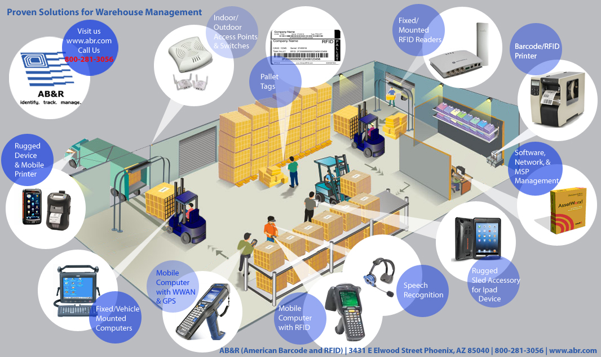

Warehouses and distribution centers are adopting the AIDC in their operations to improve their productivity, and offer a better service to consumers.  This kind of technology significantly decreases labor errors, so its implementation is increasing over time. Come and start learning more about this technology, how it can help your company, and how it can help you boost your market.

 

<title-2>What is Automatic Identification and Data Capture Technology (AIDC) applied to Warehouses</title-2>

 

Automatic identification and data capture are technologies used to organize and manage information from an object, an image, or a sound without the need to enter data manually. This data is stored on a server, and you can access it whenever you want. 

For example. You work with the image, and you acquire a product, if this product is moved to another site, your AIDC will notice and save the information. It is better than a human following. 

That’s why Automatic identification and data capture are so sought after in warehouses and distribution centers (especially for small and medium companies). They are used to manage inventory, delivery, goods, security, and documents. AIDC compliments human work, and it’s a more precise way to manage all information about the warehouse.  

AIDC applications usually fall into one of the following categories: identification and validation at the source, tracking, and interfaces with other systems. Technologies used, the information obtained, and the purpose of collection widely. 

 

 

<title-2>Some AIDC Technologies</title-2>

 

There are:

 

<title-3>Barcodes:</title-3>

 

Barcodes are images of lines or bars with spaces between them. These are usually attached to product items in stores, ID cards, and mail to identify a particular product number, person, or location.  This technology works thanks to a bar reader which uses a laser beam that is sensitive to line and thickness reflections and spatial variation. Finally, this visual information is transformed into digital data and sent to a computer for processing or storage. 

 

<title-3>RFID (Radio Frequency Identification):</title-3>

 

An antenna and a transceiver (often combined into a single device) and a transponder (the tag). The antenna transmits a signal that activates the transponder, which turns data to the antenna.  Due to RFID not requiring direct contact or in-line scanning, its tags are replacing barcodes in many applications. 

**Low frequency** (LF) RFID technology works with signals between 125 and 134 kHz and is primarily used for access control and short-range applications with potential interference problems. 

**High frequency** (HF) RFID technology operates in the 13.56 MHz band and is used in applications where both operating speed and maximum read distances are medium-range and balance out some interference problems. 

**Ultra-high frequency** (UHF) RFID technology operates between 850 and 950 MHz, allowing the highest processing speeds and the longest coverage distances.

 

<title-3>Biometrics:</title-3>

 
  
Biometric technologies use physical characteristics, such as the tone of voice or the shape of the hand, to identify people automatically.
 
Behaviors, such as writing style. Biometric systems consist of a reader or scanning device, a computer program that converts the scanned biological data into a digital format and compares the points of the match, and a database that stores the biometric data for comparison.  

Specific AIDC biometric technologies include finger scanning, electro-optical fingerprint recognition, finger vein identification, and voice recognition.  

 

<title-3>Optical Character Recognition (OCR):</title-3>

 

It is the recognition of text characters printed or written by a computer. The process includes scanning the text character by character, analyzing the image of the resulting character, and translating that image into a machine-readable character code. 

It is used to scan documents and books, sort mail, and process checks and credit card payments by mail. 

 

<title-3>Magnetic Strips:</title-3>

 
  
The band consists of magnetic iron particles in a plastic strip. Each particle is a small bar magnet. Information is written on the band by magnetizing the tiny bars in the direction of the north or south poles. The writing process, called flux reversal, causes changes in the magnetic field that can be detected by a magnetic stripe reader.

 

<title-3>Smartcards:</title-3>

 

A smart card can store much more data than a magnetic stripe card. It can be loaded with data, used for phone calls, electronic cash payments, access to services, and other applications. 

The card can be refreshed for reuse. Some smart cards can include programming and support multiple applications. 

 

<title-2>Benefits of Automatic Identification and Data Capture</title-2>

 
  
There are some benefits obtained from using AIDC. Some of them:

*Reduces the cost of data entry*

*Prevents errors related to identification and/or data collection*

*Speeds up the process of data collection*

*Facilitates tracking and determining an item’s exact location*

 

<title-2>Automatic Identification and Data Capture Market</title-2>

 
  
The overall IACD market will grow from US$40.1 billion in 2020 to US$80.3 billion in 2025. It is expected to grow at a compound annual growth rate of 14.9% over the period 2020-2025. 

Key factors driving the growth of this market include:

*The growth of the e-commerce industry worldwide

*The increasing use of smartphones for QR code scanning and image recognition

*The increasing adoption of AIDC solutions due to their ability to minimize waiting and transaction time and provide greater convenience to users when making low-value payments.

*The increasing adoption of AIDC solutions by banking and financial institutions to ensure customer security, along with data privacy.

 

<title-3>Some Suppliers of This 2020</title-3>

 
  

**Zebra Technologies**

**Honeywell**

**Datalogic**

**SATO**

**Cognex**

**Toshiba TEC**

You have already seen the different technologies that can be developed from the **AIDC** and how they can be implemented in the warehouses and distribution centers, and some of the most important suppliers of this 2020. AIDC's technologies are undoubtedly changing the way companies work and driving the market to be more efficient.  Try it and share your experience with us. If you need consultation, contact us.  

