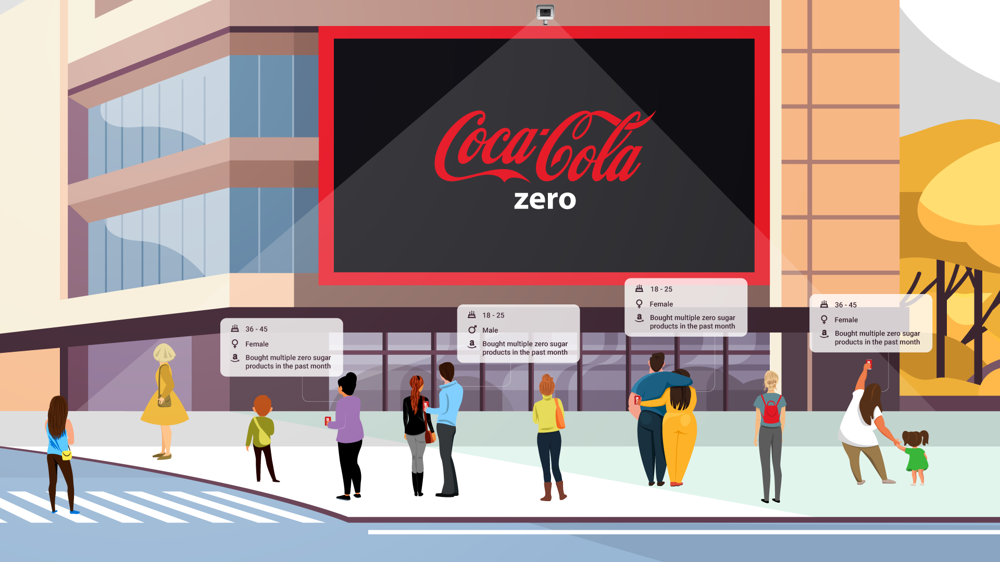

* **Location:** Miami, Florida.    
* **Industry:** Ad Targeting, Advertising, Analytics, Artificial Intelligence, Internet of Things, Big Data.    
* **Founded in:** 2014    
* **Website:** https://www.admobilize.com/    

The internet has certainly revolutionized the way we advertise, and in this new digital landscape with ever-increasing web sites, <a target="_blank" href="https://cobuildlab.com/blog/seo-tips-that-will-increase-your-position-in-search-engines/"> SEO  </a> specialists, social network campaigns, and email marketing it’s no surprise that a growing number of entrepreneurs believe that the future of their company should solely depend on digital marketing.    

This doesn’t mean that <a target="_blank" href="https://www.think-beyond.co.uk/traditional-marketing-techniques/"> traditional marketing has become obsolete  </a>, in fact, the surge of digital media is a great opportunity to look back on it. If we look carefully at digital marketing we realize that the essential concepts of traditional marketing still stand: attraction, seduction, sustained attention and interest for a product or service.    

But, what makes digital marketing so appealing? Unlike traditional venues, the great advantage of it is the possibility of knowing the impact that your marketing plan with strong and reliable metrics: you can tell how many people saw your ad, how many clicked on it, the male/female/else ratio, their ages, their locations or even what they did right after they saw your ad. This is priceless data when it comes to designing increasingly effective marketing plans because you understand how your target audience behaves.    

On the other hand, physical advertisements measure their impact through estimations, and even so, the big brands direct a big chunk of their ad budgets through this channel probably because of their tangibility or maybe because they’re the only way to reach a specific market niche. The truth is that traditional marketing focused on direct sales and there was no way to accurately measure its impact on the target audience… until now.    

<title-3 align="centered"> INTRODUCING AD MOBILIZE </title-3>    

Brazilian <a target="_blank" href="https://www.linkedin.com/in/rodolfosaccoman/"> Rodolfo Saccoman  </a> wanted to impact the world of traditional advertising while having a far more advanced interaction between the physical and digital worlds. Thus, AdMobilize was born with the main task of letting advertisers measure in an exact way how their ad is behaving and affecting its target audience in order to determine their return on investment in traditional marketing.    

Founded in 2014 with the backing of investment funds such as <a target="_blank" href="https://cobuildlab.com/blog/rokk3r/"> Rokker Fuel  </a>,  <a target="_blank" href="https://www.admobilize.com/"> AdMobilize  </a> provides AI for indoor and outdoor advertising. Its software analyzes people, faces, vehicles, crowds and other objects in real-time using a camera.  It includes features to detect or count people and vehicles in real-time.    

<youtube-video id="_zj_51eU-kU"></youtube-video>    

<title-3 align="centered"> HOW DOES IT WORK? </title-3>    

AdMobilize introduced the <a target="_blank" href="https://adage.com/article/digitalnext/rush-beacon-tech-a-plan/292099"> AdBeacon  </a>, the first real-time analytics platform for the physical world.    

The AdBeacon is roughly the size of an iPhone 5 and uses a camera to obtain data from physical spaces. It can gather face metrics such as count, views, attention time, gaze-through rate, gender, age-range, emotion, and direction in order to obtain a detailed analysis of an advertisement’s impact and engagement with the audience.    

Its installation is relatively simple. It requires only a wifi connection and the configuration and set up is made through the AdRemote app, available for Android and iPhone users.  AdMobilize displays results in real-time with cloud-based dashboards, webhooks or API.    

<youtube-video id="IUtRl8HO7Vg"></youtube-video>    

<title-3 align="centered"> IMPACT ON MARKETING </title-3>

<title-6 align="centered"> Source:  <a target="_blank" href="https://medium.com/tpsengage/real-time-data-tps-engage-and-admobilize-partner-to-accelerate-dooh-video-analytics-adoption-925c5d7f07da"> Medium  </a> </title-6>    

Headquartered in Miami and with offices in London, Bogota, and Sao Paulo, <a target="_blank" href="https://www.linkedin.com/company/admobilize/"> AdMobilize  </a> has become the world’s top intelligent platform for outdoor advertising.    

A major contributing factor of its success is its array of analytics and engagement products that are designed to be “Plug and Measure”, enabling <a target="_blank" href="https://medium.com/@rodolfo.saccoman/nothing-beats-real-time-data-period-da329dea235c"> real-time audience analytics </a> analytics and intelligence to be instantly activated at scale on any software/hardware platform. AdMobilize offers the industry’s most complete and accurate analytics/engagement solution for digital signage, <a target="_blank" href="https://www.tamoco.com/blog/out-of-home-advertising-ooh/"> OOH  </a>, <a target="_blank" href="https://blog.bannerflow.com/digital-out-of-home-dooh-advertising-trends-2020/"> DOOH  </a>, retail, live events, small business, malls, restaurants, and much more. It also is the industry’s only fully anonymous solution.     

<block-quote>“We see the physical world as a giant webpage. Our technology enables clients to make sense of this space.” Rodolfo Saccoman, AdMobilize’s CEO and founder.</block-quote>    

* AdMobilize tech is currently used by some of Forbes most valued brands like Coca-Cola, <a target="_blank" href="https://www.linkedin.com/posts/admobilize_beautiful-prime-nike-store-front-this-is-activity-6603738890098532352-oH_g"> Nike  </a>, Reebok, HBO, Chanel, or McDonald’s and also hundreds of OOH partners in more than 80 countries around the world.    

* On June 8th, 2020 <a target="_blank" href="https://www.backlitemedia.com/"> BackLite Media  </a> announced that will now offer clients <a target="_blank" href="https://www.digitalsignageconnection.com/backlite-media-partners-with-admobilize-to-offer-clients-measurable-insight-into-cinema-advertising-at-novo-and-roxy-cinemas"> measurable insight into Cine Advertising  </a> by partnering up with AdMobilize. "This is a real game-changer for cinema advertising, powered by creativity and technology as its core offerings" said Rodolfo Saccoman, AdMobilize’s CEO and founder.     

* <a target="_blank" href="https://www.linkedin.com/company/11437508/?lipi=urn%3Ali%3Apage%3Acompanies_company_index%3B5uwfFF3MTEaV2JK7AjMRDA%3D%3D"> Exterion Media France  </a> also uses AdMobilize’s vehicle recognition technology to anonymously <a target="_blank" href="https://www.exterionmedia.com/fr/groupe/actualites/nos-actus/imob"> measure traffic affluence  </a> in hundreds of locations inside the center of Paris.    

It seems that by 2025 we will have compliant video analytics on any relevant digital billboard around the world. Thank you so much for reading! 
