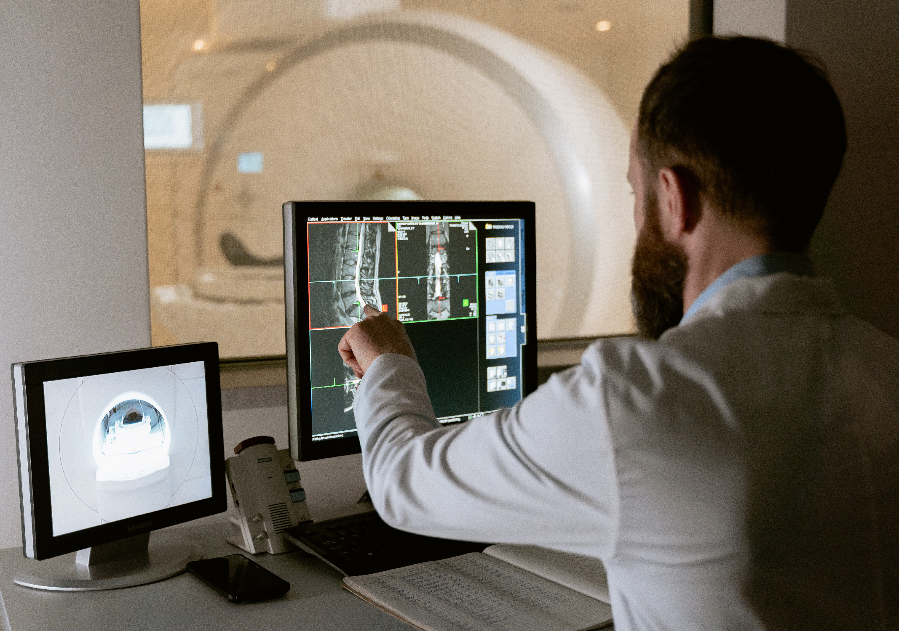
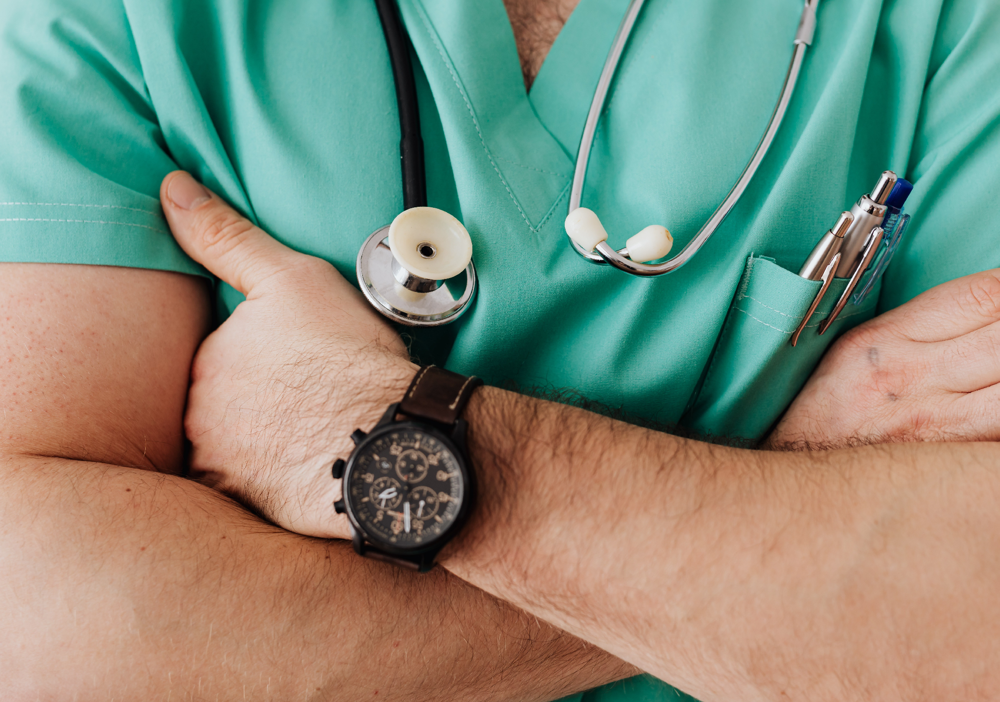

Miami, FL. Dec 20, 2021.

<a target="_blank" href="https://www.cobuildlab.com/blog/healthcare-apps-present-and-future/">   Health </a> is a subject that never goes away, and never will. Just like technology, its advances, discoveries, and innovative ways to use it to our advantage. 

In the specific case of <a target="_blank" href="https://www.cobuildlab.com/services/artificial-intelligence-development">   artificial intelligence </a>, it simplifies the lives of patients, doctors and hospital administrators by performing tasks that are usually done by humans, but in less time and at a fraction of the cost.    

<block-quote>"The only limit to AI is the human imagination." Chris Duffey</block-quote>    

<a target="_blank" href="https://www.cobuildlab.com/blog/the-5-greatest-ai-trends-for-2022/">   Artificial Intelligence (AI) </a> has been around since 1956, but it was not until the 1970s that AI for health made its breakthrough with Mycin, an expert system aimed at detecting infectious blood diseases. Mycin had the ability to "reason" by communicating in natural language with the user and to prescribe medications in a personalized way for each patient.

Today, AI is shorthand for any task that a computer/robot can perform as well, if not better, than humans. But when we think about the application of AI in medicine, we must consider different types of computational intelligence.

<a target="_blank" href="https://www.cobuildlab.com/blog/How-Can-a-Mobile-or-Web-App-Help-Improve-the-Healthcare-Industry/">   Ai for health </a> has countless applications and it´s reinventing and reinvigorating healthcare through machines that can predict, understand, learn and act upon that knowledge. Whether it’s being used to discover links between genetic codes, to power surgical robots or even to maximize hospital efficiency, AI has been a boon to the healthcare industry.

<a target="_blank" href="https://www.microsoft.com/en-us/ai/ai-for-health">   Microsoft </a> is expanding on its existing AI for Good initiative by launching the AI for Health program. AI for Health empowers researchers and organizations with AI to advance the health of people and communities around the world.

<youtube-video id="https://www.youtube.com/watch?v=ii-FfE-7C-k"></youtube-video>

<title-3 align="centered">6 applications of artificial intelligence to reduce medical diagnostic errors</title-3>

    

Incomplete medical histories and large caseloads can lead to deadly human errors. Immune to those variables, <a target="_blank" href="https://www.cobuildlab.com/blog/Artificial-Intelligence-What-is-it/">   AI </a> can predict and diagnose disease at a faster rate than most medical professionals.    

<b><title-4>1. <a target="_blank" href="https://www.pathai.com/">   PathAI</a>:</title-4></b> It provides a more accurate Cancer diagnosis with Ai. From Cambridge, Massachusetts, PathAi is developing machine learning technology to assist pathologists in making more accurate diagnoses. It has worked with drug developers like Bristol-Myers Squibb and organizations like the Bill & Melinda Gates Foundation to expand its AI technology into other healthcare industries. 

The company's current goals include reducing error in cancer diagnosis and developing methods for individualized medical treatment.    

<b><title-4>2. <a target="_blank" href="https://www.buoyhealth.com/">   Buoy Health</a>:</title-4></b> An intelligent symptom checker. From Boston, Massachusetts, Buoy Health is an AI-based symptom and cure checker that uses algorithms to diagnose and treat illness. 

The Harvard Medical School is just one of the many hospitals and healthcare providers that uses Buoy’s AI to help diagnose and treat patients more quickly.

A chatbot listens to a patient’s symptoms and health concerns, then guides that patient to the correct care based on its diagnosis.    

<b><title-4>3. <a target="_blank" href="https://www.enlitic.com/">   Enlitic</a>:</title-4></b> Ai deep learning for actionable insights. From San Francisco, California, Enlitic develops deep learning medical tools to streamline radiology diagnoses. The company’s deep learning platform analyzes unstructured medical data. just like:

- Radiology images
- Blood tests
- EKGs
- Genomics
- Patient medical history

All of this in order to give doctors better insight into a patient’s real-time needs.

<b>Curious fact:</b> MIT named Enlitic the 5th smartest artificial intelligence company in the world, ranking above Facebook and Microsoft.    

<b><title-4>4. <a target="_blank" href="https://www.freenome.com/">   Freenome</a>:</title-4></b> Earlier Cancer detection with Ai. From San Francisco, California, Freenome uses AI in screenings, diagnostic tests, and blood work to test for cancer. By deploying AI at general screenings, Freenome aims to detect cancer in its earliest stages and subsequently develop new treatments.    

<b><title-4>5. <a target="_blank" href="https://www.bidmc.org/">   Beth Israel Deaconess Medical Center</a>:</title-4></b> Diagnosing deadly blood diseases faster. From Boston, Massachusetts, Harvard University’s teaching hospital, Beth Israel Deaconess Medical Center, is using artificial intelligence to diagnose potentially deadly blood diseases at a very early stage.

Doctors are using AI-enhanced microscopes to look for harmful bacteria (such as E. coli and staphylococcus) in blood samples at a much faster rate than manual scanning allows. 

The scientists loaded about 25,000 images of blood samples to teach the machines to identify and predict harmful bacteria. The machines were 95% accurate in detecting harmful bacteria.    

<b><title-4>6. <a target="_blank" href="https://www.nanox.vision/ai">   Zebra Medical Vision</a>:</title-4></b> Ai-powered radiology assistant. From Shefayim, Israel, Zebra Medical Vision provides radiologists with an artificially intelligent assistant that receives image scans and automatically analyzes them for various clinical findings that it has studied.

The findings are transmitted to radiologists, who take the assistant's reports into account when making a diagnosis.

    

One of the biggest problems that the health sector has to face is the incorrect or late diagnosis, which is why the use of technological tools is becoming more common and more demanded for the benefit of patients. 

By introducing technology into genetics, pathology and other important diagnostic fields, healthcare technology companies have helped detect deadly diseases such as cancer earlier and more accurately than by relying on humans alone.

<a target="_blank" href="https://www.cobuildlab.com/blog/carecloud/">   Ai for health </a> can be applied in many different ways in healthcare, summarized as follows:

<b>- Algorithmic solutions:</b> When humans integrate known data into algorithms, computers can extract information and apply it to a problem.

<b>- Image processing:</b> Visual pattern recognition software, which can store and compare tens of thousands of images using the same heuristic techniques as humans, is estimated to be 5% to 10% more accurate than the average doctor.

<b>- Medical practice support tools:</b> Involves the use of computers to observe and learn from doctors in their routine performance. One example is Natural Language Processing, a branch of AI that helps machines understand and interpret human speech and writing.    

<b><title-2 align="centered">Disease diagnosis and treatment have been at the core of Ai for health for the past 50 years</title-2></b>    

Most AI technologies have great relevance in healthcare, but the tactics they support can vary significantly.

Being able to predict which treatment procedures are most likely to be successful with patients based on their constitution and treatment setting is a major breakthrough for many healthcare organizations.

The biggest challenge for AI in healthcare is not whether the technologies will be capable enough to be useful, but ensuring their adoption in everyday clinical practice.

Over time, clinicians may migrate toward tasks that require uniquely human skills, tasks that require the highest level of cognitive function. Perhaps the only healthcare professionals who will miss out on the full potential of AI for heath are those who refuse to work with it.

Resistance to change is just a delay. With artificial intelligence and custom <a target="_blank" href="https://www.cobuildlab.com/services/custom-software-development">   software </a> development, the future has become our everyday. 

Let's take your project to the next level. 

<b>Cobuild Lab Team</b>  

