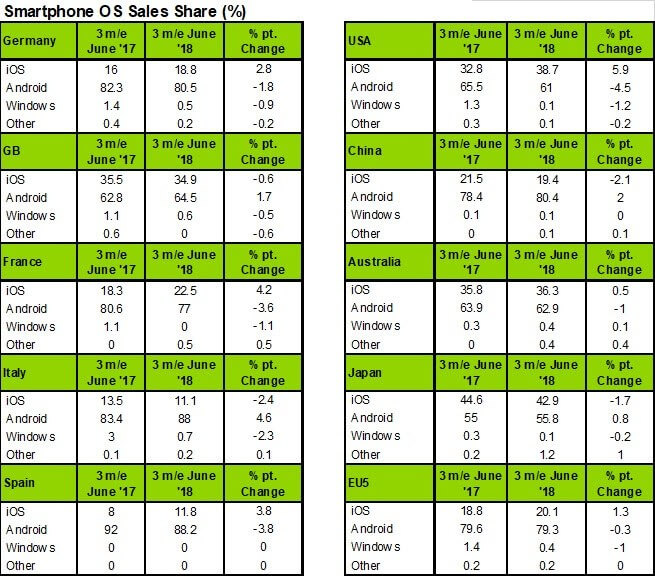

Android came to stay in our life. In some countries, it is most common than others, but as the undeniable reality it is that is one of the more important OS in the world. Actually, it is at the top of the market from the hand of Apple with iOS. 

Some statistics show that Android is a little higher os iOS if we consider the hall world. So, developing an Android App can make your business dreams come true, but you have to be sure of doing it in the right way.

Source: [TechSpot](https://www.techspot.com/news/75658-iphone-sales-help-ios-grow-us-market-share.html)

Next, we will tell you how to do it and, in addition, we will show you information that supports Android Apps development as the best way to succeed.

<title-2>Android App: what is it and where did they come from?</title-2>

The first time Android was on the market was in 2005. [Android Inc](https://www.techradar.com/news/phone-and-communications/mobile-phones/a-complete-history-of-android-470327) was responsible for that. But in 2007 this company was bought for Google and changed it in many aspects. 

They converted it in an OS based on Linux Kernel which is for tactile devices as smartphones and tablets. 

From there they take the first place in the market until now.

In a few words, Android is an OS open source which includes proprietary software also. It is based on Linux and Google is behind this revolutionary technology. 

This OS support apps that they created and also from others. They found a store called Play Store where people offer apps to users or customers. It works like a market. This market is the one you have to take position offering a good app. 

<title-3>How could be your Android App?</title-3>

We think the most important thing to develop nicely an Android App it’s first to select a technology and programming language. For this reason, we will tell you some options you have when it is developing one. 

* Native, hybrid or Cross-platform Apps

An **App is native** when it has developed specifically for an OS taking its native programming language, framework, and technologies. 

For example, if we select Android how our OS, the native app need to be Java, Kotlin or C++. 

The benefit of this kind of app is they bring a better customer experience because they were created for adapting perfectly with device functions and characteristic.  

Native apps are amazing, but you have to know it: they are more expensive in resources, especially if you plan to expand it to other platforms. In this case, you will have to create it again using the native language of the other platform. 

Let’s go back to the previous example. You achieve an app for Android, you get enough success and you decide to make a version for iOS. In this case, you will have to create it using Swift or Objective C. But remember, your app is going to have a perfect performance in each platform. 

On the other hand, **hybrid apps** are a combination of technologies like HTML, Javascript, CSS, and other technologies for the web. They are not web apps, they are mobile, and they can be used in all platforms you choose because they can adapt it to every platform. 

Most of the tools for creating hybrid apps, use something called a WebView, that is basically an embedded browser that looks like an App, where the application has access to some of the functionalities of the underlying OS.

It is a fast and efficient way to build an App for both systems, a good example of this technologies, and probably the most popular is the [Ionic Framework](https://ionicframework.com/).

In **Cross-Platform Apps**, we will find tools like React Native, Xamarin, and Native Script. In this kind of apps you use the same language to create one app version, we mean, iOS and Android version, but the difference with the last it is you don’t need a web view, neither HTML or CSS.

Taking again our example, you can reuse the code for Android to create an iOS’s version of your App, but you won’t use a web view because it is on a native container and it uses native tools, but they also work for other platforms. So, this kind of app offers you the same performance of a native app but is less expensive thanks to the code reused.

<title-2>Steps you have to follow for developing an Android App</title-2>

If you got al this point it is because you are seriously thinking on change your life making an App for Android. For that reason, we make a list with some steps for doing it correctly. So, let’s go: 

1. First of all, define your idea. Work in her, perfect it and make it clear before the start. 
2. Study the market, the competition, potential customers, necessities, and find something that makes you special or different from the others. 
3. Make a mockup. Write in a paper or digital tool how it will work and how it will interact with customers. 
4. Think in a business model, especially how will be your income. This is important doing before designing and developing the app.
5. Define and put together everything you have thought before. The idea, monetization, design, reach, functionality and every app’s detail you thought.
6. Find a team if you don’t know how to develop correctly the app for Android. We can help you at this point.
7. Take a decision about technology, kind of app, tools, languages, framework, and everything we said some lines before. 
8. Design how it will look the interface of the Android App. The “Look and Feel”
9. You can make a prototype a probe it making tests.
10. Define how you will handle the logic of your App, 1) it would be stored locally on the phone, 2) You will create an API and services, 3) You will use some serverless technology like [8base](https://www.8base.com/) o [firebase](https://firebase.google.com/).
11. Look for a tester again if you want to be sure of functionality. 
12. Getting better every detail. 
13. Optimize the app.
14. Make it public in the Google Play Store.

<title-4>Facts about Android Apps in the world</title-4>

How we said in the last post, Android has a little more acceptance of iOS in the world, excluding the United States. 

This is important to know it because it will give you the opportunity to evaluate your app viability. 

Europe, Asia, and Latin America are Android territories. So, if you are thinking in this countries as markets, let’s go and develop an Android App focusing on this steps and choosing the best team to achieve the best app possible. 

An **Android App** can take you to happiness? The answer is yes, as long as you make it in a better way. It is time to do it!

