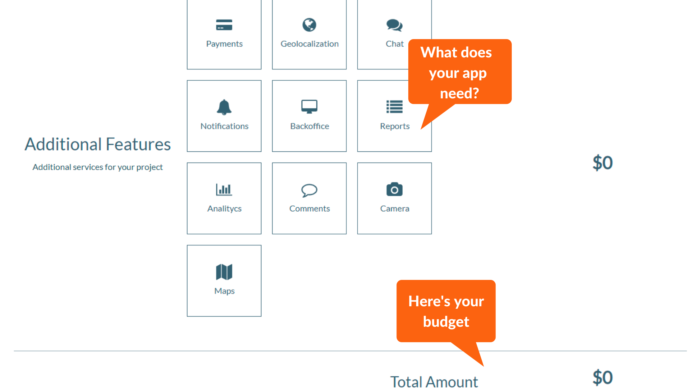

There are all kinds of apps out there: news, games, social networks, cabs, sports, languages, enterprise-focused, or even for dating, you name it, there must be an app for what you need. Apps have become an extension of us as well as our cell phones or tablets, they are tools that we use every day, even on our computers and laptops.    

In previous posts, we have explained in detail what an app is, its functions, and the different types of apps that can be built. If we go to any app store, we will get an infinite range to choose from, and in such a growing market in which a good idea can be a business that depends on its success, it can be a great success or an absolute failure.    

Whether you are an entrepreneur with a groundbreaking idea or a consolidated company looking to optimize processes with a bit of technology, the question circulating in your mind is the same: How much does it cost to make an app? Even though determining the price to develop an app is not exactly a piece of cake, we'll chuck it into bite-size pieces for a better understanding since it’s a very rigorous process.    

* **Hourly Rate of the Programmer**

It is important to find the person or company that best suits your needs, expectations, and budget. The price varies depending on whether you hire a freelancer programmer or partner with a software development company like Cobuild Lab. The reality is that hiring a good programming team will be a bit more expensive and cost-effective in the long run.    

* **Internet Data Access**

This feature will have a significant impact on the final price of your App, depending on the specific task it will perform, whether it is simply connecting to servers to perform searches, or updating your information in real-time, displaying specific results, among others.    

* **Geo-location of the user**

There are many advantages of having geolocation, we see it in applications such as Instagram, WhatsApp, Uber, and more. It can show you from the nearest ice cream store to the shortest route to your cargo.    

* **The App Content Manager**

The price is going to vary depending on whether the content is static or can be dynamically updated. In this case, the content manager or CMS is basic. For the dynamic contents, we can use a content manager integrated into the App, or we can create a custom manager to modify the contents of the application when it is more convenient, this means a higher price of course.    

* **Registration of users in the application**

This may affect the final cost of the app since it will depend on the size of the database and the type of data accumulated.    

* **Sending Notifications**

The type of notifications should be taken into account, the development team should evaluate if it is necessary to create a notification management interface or if it should be integrated with an existing system.     

* **Download platforms**

You must consider the number of platforms where the app will be accessible. The main operating systems are Android and iOS.    

* **Integration with other systems**

It is usually a costly process due to the level of technicality required, since it can be complicated to integrate the app with existing systems in the company, such as databases, user, and content management, among others.    

* **Augmented reality**

Products such as games, digital catalogs, and other products need to show a 3D image and require a higher level of development, which will increase the cost of your app.   

* **App design**

UX/UI design is a very important part of the development of any software product. This is where the price varies, since it is not the same as a banking platform with a fairly simple design to develop a game with the best graphics and augmented reality.    

* **The complexity of the application**

This is an important point that will affect your budget, an app for example a calendar is very simple to make, but a game takes thousands of hours of work. We have then four categories:    

**1. Simple Apps**

These applications generate limited amounts of analytical data, connect to an API to retrieve data, and have a fairly simple design. 

<title-6 align="centered">News Mobile App developed by Cobuild Lab     

**2. Complex Apps**

These types of apps need a lot of development and design work, usually requiring a whole team to build them. They connect to at least one API, usually use location data, can offer shopping or have a shopping cart within the app as well as have the function of providing their users with a profile to navigate the app. Requires many more hours of development and costs are higher.

<title-6 align="centered"> Art Management System developed by Cobuild Lab    

**3.  Large Enterprise apps**

They usually require a large team of experienced developers and designers. Enterprise applications are usually quite expensive. They require a long list of features such as creating a profile for each user, with more than 10 screens with characteristic layouts and various functions, must collect massive amounts of analytical data, and connect to various APIs. They usually require a robust web-based user management console for administrators and their price range can climb above $500,000.

<title-6 align="centered"> Massone Mechanicals Web and Mobile app developed by Cobuild Lab    

**4. Gaming apps**

They need a project manager and more than one development team, multiple designers, specialized and experienced programmers. They can connect to multiple APIs, create user profiles, synchronize with the web platform, allow in-app purchases, many other additional features, and an important infrastructure that makes this type of app the most expensive with prices that can rise above $700,000.

<title-6 align="centered"> Call of Duty Mobile developed by: <a target="_blank" href="https://www.activision.com/">  Activision </a>   

<title-2 align="centered"> Check out our Price Calculator  </title-2>

At <a target="_blank" href="https://cobuildlab.com/"> Cobuild Lab</a>, we partner with Industry Experts to solve Logistical and Productivity problems with Custom Software Solutions, Artificial Intelligence, Cloud Computing and IoT.  Since 2012 we've focused on developing and combining cutting-edge techniques, tools, and technologies to increase development speed to deliver faster results

Our <a target="_blank" href="https://cobuildlab.com/price-calculator/">  price calculator</a> can give you an insight into how much would it cost to build an app, Check it out!

<title-4 align="centered"> Step 1 </title-4>
    

<title-4 align="centered"> Step 2 </title-4>
    

<title-4 align="centered"> Step 3 </title-4>
    

Got an idea for a web or mobile app? Let’s build it! E-mail us at contact@cobuildlab.com and get a FREE online consultation. 

