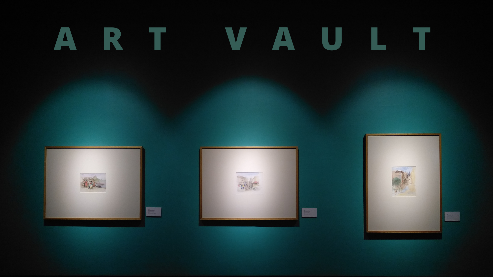

Miami, FL. Nov 23, 2020 - Miami's cultural fusion can be appreciated in all its forms: music, cuisine, traditions... and especially, art & events. Since the city is home to many entertainment venues, theaters, museums, parks, and performing arts centers, is no wonder that people feel like it’s an art lover’s paradise. The founder of 305 Creative, <a target="_blank" href="https://www.linkedin.com/in/kerrymclaney//"> Kerry McLaney</a>, would agree with us on that for sure since she gave us a challenge that we couldn’t refuse.    

With over 20+ years of experience in art, design, and photography, <a target="_blank" href="https://www.linkedin.com/in/kerrymclaney//"> Kerry McLaney</a> is definitely an art lover and an active member of South Florida’s cultural scene and now she is looking to support the new artists in ‘Magic City’ as it’s also known. In a recent <a target="_blank" href="https://miamigirls.org/miamigirls/kerry-mclaney//"> interview with Miamigirls.org</a>, she was asked “why Miami?” and with a simple but very accurate answer leaves us amazed to just say "it's paradise".  Well, we cannot agree more with her, it really is paradise.    

She is the founder of 305 Creative Group, working and consulting with companies and artists in designing brand identities and experiences. This is exactly why she reached to Cobuild Lab’s team to start developing a new platform that allows her to close the gap between artists and buyers.     

<title-4 align="centered"> WE INTRODUCE YOU ART VAULT </title-4>

    

<a target="_blank" href="https://artvault.app/"> Art Vault</a> is a web platform that helps artists keep track of the purchasing of their pieces. Artists can create their profile and use the app as an online inventory of their pieces, display them, and keep track of sales, either weekly, monthly, or year-round. We talked to <a target="_blank" href="https://cobuildlab.com/blog/congratulations-to-jacqueline-popovich-cobuild-lab-new-product-manager/"> Jacqueline Popovich</a>, our Product Manager, who told us more about the challenges faced by the development team during the construction of this <a target="_blank" href="https://cobuildlab.com/blog/software-development-for-new-products/"> Software Product</a>.      

**Q: What is most distinctive about Art Vault?**

*“The main feature of this web application is that it's very easy to use. From the beginning of the development process having a very intuitive and simple interface was the most important, and that makes no visual clutter. This is why we decided to use a minimalist approach when it comes to web design, to emphasize what truly matters: the artists and their creations”.*    

**Q: What were the biggest challenges you faced during the development process?**

*“The development process was very smooth and efficien, the real challenge came at the time of choosing the final design for the platform, since we already had a design planned for this app and since the development was quite advanced, the changes affected the work done earlier. But its was all for the better.*

 *We then decided going for a much more minimalist design, black and white backgrounds with enough free space to avoid creating visual clutter by using subtle line elements, instead using good size texts with a typography that breathes elegance, simplicity and modernism”.*    
 
 
 
 <title-6 align="centered"> Photo: <a target="_blank" href="https://www.linkedin.com/in/alacret/"> Angel Lacret</a>, Chief of Product Development and <a target="_blank" href="https://www.linkedin.com/in/jacqueline-popovich/"> Jacqueline Popovich</a>, Product Manager </title-6>    
 
 
 **Q: What is the feature that users will appreciate the most?**

*“One thing users will definitely appreciate is how easy it is to use. The interface is designed to make the purchase process extremely simple and intuitive, once the user logs into the platform they can jump to the artist's profile where they can see their education and work experience as well, they can visualize their inventory and buy a piece of their choice in a nutshell”.*    

Once again we can appreciate how the <a target="_blank" href="https://cobuildlab.com/blog/what-is-digital-transformation-and-how-can-small-businesses-take-advantage-of-it-this-2020/amp//"> Digital Transformation</a> is reaching all areas changing the way we live and operate. During pandemic times when most art galleries are closed, Art Vault is stepping up to take advantage of technology to keep empowering talented artists and creators. Thank you so much for reading and stay safe!     

<title-5 align="left"> CompetitiveAdvantage Cobuild Lab </title-5>

At <a target="_blank" href="https://cobuildlab.com/">  Cobuild Lab</a>, we’ve been helping business owners, CEO's, COO’s and IT leaders get past the techno-speak and help them take a business process and turn it into a custom software solution, whether they need design and build services, technical assistance, or are looking to augment their existing team with experienced agile developers. Since 2012 we've focused on developing and combining cutting-edge techniques, tools, and technologies to increase development speed to deliver faster results.    

<youtube-video id="5fbYxQNgJ7s&"></youtube-video>     

Got an idea for a web or mobile app? Let’s build it! Check out our <a target="_blank" href="https://cobuildlab.com/price-calculator/">  price calculator</a> to have an estimate of the cost of your project or email us at contact@cobuildlab.com and get a FREE online consultation. 

