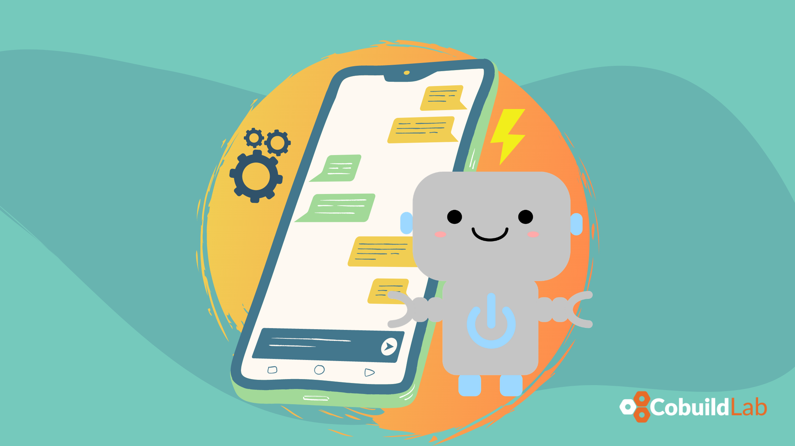

Talking about artificial intelligence still feels a bit futuristic, perhaps because of the way it's been depicted in movies and because of the connotation that was given to it when it began to be a subject of study.

However, it is no longer a matter of the future, it is a very tangible reality we live with on a daily basis. For example, when we want to see a movie at home and we see the recommendations by affinity or when we look for a plane ticket and then we receive recommendations for accommodation, car rental and everything we need to make the most of in the destination city.

And yes, it is possible to do all that with artificial intelligence. But it is not only useful in the entertainment or tourism industry. If you are interested in improving the customer experience in your company (regardless of your business sector), in this article we will tell you how to do it with the help of technology.    

<title-4 align="left">  Integrating chatbots in customer service </title-4>

Your customer is very close to the heart of your business, so if they’re unsatisfied, it’s fundamental to look for ways to better serve their needs. When it comes to automation, customer service is the best place to start.

The chatbots’ objective is to replace human-to-human interaction, and it’s quite a thing to consider that your highly valued customer will interact with an AI rather than a human being.    

<title-4 align="left">  What are the benefits of an artificial intelligence chatbot? </title-4>

A chatbot is a program through which people can interact with technology in different ways: text, voice, gestures, and touch, among others. It is characterized by its wide availability 365 days a year, 7 days a week, and 24 hours a day.

The functions it can perform will vary depending on the type of chatbot and its capabilities.

For example, they range from answering frequently asked questions, capturing data, or conducting simple transactions to generating almost human conversational experiences, remembering preferences, giving advice, helping to solve situations, and suggesting related products that improve the customer experience and increase the value of their purchase.

A successful Chatbot implementation will provide your customer with fast, intuitive, and convenient attention. This represents benefits for the client and for the company. To the client, it provides a personalized and relevant experience, while to the company it offers a set of data about its clients so that it can better understand their needs.    

<title-3 align="centered">  8 benefits of an artificial intelligence chatbot   </title-3>    
    

Artificial Intelligence is a powerful tool to generate value and improve the customer experience in your company's online chat. These are the main benefits:

⚫️ **Immediacy in response**
Most consumers expect real-time support, regardless of the customer service channel they use. In accordance with current customer expectations in terms of channels, availability, and response times, chatbots become a highly relevant tool in the customer experience.

⚫️ **Sales conversion**
The chat with artificial intelligence performs an accompaniment and leads the purchase process, promoting sales conversion and motivating cross-selling through the suggestion of complementary or purchase-related products.

⚫️ **Decrease in costs**
By automating processes, you increase productivity, the rate of first contact resolution, and other indicators that can reduce costs.

⚫️ **Leveraging staff skills and time**
Freeing up staff time, automating repetitive activities, allows exploring or deepening analytical, creative activities or the same service activities, but with a focus on qualified clients.

⚫️ **Reach through new channels**
It represents opportunities for new sales channels and interaction with the customer, in an automated way and without the need for a large investment in terms of staff availability for its implementation.

⚫️ **Increase in loyalty and commitment**
Improving the customer experience can help improve the loyalty indicator. Transforming the user experience can bring benefits reflected in higher profits, more loyal customers, and more engaged employees.

⚫️ **Availability**
Most online customers expect a rapid response and help in five minutes. The chatbot is a very important tool because it allows you to offer total availability. Attention 365 days a year, 7 days a week, and 24 hours a day, regardless of the physical location of the client or the device through which they establish contact.

⚫️ **Understanding of customer needs**
An online chat with artificial intelligence provides highly useful information for the company when it comes to understanding the needs of its customers. Information that allows companies to improve their current processes and products, create new products, expand channels, identify trends and, in general, make decisions that improve the customer experience.

Once we've looked at all these benefits, it's easy to understand those customer service companies that incorporate Artificial Intelligence into their multichannel customer contact platform will greatly increase their operational efficiency. To join the ranks of these companies and receive great benefits that'll help transform your organization, you can count on Cobuild Lab.    

<title-4 align="left"> About Cobuild Lab </title-4>

We partner with Industry Experts to solve Logistical and Productivity problems with Custom Software Solutions, Artificial Intelligence, and IoT.  Since 2012 we've focused on developing and combining cutting-edge techniques, tools, and technologies to increase development speed to deliver faster results

<youtube-video id="5fbYxQNgJ7s&"></youtube-video>     

Got an idea for a web or mobile app? Let’s build it! Check out our <a target="_blank" href="https://cobuildlab.com/price-calculator/">  price calculator</a> to have an estimate of the cost of your project or email us at contact@cobuildlab.com and get a FREE online consultation. 

