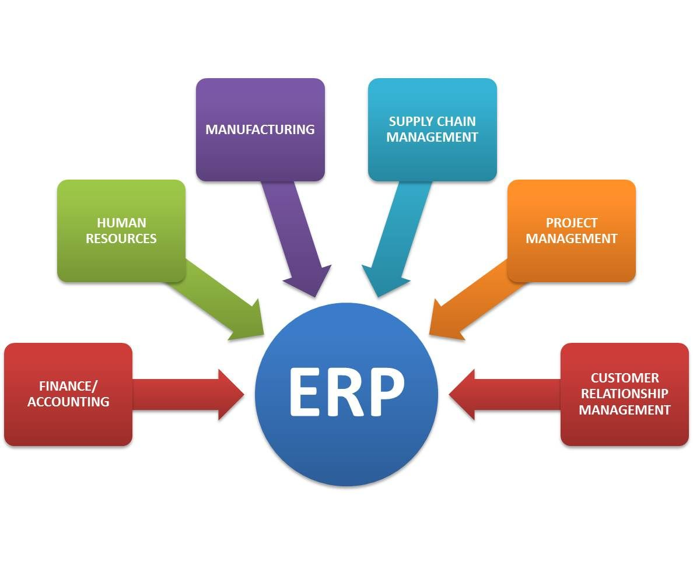

While real artificial intelligence hasn’t truly been achieved yet, businesses are taking advantage of intelligent automation, like machine learning, to improve business operations, drive innovation, and improve the customer experience.

**AI** and automation are transforming the business environment in all industries, offering new opportunities through intelligent and automated products. Some companies are ahead of the curve, and others are stagnating in their adoption of the technology. Board members and decision-makers are increasingly aware of the benefits of AI and automation, but the question should always remain: ‘Is it right for my business? How does it solve a problem?.

With the general rise of this technology into business operations also comes challenges, dangers, and potential risks to the human workforce. This feature will examine all these aspects and hope to give an overall look at AI and automation in the enterprise.

<title-2>First, What is AI?</title-2>

Artificial intelligence (AI) is effectively a term to describe processes of intelligent automation, like machine learning, natural language processing (NLP), cognitive computing, and deep learning. 

True AI is when a computer or robot can think and act as a human brain would. At the moment, companies are using autonomous processes to improve operations, and change the face of customer service (through, for example, AI-powered chatbots), while spurring innovation to new heights. AI is a set of algorithms that can solve a specific set of problems — and it works best with a large amount of big quality data.

<title-2>The market of AI in the enterprise software</title-2>

