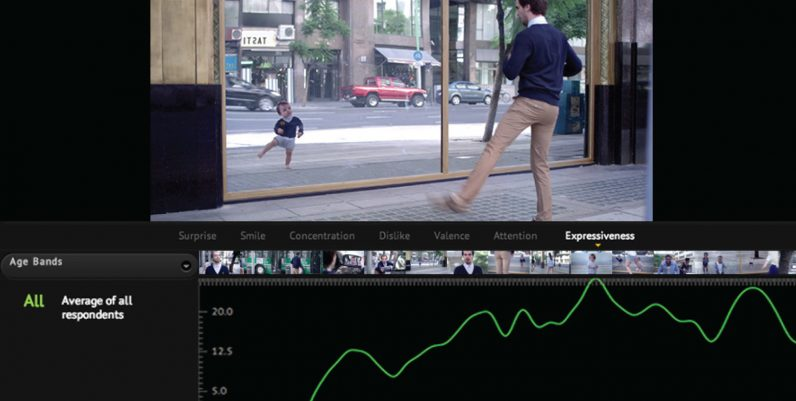
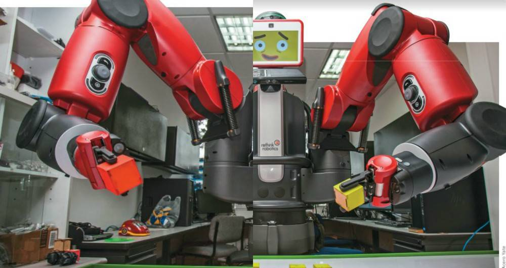
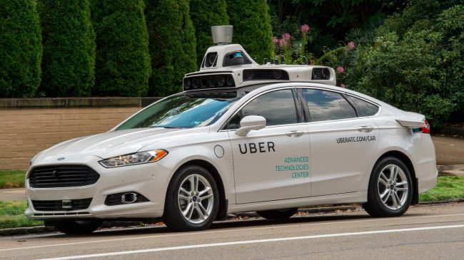

The year is ending, and a good way to say goodbye is remembering amazing things that happened from the beginning. One of them was the interesting advances in **artificial intelligence in 2018.**

Artificial intelligence is a simulation of human intelligence made from machines or systems. How can they do it? Doing three basic actions: learning, reasoning, and self-correcting. This is the basic method of human intelligence. 

This kind of technology exists since some years ago but in this 2018 it has been more popular and needed in some cases. 

<title-2>Artificial intelligence: facts</title-2>

Scientists created three methods: deep learning, artificial intuition, and machine learning. 

Before 2018 these three methods were separated but this year scientists of artificial intelligence worked hard to put them together and create powerful machines that have meta-learning. 

But, what meta-learning is? Meta-learning is a subfield of machine learning where automatic learning algorithms are applied to metadata about machine learning experiments.

Source:[Wikipedia](https://en.wikipedia.org/wiki/Meta_learning_(computer_science))

Meta-learning is a way of getting a knowledge and use different resources to perfection it. It works like a method of human learning, but doing it by a machine. 

That’s why we see the first commercial done by Watson, an IBM’s machine. This artificial intelligence was able to develop creativity. It wrote a script for a promotional video of the Lexus car. 

And that wasn’t all, this machine works from the hand of Kevin Mcdonald. A famous director of Hollywood, winner of an Oscar who decided to respect the whole script made for Watson and not change it. 

Awesome right? You can see it here.

<youtube-video id="BhKw71AeOg4"></youtube-video>

This pattern on meta-learning not only has been applied for audiovisual commercials, but also artificial intelligence on meta-learning has been used for video games, and that’s why on [AlphaGO a machine win a game to the best gamer in the world.](https://www.theregister.co.uk/2017/05/25/alphago_defeats_best_go_player_first_round/)

This fact was new in the whole world and some people felt afraid of that because an artificial intelligence overcame human intelligence at least on this video game. Are you afraid too? 

Artificial intelligence is so developed on this 2018 that can detect your emotions. 

An example of that is [Affectiva](https://www.affectiva.com/). A technology measure emotion through sensing and analyzing facial expressions, and nowadays they are working to get better this technology and achieve the emotion detection through human speech.

Source: [the next web](https://thenextweb.com/artificial-intelligence/2018/07/05/companies-work-ai-technology/)

AI is on education also, that's why we find some robots that educate interacting with students and professors. IBM was one of the pioneers in this creating teachers’ assistant as this robot that teaches in Javeriana University.

Source: [Semana](https://www.semana.com/educacion/articulo/el-uso-de-la-inteligencia-artificial-en-la-educacion/578735)

Robots in 2018 saved lives too. This thanks to artificial intelligence capable to predict, diagnostic and to be easier all processes during a patient disease. An example of that is [Cloudera](https://www.cloudera.com/) a bot that we can show you in the next video.

<youtube-video id="ePzDw13jnjY"></youtube-video>

In the same branch, we can find other AI called [H2O.ai](https://www.h2o.ai/healthcare/)  which is an open source artificial intelligence that works with the healthcare. How does it work? Well, it gives a number of scenarios including managing claims, detecting fraud, improving clinical workflows, and predicting hospital-acquired infections for assisting doctors, nurses, and hospital employees.

<youtube-video id="zTwLETwEyro"></youtube-video>

By last, we wouldn’t stop talking about [Boston Dynamic](https://www.bostondynamics.com/). This American company is specialized in robotic. They create amazing robots for many purposes, and they will help you or many people in the world to do industrial activities as the materials transportation or building. They can assist you in housework, etc. 

We select some of its products to show you how amazing they are. How they say: “Changing your idea of what robots can do.”

<youtube-video id="7xvqQeoA8c"></youtube-video>

<youtube-video id="kgaO45SyaO4"></youtube-video>

<youtube-video id="fRj34o4hN4I"></youtube-video>

<youtube-video id="M8YjvHYbZ9w"></youtube-video>

That’s so good! right?

All of this is possible thanks to the deep learning, meta-learning, intuitive, machine learning, and all technologies that be part of the artificial intelligence. 

<title-2>These important companies use artificial intelligence and you might not know it</title-2>

<title-3>* Google</title-3>

If you don’t know it, RankBrain is the last algorithm of Google. This algorithm uses artificial intelligence for understanding the keywords you search, even the size the satisfaction you had with the results base on your interaction. 

Another artificial intelligence (AI) Google uses in the smart compose of Gmail. This AI evaluate the phrases and you write to complete your emails in the future. This work is made for a chatbot that is able to answer some question. 

Google also uses artificial intelligence to store images on the cloud. It has happened that your photos on the cloud are classified on albums for people, places, or period of time? This is possible thanks to an intuitive artificial intelligence. 

The suggestion of Google Maps! They are possible thanks to another artificial intelligence that Google uses. Specifically, this AI works with the places you visited and the ratings of similar places. That technology also is intuitive. The same happens with Google News. 

Google has products that use artificial intelligence how [Google lens](https://lens.google.com/). This product has augmented reality, detection of smart texts and objects and all of that works well for the AI.

If we have to choose one of the bestsellers of Google on artificial intelligence we vote for Google Assistant, which will give you result base on your searches and through time it will give you better results. Why? Because the assistant knows you better.

<title-3>* Amazon</title-3>

Artificial intelligence is a nice technology that Amazon wouldn’t ignore. Why are they using it? To get better the customer experience. 

Amazon was one of the first companies that used artificial intelligence, and it was to drive products recommendations. They improve innovation to the company with AI. And the results are in favor. Nowadays, Amazon has Alexa, the Go store, and the Amazon recommendation engine. Three products use artificial intelligence successfully. 

The first is a product made by Amazon Echo and it is a machine learning in essence. Alexa was converted on the best friend of a customer. She is integrated with Amazon music, prime video, your shopping, and lots of data source you have on Amazon. In that way she can assist you, making your recommendations, and getting your life better. 

The second and the third one work with artificial intelligence to understand preferences, activity, photos, and purchases to create a customer trend in general, and to show you a list of suggestions with things that you will want to buy. You have a better life and they earn money for that. 

<title-3>* Volkswagen</title-3>

How if we are in a movie, self-driving cars are a bet for some companies as Volkswagen. 

They are overcoming some challenges in this technology, self-driving cars are real right now, and we are sure that they will be really common in some years.  

These automobiles work with algorithms of artificial intelligence that can make possible this technology.

Also, they [associated with other companies as NVIDIA](https://techcrunch.com/2017/06/27/volkswagen-partners-with-nvidia-to-expand-its-use-of-ai-beyond-autonomous-vehicles/) to have chips, artificial intelligence, deep learning, and technologies to make self-driving cars real. Likewise, they made [strategic alliances with the car startup Aurora.](http://fortune.com/2018/01/25/aurora-innovation-self-driving-car-startup/)

<title-3>* Tesla</title-3>

We continue talking about self-driving cars because they are awesome! But at this time we want to refer to [Tesla.](https://www.tesla.com/autopilot) They are pioneers on the country on self-driving cars. They design a car that you can use to travel short, medium, and long distances without doing any action. Just enjoying the path.

They calculate the better route, they will park for you, they respect the road signal, even they have automatic charge. Less work for you!

This initiative has been so good that the Congress also is supporting it, and they are working on a [regulatory framework that would govern autonomous cars.](https://www.theverge.com/2018/12/3/18124750/av-start-act-congress-us-first-self-driving-car-bill-tesla-gm)

<title-3>* Uber</title-3>

Another American company that is betting for self-driving cars is Uber. But its cars work on manual mode. 

These cars have around 20 cameras, 7 lasers, GPS, radars, a technology that measures the distance reached, and the necessary equipment to bring its service in a safe way. Of course, using self-driving cars.

Source: [techradar](https://www.techradar.com/news/uber-self-driving-cars)

Would you like to be in a self-driving car like this?

<title-3>* Panasonic</title-3>

This company is multifaceted. They manufacture different things. From TVs, smartphones, cars, etc. 

In that way, they have used artificial intelligence from computer vision projects until pedestrian detection and automatic inspection with a highly detailed image analysis.

<title-3>* Spotify</title-3>

As Google and Amazon, this music company uses deep learning to understand your music preferences and take it for doing recommendations thanks to a learning algorithm.

<title-3>* General Electric with Predix</title-3>

<youtube-video id="uE-R44Yv0FU"></youtube-video>

This video explains in a good way the artificial intelligence that uses General Electric. 
They have machine learning that integrates the data from devices, processes even the human knowledge, to understand and store the historic performance equipment and make predictions about the future. The goal is to reduce fails, issues, and to be prepared for eventualities.

<title-2>Artificial intelligence: predictions for 2019</title-2>

Artificial intelligence for the next year is more than a promise. We think that some amazing things will happen. 

Some promises we have for the next year will be a fusion of artificial intelligence and government politics. Specifically, the US government and the Chinese government which are developing companies in China to improve AI and don’t depend on US technologies. 

Source: [Forbes](https://www.forbes.com/sites/bernardmarr/2018/12/03/5-important-artificial-intelligence-predictions-for-2019-everyone-should-read/#6fe3fc9f319f)

Also, lots of people in the world hope more transparency on AI, algorithms, machines, and its uses. 

Talking of people, some experts want to clarify and if it’s possible to rule the artificial intelligence use. Why? AI is an amazing technology for improve the efficiency in a company, but also could mean fewer people working.

Medical bots are some of the most expected the next year because a machine can perfection its knowledge faster than a human just following an algorithm. This doesn’t mean that doctors will disappear. That means that they will have an important role in helping to save more lives. 

 Do you think that cancer cure can be found the next year? We will see. 

Other people are anxious to take advantage of artificial intelligence on finance, money transactions, the world economy, etc. 

**Artificial intelligence in 2018** was really high and the next year we think it will be better. Do you think the same? If you like this post share it and do your bet. Life can be easier, more efficient, and better in all aspects thanks to these technologies. 

