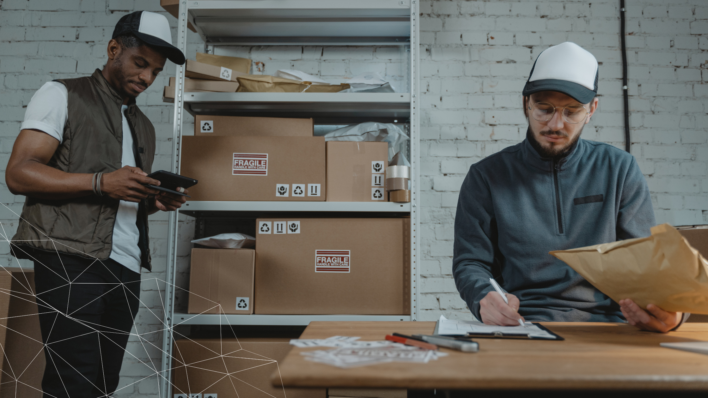

   Right now, Artificial Intelligence is fundamentally changing a wide array of aspects right at the heart of the logistics sector, and in our very near future and the years to come it will amount to nothing short of a revolution that’ll alter the way we work and understand every single logistic process.    

   Every single expert in the field will tell you that AI is here to stay, and for good reasons. Computers can sort through amounts of data so massive that it would be humanly impossible to take them into account for the decision-making process. AI can do exactly that, and that makes it an invaluable asset for the present and future development of the industry.     

   Let’s take a look at all the particular areas in the logistics sector that are being changed through AI implementation.    

<title-3 align="centered"> Warehouse Maintenance  </title-3> 

    

   With the rise in facial recognition in AI, machines are now even capable of handling security. An unmanned warehouse can easily be kept safe by tracking all those who enter and leave it. Furthermore, machines can keep track of items being put on shelves and those leaving the warehouse by simply reading the barcode on the package and updating inventory accordingly.    
    
   So far, unmanned warehouses have proven to be effective in emulating the traditional warehouse methods while being far more efficient by eliminating human error.    

<title-3 align="centered"> Route Optimization  </title-3> 

    

  When you’re <a target="_blank" href="https://cobuildlab.com/blog/Choosing-or-developing-transport-and-logistics-software-Here-are-some-aspects-to-consider/amp/"> planning transportation </a>, route optimization is one of its most critical aspects. It ensures that deliveries always arrive with the lowest possible cost and energy expenditure. But there are a lot of variables that go into route optimization, and all of them must be in working order and reliable if they are to be of any real use, especially during a capacity crunch.    

  When dealing with heavy road congestion and an influx of e-commerce orders, you need to be able to face it all head-on to make sure you give your customer a speedy delivery. AI pays off at times like these because it is continually retrieving data, learning from it, and analyzing new methods to ensure drivers are taking the most optimized route—down to the minute in real-time.    
   
   
<title-3 align="centered"> Inventory Management  </title-3> 

    

   Inefficient inventory optimization leads to inefficient inventory levels. And, when there are inefficient inventory levels, it is bound to have an impact on the cost of goods sold. It creates a chain reaction that ultimately hurts your bottom line. When the cost of goods sold goes down, you will not expect to incur any cost of holding inventory beyond its given use. This is where AI proves useful as it ensures that the risk of overstocking is kept to a minimum during a production period. The idea is to free up cash whenever it is available so that it can be used for other profitable business activities.    
   
   When you have approximate data of what the future demand is going to be, you no longer need to play a guessing game. This is the reason why AI has become so valuable in inventory management. AI can forecast the demand of the customers and also the suppliers based on the previous orders and the market trend. So, you can play on both sides and stock the products when you see that the demand is going to be high in a few months rather than wait and pick them up at the last moment. Taking advantage of AI also helps you build better relationships with suppliers because you will be assisting them when the market is down as you already have information about future demands.    
   
   

<title-3 align="centered"> Workflow Automation </title-3> 

    

   <a target="_blank" href="https://cobuildlab.com/blog/Process-Automation-and-Software-Solutions-for-Small-Businesses/?utm_source=newsletter&utm_campaign=jun1"> Workflow Automation </a> is the utilization of Artificial Intelligence to streamline complex and manual back-office operations. Documentation in freight forwarding is a tedious task and has immense potential for automation using Robotic Process Automation (RPA) and Optical Character Recognition (OCR). Shipping documents are all not in a standard format, and this is where technologies like these can automate reading and understanding documents that are printed or handwritten with utmost accuracy. Such workflow automation can free up significant work-hours of the logistics personnel and assign them to do more value-added activities.    
   
   
   
<title-3 align="centered"> Predictive Logistics </title-3> 

    

   Different touchpoints across a supply chain generate extensive data. Better <a target="_blank" href="https://cobuildlab.com/blog/logistics-industry-trends-for-2021/"> Machine Learning </a> algorithms can extract predictive insights in logistics that are critical to decision-making. Artificial Intelligence can aid decisions related to capacity planning, forecasting, and network optimization, thereby streamlining operations and enhancing overall supply chain performance. AI is finding extensive use in dynamic route optimization, managing delivery time windows, optimize fuel consumption, and load capacity utilization, among many other activities in last-mile deliveries thereby propelling the digitization of supply chains.    

<title-3 align="centered"> Intelligent Computer Vision </title-3> 

    

  Deep learning and AI have enabled advanced scanning, surveillance, and automation to visualize many logistics scenarios through images and videos and direct operations accordingly. This has changed how shipments are dimensioned or inspected for damage, labeling, and stacking arrangements while loading. Computer Vision, combined with Deep Learning in self-driving vehicles for automated and smart navigation, is now a reality.    
    

   As you’ve seen in this article, AI will play a key role in logistics for the foreseeable future, improving our processes and making our enterprises more efficient.
    
Our advice is to assess what you want AI systems to do and the problems you need to solve, adapt them according to your business objectives and measure their efficiency. It pays off to use AI in the right way for your company.    
 
<title-5 align="centered"> Also, check out  👉 <a target="_blank" href="https://cobuildlab.com/blog/artificial-intelligence-for-enterprise-software/amp/"> How AI is transforming the world of enterprise software </a> </title-5>      

<title-5 align="left"> About Cobuild Lab </title-5>

  We partner with Industry Experts to solve Logistical and Productivity problems with Custom Software Solutions, Artificial Intelligence, and IoT.  Everything from using email autoresponders to automated workflow can help you redefine your relationship with the customer and open up new revenue streams for you. It's time for you to use technology and automation to make your business more efficient.    

<youtube-video id="5fbYxQNgJ7s&"></youtube-video>     

  Got an idea for a web or mobile app? Let’s build it! Check out our <a target="_blank" href="https://cobuildlab.com/price-calculator/">  price calculator</a> to have an estimate of the cost of your project or email us at contact@cobuildlab.com and get a FREE online consultation. 

