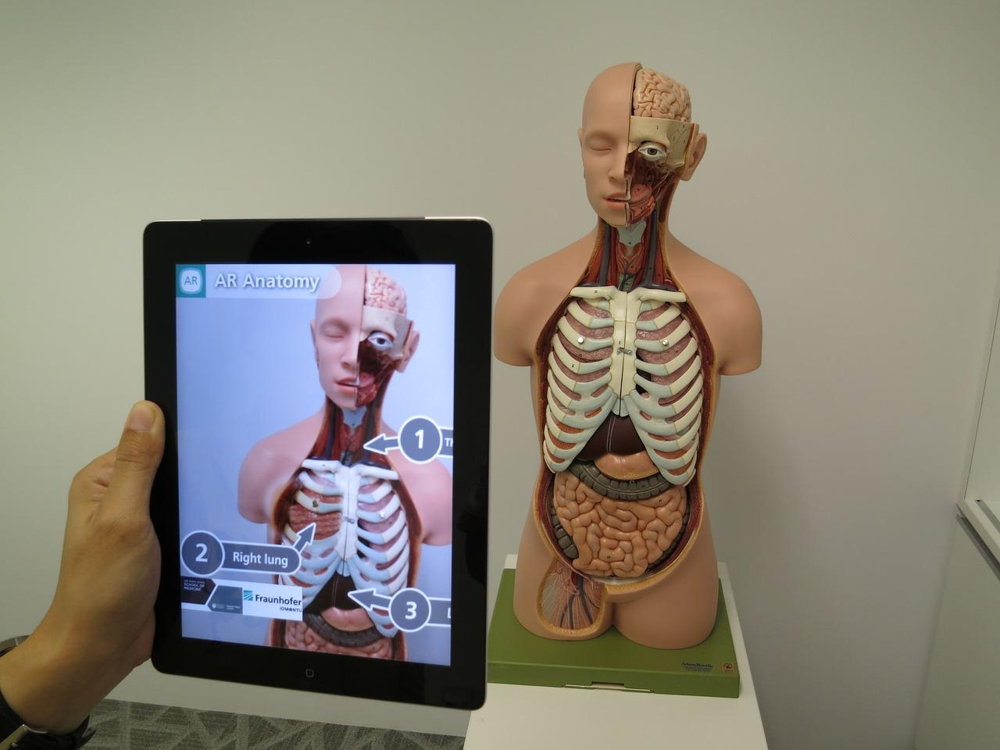

Mark Zuckerberg and his team do not let to grow and surprise us. Although there are some restrictions for fan pages, recently, Facebook
annunciated new sales strategies for brands.

As we know, **Facebook gives a lot of views to the brand that pays for ads on this social network**. If you do not pay, you run the risk
of falling into a black hole where your followers do not see you.

But if you are a very good brand account, with thousands of followers and pay for ads, you will have a plus as of now **Does Augmented
Reality (AR) sound familiar?** This type of technology launched some years ago comes to Facebook to provide a new experience for users who
can now interact with the product through the application.

**AR allows you to see the real world with some additional information, using technological devices**. It can be confused with Virtual
Reality (VR), but the main difference in the latter is that it introduces you to a created an imaginary world. With AR, you can explore a
product in your own space, wherever you are.

According to Boston Consulting Group, more than 80 million of people at U.S have tested augmented reality monthly and the expectation is
that this statistic grows to more than 120 million by 2021.

<title-2>Successful businesses that have used AR in advertising</title-2>

**Pokemon Go was the first and most popular Augmented Reality application**. Later, many companies have verified this technology and its
multiple uses to offer customers the possibility to see the product closer to them.

**Ikea**, the big corporation of decorated furniture and home articles, was a pioneer in AR since 2014 when they offered the option to
scan the product in their catalogs and then with the mobile to focus on where they want to see the furniture in their home.

There are other successful cases, such as **Total Immersion** and the app TryLive, that allows you to test glasses virtually; **Fitting
Reality** offers a virtual room to try clothes, and even **Volkswagen** uses AR to guide the mechanics step by step in tasks related to
assembly and maintenance.

On Facebook, **one of the brands that AR try on news feed is Michael Kors**, to show their clients handbags, watches, shoes and clothes
designed by the creator.  In addition, Sephora, a business of cosmetics, beauty products, and fragrances, will allow people to try
cosmetics virtually.

<credits>Photo by Zedinteractive on [Pixabay](https://pixabay.com/)</credits>
<title-6 align="centered">You can use Augmented Reality in science or education. Its applications are endless.</title-6>

<title-2>Benefits of using AR ads on Facebook</title-2>

These ads, only visible and available to US audience, will look like the same ads in the news feed; but when you touch it, you will see
the “tap to try it on” option and then start this unique experience for the customers.

The benefits of this technology in this social network are the same as those obtained in traditional AR advertising. **Facebook will let you know how many people interact with your product**, because it will measure very closely the effects of this technology.

**Customers will trust and feel more loyal to your product and the brand because you give them the opportunity to see and know it**, as well as in the real world, how it works.

Undoubtedly, Facebook ads and Augmented Reality will revolutionize the way that brands advertise on Facebook until now, to increase their sales and grow in followers.

<credits>Photo on [VRScout](https://vrscout.com/)</credits>
<title-6 align="centered">CEO Facebook, Mark Zuckerberg, explained for first time this new technology at Facebook Inc's annual F8 developers conference.</title-6>

