We talk about the most recent proposals of Google on marketing, ads, and the proper management of web content. But we could not leave out this month one of the most solid and useful tools of the same company, to know the web metrics. This is **Google Analytics**.

<title-2>Take a look at the overview of Google Analytics</title-2>

It is a web analytics service that Google offers for knowing our web metrics and improve them.

This tool is inside of Google Marketing Platform, but it was released in 2005 and you can have access to it with your Google account.
 
It is free but very powerful. It would help you with the Search Engine Optimization better known as [SEO](https://cobuildlab.com/blog/seo-tips-that-will-increase-your-position-in-search-engines/), and it helps you with any marketing purposes. 

<title-2>3 Google Analytics reports that you cannot overlook</title-2>

Google analytics offers a variety of reports. This is its main feature. And all these reports have the analytics and metrics of your online platforms. Because in fact, that's their nature, 100% analytic. 

Some you may even feel overwhelmed by the amount of information you can access just by creating a free account on this platform. 

For this very reason, we decided to make you a simple, and concise list with what we consider to be some of the most important reports that Google Analytic offers you, and that you can't overlook. 

Needless to say, these are:

**1. Traffic Acquisition Report**

The main reason of Google Analytics for existing is to know the analytics and metrics of your web platforms, and much of those metrics are related to the acquisition of new visitors, which Google decided to call **Traffic Acquisition**. 

All the data that you analyze and the strategies that you undertake based on the information that Google offers you are oriented to this traffic acquisition. 

With this report, you can know where specifically are visiting or "accessing" your website each of the users.

It can be from your social network strategy, your email marketing campaigns, your ads on [Google ads](https://cobuildlab.com/blog/tips-to-create-effective-campaigns-in-google-search-engine/) or specifically from where. It's the best thermometer to reinforce or improve each of the strategies you're using on digital platforms. 

This is also important because the final destination of your users must be your website, and with this report, you will know if you are achieving the goal, and from where it is being achieved. 

The options for you to use this report are as follows: 

if you select **Acquisition + Overview**, you will see all the channels where you are receiving visits, the number of sessions in which it happened, the percentage of bounce you had, if you did not know, the percentage of bounce are all those people who entered your page, and they haven't performed any action or interaction with your website, and they're gone. 

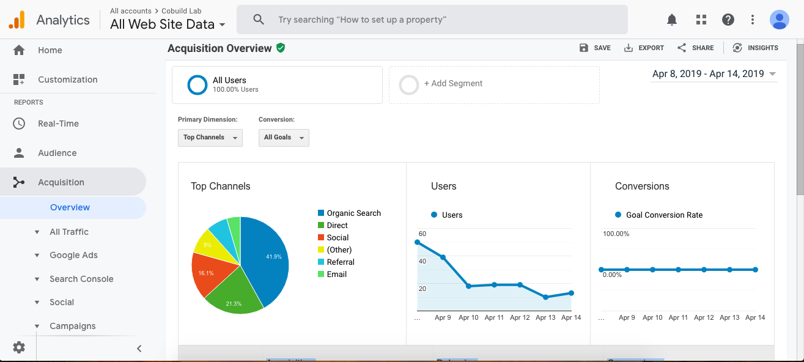

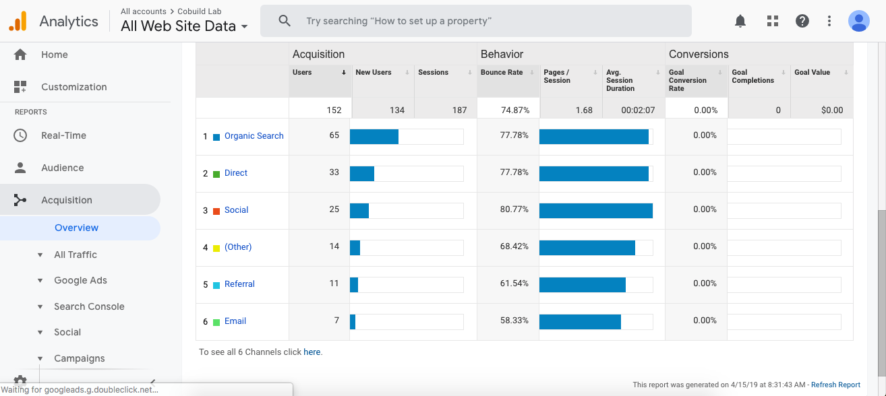

 

Now if you select the route **Acquisition  + All Traffic + Channels** you will get even more detailed information about the specific channels, including keywords, specific URLs, etc.

 

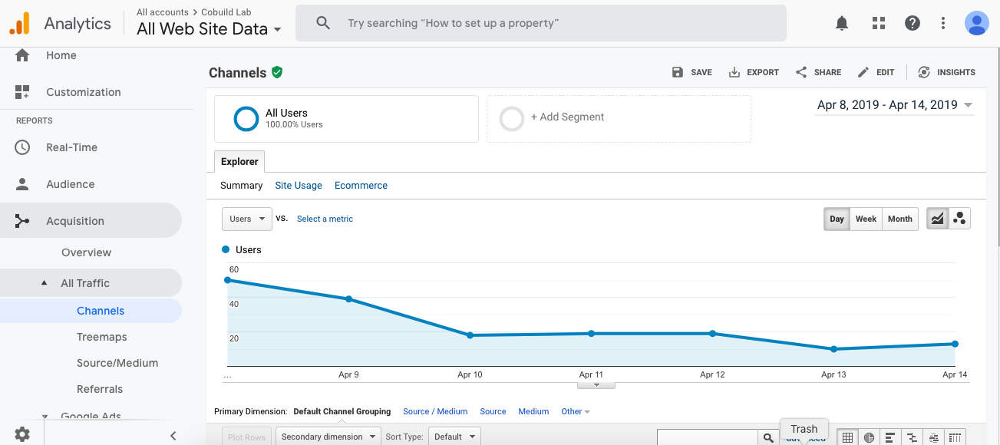

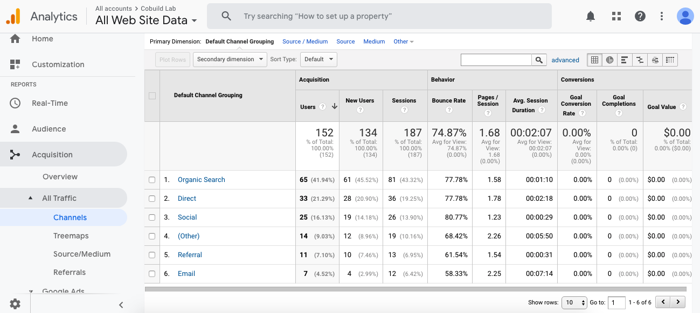
 

There is another variant in this report with the following route: **Acquisition + All traffic + Referrals**. 
 
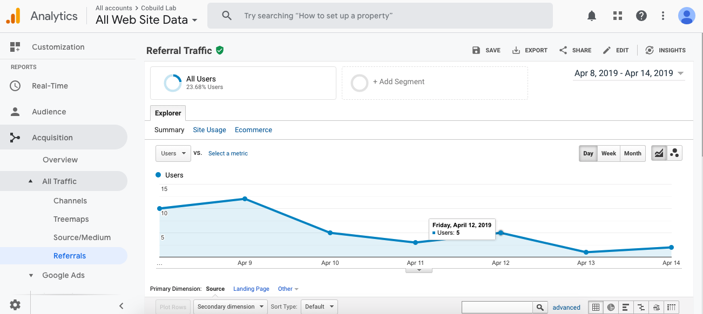

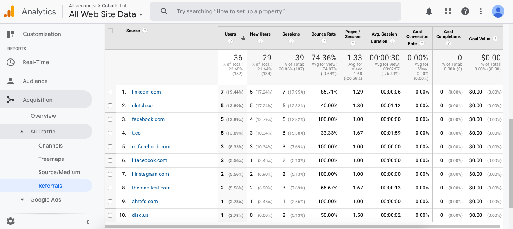
 
With this route you will have the possibility to know the external websites that are giving you traffic, for example, when you were linked in one of their post, etc.. If you know this information, you can propose linkbuilding campaigns or just say thank you. 

**2. Keyword Report**

This report is also very important because it will fully define your content strategy. 

With the keyword report, you can know which keywords you are getting organic visits for, and this way you can improve and optimize your website and your content strategies in the other platforms.  

When you have access to this report of keywords what you will be able to distinguish will be the impressions that had your content, the clicks, or the times that they entered to your website, the CTR that translates to Click Through Rate or the times or number of clicks that obtains a link with respect to its number of impressions that is to say when they see you in the results. And you can also see the average position of each keyword. 

The route to access it is **Acquisition + Search Console + Queries**.

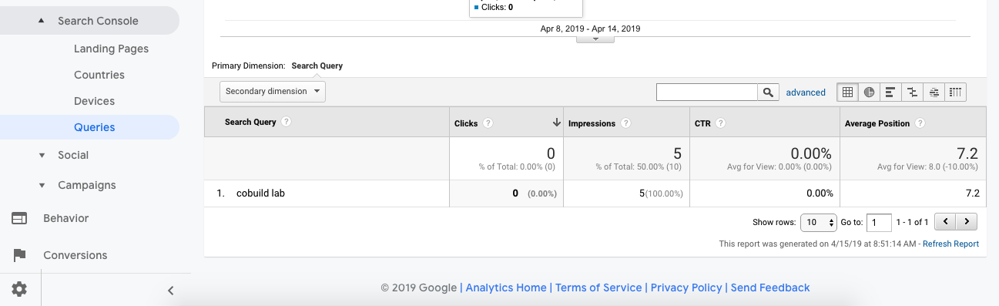

 
**3. Landing Page Report**

This report lets you know which URLs your web visitors are accessing most organically and by reference. It also has a section for you to assess the quality of the content of each of those landing pages that make up your website, by the interaction that visitors have with each of the pages. 

It can even work so that you know which of your pages are not having the best effect and you can improve them even taking into account the aspects of those that do meet the goals. 

The route for you to visit it is **Behavior + Site Content + Landing Pages**

 
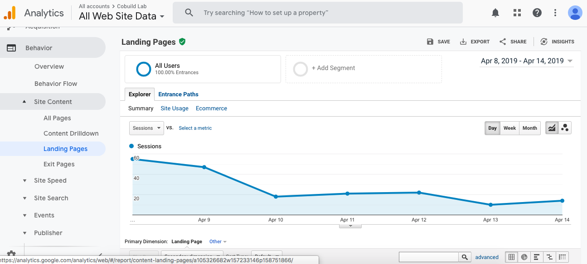

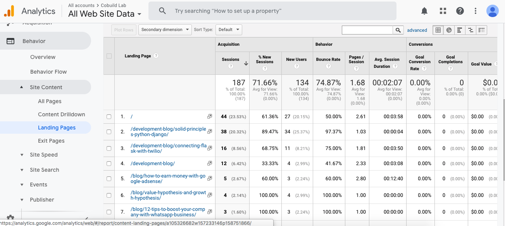

<title-3>Other things you should know are the customized reports...</title-3>

You can mix more than a kind of report. We mean, you can get in the same report the information of many standard reports of the platform. So, you can save time, clicks and, at the same time, you will obtain the information organized as you prefer.
 
If you provide a marketing service, or just you have clients and use this tool, a custom report is perfect for you because it allows you to communicate, share and report its information in a simple and more complete way. And also, only have access to the important and needed information.

<title-3>How to create and manage custom reports on Google Analytics?</title-3>

It's a pretty easy process that you can follow with this step by step.

1. Log in to your Google Analytics account and open the reports section. 

2. Click on **Customization**, specifically on **Custom Reports**, and select the **New Custom Report** option.
 

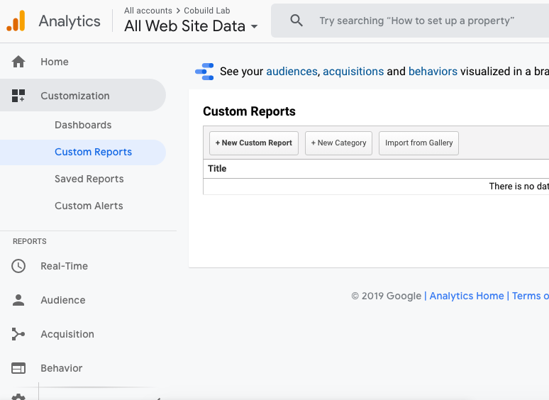

3. Give a title to that report you're creating.
 

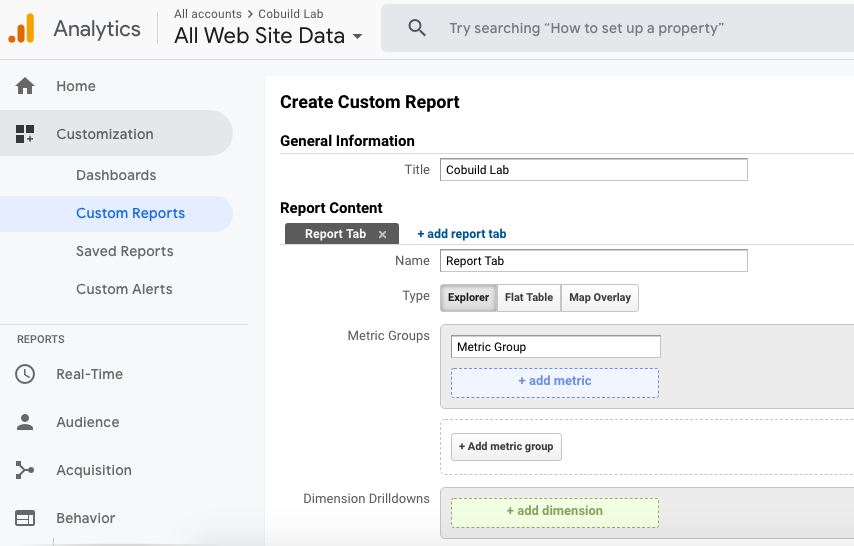
 

4. If you wish, you can select the add report tab option.
 

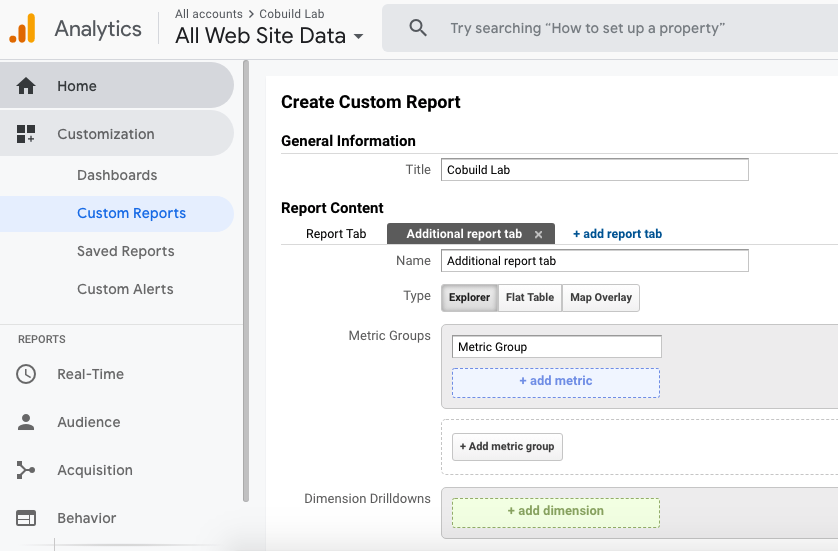
 

5. Select one of the report types available to you. 
The report types are: 

* **Explorer:** This is a standard report that includes a line graph and a data table. 
* **Unique Table:** as its name says, it is a table where the data is sorted in a row. 
* **Graph of visits by location:** It is a graph that is basically a map of the world, where you can see the regions of the world where you get the most visits because they are shown in darker colors than the rest. 
* **Conversion Funnel** that you define yourself.
 
 
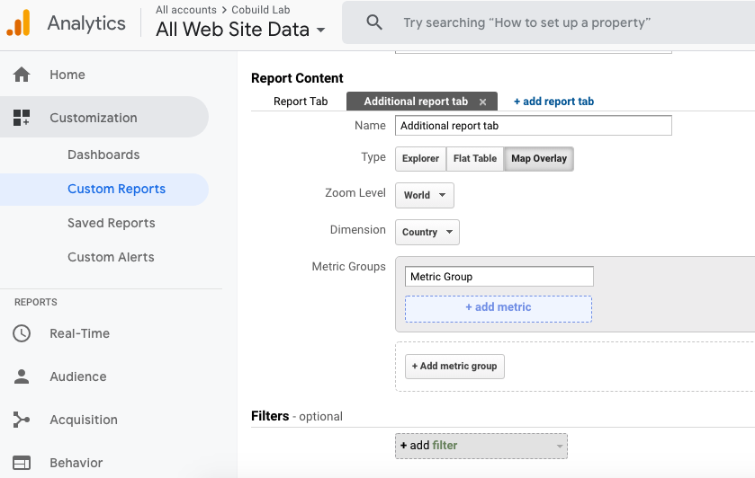
 

6. Defines the properties of the report. Metrics and dimensions. 
 

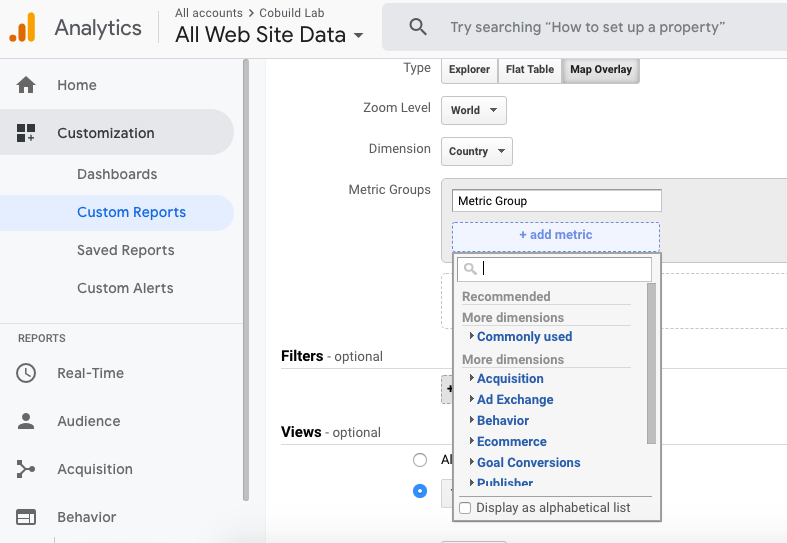
 

7. If you add a filter you can limit the report to only a few properties. 
 

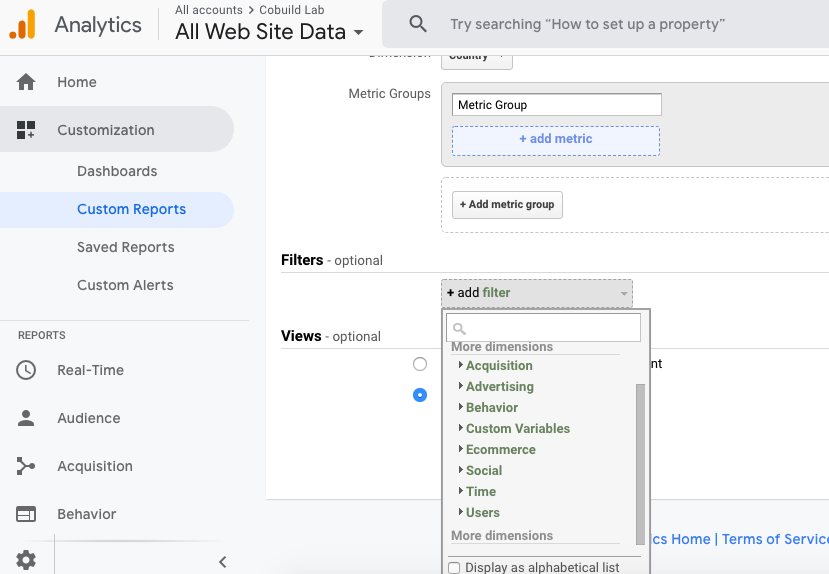
 

8. Then, the time will come for you to select the specific view option or the All Views associated with the account option, so that you can choose in which views or spaces the custom report you are creating will appear.
 
 
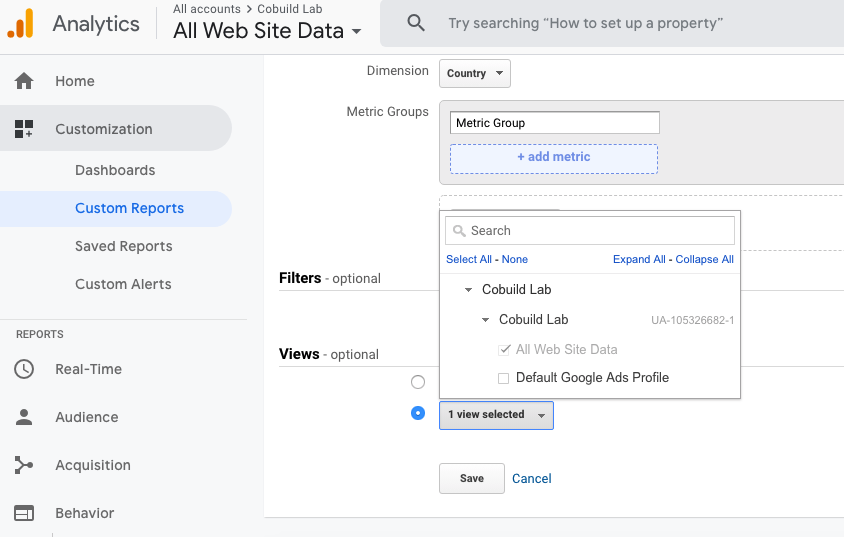
 

9. Click on save and your report is created. 

Remember that you can merge information from several default report types, all in one report, so you get all the information you need just by accessing a single report. 

If you want to access your customized reports or if you want to manage them, all you need to do is log into your Google Analytics account, go to the view you previously chose for the reports, click on customization, and there you will have a view of all the customized reports you have created. 

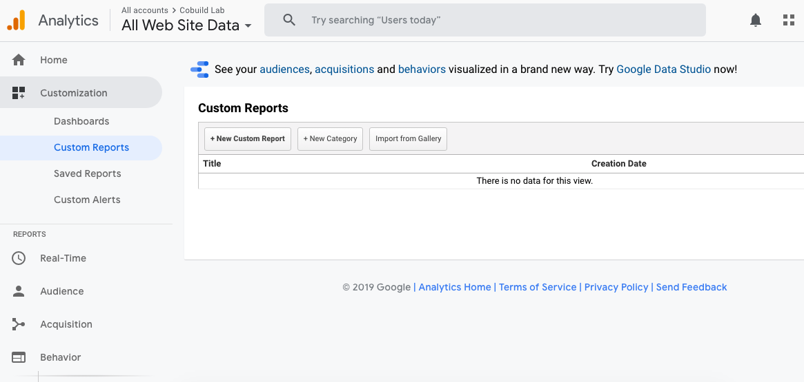

The management is very simple. If you activate the **“Actions”** option, you will have a complete menu to copy, edit, delete and even share your customized reports. But you can feel safe, what you will share with others, in this case, is the configuration you decided to give to the report since the information and data in your reports will continue to be private. This tool is quite secure. 

Save the changes, and you're ready to create and manage your custom reports. 

If you want to have a little more information from the hands of the creator of the tool you can [visit this link](https://support.google.com/analytics/answer/1151300?hl=en) that tells us a little about this topic. 

If we had to define Google Analytic in one sentence, that would be: **measure and you'll win**. 

What you measure in this case are the visits, the quality of the content and which pages of your website attract and convert more. All that and more **Google Analytics** offers you. 

