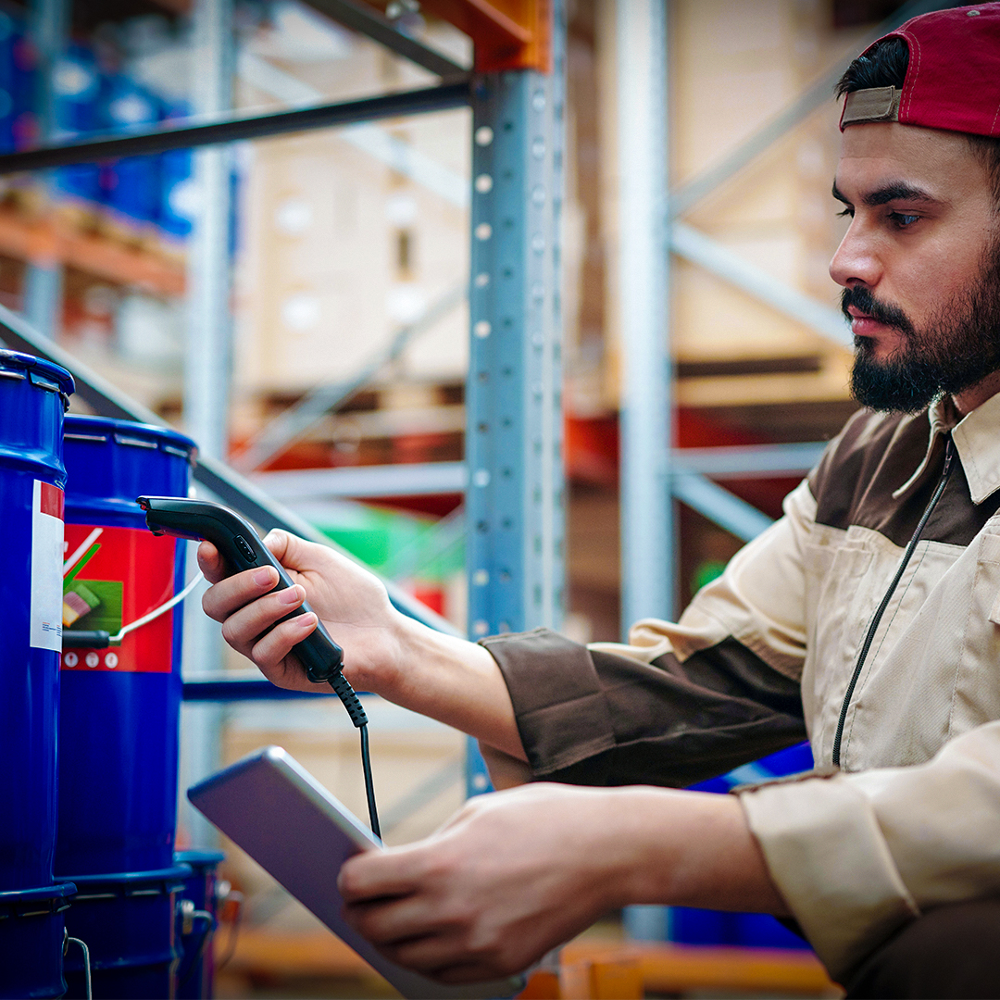

Today's logistics are more demanding for small and medium-sized companies in the United States and the rest of the world, and thanks to that **multimodal transportation** are becoming more popular every day to speed up logistics processes and gain competitive advantages in the market. 

Yes, many businesses bet on outsource partners to take care of this issue, especially if they manage all instances of multimodal transport, but you can also do it yourself with the help of a software tool. Or you can even make your supplier's life easier by suggesting some of the ideas we'll describe below. 

 

<title-2>Benefits of using custom software for manage cargo in multimodal transports</title-2>

 
  
<title-3>1. Avoid handling of your shipment</title-3>

 

 

Many third-party companies that handle multimodal transportation don't do it all themselves. They manage certain instances of the cargo (e.g. overland), but then the river or air transport of the same cargo is managed by other companies that they in turn subcontract. 

The result for you as a beneficiary is that many different hands may have contact with your package and that increases the chances of damage, loss, and many of the risks you’re surely well aware of. 

If you manage your multimodal transport, or if you suggest to your supplier to do it all on their own, they can use cargo control and management software and take advantage of technologies such as NFC chips, QR code to check the goods in situ (without human handling), and then check that data against the database uploaded to the cloud from the point of departure. 

Best of all, you can perform this process every time a transshipment is made and automatically check upon arrival at the delivery site. 

Easy, automated, and fast. 

It is not a person transcribing the data, but automatically stored and compared with the help of a robot, or even a person using the device without the need to manually handle any of your packages. 

 
  
<title-3>2. Improve the use and presentation of documents, regulations, and transportation and transit permits</title-3>

 

 

If transporting cargo through a single channel is a challenge in terms of documentation and permitting (especially if it is between two countries with different regulations), imagine how challenging it is to transport the same cargo by various means (air, land, and river). Different documents and permits are required for each point of exchange. 

This is the main reason why many managers like you outsource this service, but it happens that suppliers handle this information almost completely isolated from the knowledge of their customer, i.e. you. 

With the help of customized software that you share with your supplier or even use yourself (in case you decide to run this process on your own) it is possible to have all the information in the same shared database, backed up so that every time it needs to be submitted, you can streamline the customs process. 

You can even have a history of that information in case a dispute, loss, or challenging situation arises. 

Managing information with technology becomes much easier. 

 
  
<title-3>3. Know the status and location of the cargo in real-time</title-3>

 

 

Geolocation is a topic where software hasn't advanced infinitely. <a target="_blank" href="https://www.google.com/">  Google </a> gave us a hand with this topic, and other technologies such as artificial intelligence complement it.

Predictive routing, real-time geolocation, live images of the load, the possibility of improving times, and predictive analysis of productivity in terms of multimodal routes of our packages. Not even the sky's the limit when it comes to all that customized software can achieve to manage the transportation of our inputs or products. 

This advantage (as the previous ones) applies to you if you want to develop this process on your own and for your supplier, to improve their service, increasing your satisfaction and that of their entire customer base. 

With a customized software to manage multimodal transportation, we all win. Would you like to contact us to receive other ideas on the subject or clarify your doubts? We are here to serve you.
