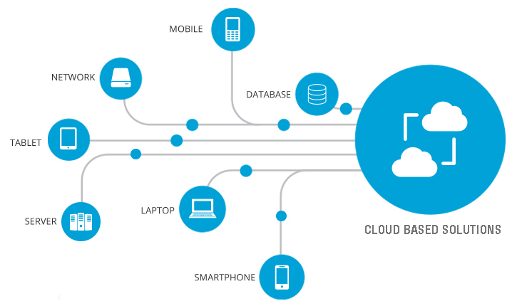

The use of cloud-based solutions is changing the way we share and store a lot of our data or important information. Likewise, companies are relying on this type of cloud-based services to boost their company's IT infrastructure, research, or projects. Today we will be showing you some of the best cloud-based solutions that you can find in the market.

 

 

<a target="_blank" href="https://www.compassitsolutions.com/cloud-based-solutions/">  COMPASSIT SOLUTIONS </a>

 

<title-2>Some of the Cloud-Based solutions in the Market</title-2>

 

<title-3><a target="_blank" href="https://cloud.google.com/">   Google Cloud:</a></title-3>

 

Google Cloud is a great service as it allows its users to create outstanding enterprise solutions Google Cloud using modular web services provided by Google, including G Suite, Google Maps Platform, Google Hardware, Google Identity, Chrome Enterprise, Android Enterprise, Apigee, Firebase, and Orbitera. 

It can also be used with other tools and technologies such as AI and Machine Learning, API Management, Containers, Data Analytics, Databases, Developer Tools, Healthcare and Life Sciences, Hybrid and Multi-cloud, Internet of Things, and  Management Tools among others.

 

<title-3><a target="_blank" href="https://azure.microsoft.com/es-es/">  Microsoft Azure:</a></title-3>

 

Microsoft Azure was launched in 2010, this cloud service offers a wide variety of services, being able to work with AI + Machine Learning, Analytics, Blockchain, Compute, Containers, Databases, Developer Tools, DevOps, Identity, Integration, Internet of Things, Management, Media, Microsoft Azure Stack, Migration, Mixed Reality, Mobile, Networking, Security, Storage, Web, Windows Virtual Desktop, and more.   One of the main purposes of Azure is for companies to reduce the enormous amount of servers in their facilities, being able to reduce their general and maintenance costs for this type of infrastructure. 

 

<title-3><a target="_blank" href="https://www.ibm.com/cloud">  IBM Cloud: </a></title-3>

 

IBM Cloud offers a wide range of services. Not all are cloud-based: it encompasses both virtual and hardware-based servers, consisting of public, private, and managed networks.  IBM Cloud also offers full server customization. This means that everything included in the server is chosen by you. So you don't have to pay for features you may never use.

It enables Compute, Network, Storage, Cloud Packs, Management, Security, Database, Analytics, AI, IoT, Mobile, Dev Tools, Blockchain, Integration, Migration, Private Cloud, and VMware.

 

<title-3><a target="_blank" href="https://www.vmware.com/latam.html">  VMware: </a></title-3>

 

VMware, of course, did as much as any company to popularize virtualization in the data center – arguably the company is the “original” private cloud company. In the early days of cloud, many companies simply fully virtualized their data center and called it a private cloud.

Moreover, in today’s cloud world, VMware is often thought of as a “bridge” between the private and public cloud worlds. It also offers the vRealize Suite Cloud Management Platform, which can manage both private and hybrid clouds, and Cloud Foundation, a software-defined data center platform designed for private clouds.

 

<title-3><a target="_blank" href="https://aws.amazon.com">  AWS Cloud: </a></title-3>

 

Amazon Web Services (AWS) is a cloud-based platform for building enterprise solutions using integrated web services. AWS offers a wide range of IaaS and PaaS services. Making it the world leader in cloud-based services. 

AWS offers hundreds of services. Some of them are Virtual Private Cloud, EC2, AWS Data Transfer, Simple Storage Service, DynamoDB, Elastic Compute Cloud, AWS Key Management Service, AmazonCloudWatch, Simple Notification Service, Relational Database Service, Route 53, Simple Queue Service, CloudTrail, and Simple Email Service. Other benefits include: 

 

<title-2>Why do we at Cobuild Lab consider AWS the ideal partner?</title-2>

 

At Cobuild Lab we use AWS as our cloud-based solutions provider, so here are some of the benefits of having AWS as a provider:

* **Available worldwide**, AWS has 20 global data centers, each of which operates in multiple availability zones.

* **Scalability and Flexibility**,AWS offers unlimited flexibility and scalability. AWS Cloud Automation is one such tool that provides on-demand scaling. This allows companies to save and reduce costs.

* **Security**, AWS offers security tools that are not typically available in cheaper alternatives accessible on the market. Organizations can directly deploy these tools in individual IT environments. After deploying these tools, data is secure. 

* **Utilized for Big Data**, AWS has scalable storage that can be used to run analytics more frequently. AWS storage does not require much effort to be indexed as well. The perfect recipe for building data lakes or warehouses. AWS and Big Data work together to provide the infrastructure and power to meet the requirements of high-end intelligent software. 

* **API**, APIs are available in several programming languages to help you manage your infrastructure programmatically. Whether it's launching a new instance or performing backups, everything is possible through the API. The APIs are more powerful than the AWS Management Console.

* **Little or No Investment**, With AWS cloud-related services, organizations are saved from excess expenditures on software and hardware. A physical data center is not required, which results in savings of operating costs. 

It is also used for web development, mobile, gaming, social applications, storage, backup, and enterprise IT, among others. 

Cloud computing has grown into a vast and complex ecosystem of technologies, products, and services. It has given rise to a multi-billion dollar economy with many cloud providers competing for an ever-expanding share of the cloud market, estimating an increase in this market to $927.51 billion by 2027. So get started today and sign up for your preferred cloud-based services.   
