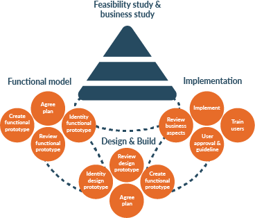
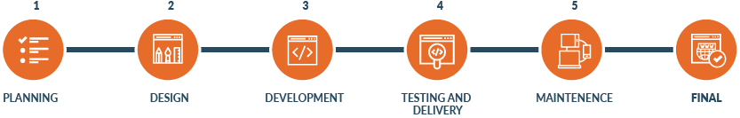
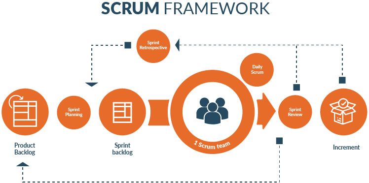

When we have a [business idea](https://cobuildlab.com/blog/startups-a-new-technological-business-model/) or a Product Idea and we don’t know where to begin, the best thing we can do is going for professional help, especially if our product will be located on the internet or it is related to technology, and believe us, 99% of products or services now, should be like this. If you are in this point, relax, chances are that here you would find the solution.

We not only say that there are also lots of medium and big companies that have found the key to success with the **best software development process** to their business necessities. If you don’t believe us, we invited you to read the next interesting information about that and discover how to succeed.

<title-2>What is the best software development process?</title-2>

First of all, you have to know that a software development is basically, how to build a software product. But when we refer to the best, we are talking about the more convenient, practical and effective way to realize it.

<title-3>Why it is important?</title-3>

Discover and select the best process will help you achieve your business goals on time, to be more efficient, to win lots of money and to be successful.

<title-3>The process:</title-3>
 

Taking into consideration, that every idea, startup or business it is different, with their objectives, characteristics, and necessities, we have designed, based on our experience a step by step guide on how to build a Software Product.

<title-4>1) Step One: Know what you are doing, I mean really know it</title-4>
 

The first thing you have to know it is what you want and where do you go exactly. You should describe and define very well those aspects to begin the project with the right hand. A good way to achieve this is to write down your goals, the problem that you are solving and how do you plan to solve it and even the values of your solution.

If you know that information, you could be able to explain better to the developer’s team what exactly you need in the next step.

<title-4>2) Step two: A requirements meeting</title-4>
 

In this the meeting, you talk about your requirements, stories, and every necessary detail to make real the best version of your software product.

You talk about the journey your users are gonna have inside the software, and how is your vision of the product, also explain, what will be the problem that the user has and looks to solve and how does he feel doing this.

At this moment that you thought about every detail of your solution, it’s time to call the developer’s team and move on with your project.

It’s important to make clear to everyone involved which are the elements that provide the most value to the solution.

<title-4>3) Step 3: High-level design</title-4>
 

The technical team, that can include developers, designers, architects, UI/UX specialist should build a plan for building the product, that should include a mockup on how the applications it’s gonna look and feel, outline the major components and how they are gonna interact to provide the value desired.

This high-level design should come with a proposal on time and resources needed to accomplish the first version of the Software.

It’s strongly recommended that this period proposed shouldn’t be more than 12 weeks.

<title-4>4) Step 4: Let’s Build!</title-4>
 

Once the final adjustments are made to the plan, it’s time to start building.

 

Developing a software project it’s a hard task. Specialists have been doing it for decades and still many disagree in the best way to do it.

The method, methodologies, framework or tools are usually this a team choice, that depends on the resources on hand, the previous experience, and the background of the leaders. Of these are tons, many good, some other very very good.

Here we present some options at a high level:

<title-3>#### 1. Agile Software Development:</title-3>
 

It is the software development process that has short steps which are achieved from one week to a month. It means you develop software or features or functionality in a short period of time involving the different areas that need to have an opinion in the product with the purpose of delivering soon and get feedback early in the project.

This is the best software development process to business that needs an adaptive approach because they have more changes than others and that’s why they need to work faster to attend client and market requirements.

Also, this is the best software development methodology for ideas that need direct communication and feedback from customer constantly.

<title-3>2. Dynamic system development model</title-3>
 

Dynamic means changes, from there we can understand the dynamic system development model’s essence.

It is the best software development process in companies where the users’ opinions are essential.

This process has the quality of developing software that is not perfect (but fast), that’s why taking in consideration users’ opinions, reviews and experiences, developers team can get better software every day.

Some advantages of this process are direct access from users to developers and also their participation in the development process, which is really positive because they are the final customer.

<title-3>3. Waterfall model</title-3>
 

This kind of software development methodology is not really common nowadays. Also, it is completely the opposite of previous. Why? In the others, changes can make it in any phase during the developing process, but in this case, developers only can change things during the initial phase. Once they close the step, they shouldn’t go behind. What does it mean? Developers and you have to conclude 100% every detail before going to the next phase.

In that way, you will finish completely every step and you will be secure of everything.

In addition, the waterfall model is the best software development process to business ideas where simplicity is desired, where the process to be built is very robust and is well documented and the probability of it to change is minimal.

This model is simple, easy to understand and it is developed in a linear sequence.

This software development process is used generally in medium or small projects.

<title-3>4. Scrum</title-3>
 

[This](https://www.scrumalliance.org/get-certified?gclid=EAIaIQobChMIhOiEpIfr3QIVhoizCh1BXAibEAAYAiAAEgK-q_D_BwE) is a really nice framework that is used more and more through the time and the reason is simple: we can develop in short time, with direct and constant communication between developers, coach and you or whoever be the client or stakeholders.

It is possible to know, correct and solve every situation during the phases of development because there are lots of team meetings and every step is measured constantly.

Moreover, this is considered like the best software development process to some companies and part of that is due to is similar to agile but more complete.

<title-3>5) Support: Maintenance and support</title-3>
 

The final step of the process it’s to test it, start using it in the real world, and for this support and maintenance is need it.

Depending on the complexity of the solution, a good team can provide help for bugs, service interruptions, updates, and the enormous amount of scenarios that can make a product solution fail.

Always make sure to have a plan for this before [jumping into a project](http://cobuildlab.com/), take advantage of the best software development process for your idea and make it real in a successful way.

 
