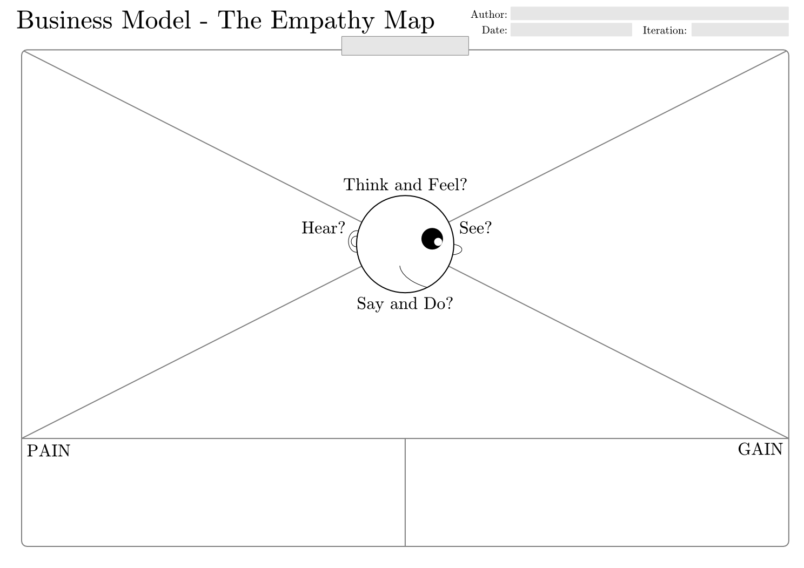

When you find an opportunity to develop software, i.e. you worked on your idea enough and started working with it, one of the essential steps to take is to know the consumer. 

Delimit them to such an extent that you develop your sense of software specially adapted to their needs, to their complaints, to their desires, to the value they require. 

You can achieve this by making the character of your ideal client. As if it were a role for a story or a movie, you will create a representation, give it a name, preferences, a profile, and in general provides life to the role. Why is this done? We'll explain it in more detail and show you how to do it. First of all, you only need to know that these tools are known as **Customer Archetypes and Buyer Persona.**

<title-2>A more complete understanding of the Customer Archetypes</title-2>

The characters lead every step you take with your business. 

The consumer archetype is a narrative of the profile of the character you described as your ideal customer, focused on their behavior and their relationship with a particular software product. 

You can base this practice on an existing software product, which is your competition, but you can also make this practice base on the concept of your product. 

The important thing is to have that information about how the ideal customer behaves. What he wants, what he longs for, what he lacks, and how he can feel when interacting with a person. 

The Customer Archetype is a tool that is designed to have in-depth knowledge of the final consumer behavior, and the future interaction that they could have with the software solution you will offer. 

In this sense, it is easier to meet their expectations.

* **Why a Customer Archetype?**

It serves to predict their behavior, their desires, and their concerns. And then, use that information as a competitive advantage to satisfy them with the software product you are going to develop. 

Some experts believe that an archetype even contains information about the product and the future interaction of the consumer with the software you are going to develop. That is why leading questions such as What are the general characteristics of the consumer? What is the goal of using the product? What is the consumer-focused on when he uses the product?

* **Importance of the Product Development Process**

We agree with this premise. We think that the archetype refers to the behavior of the consumer, and his possible interaction with the product.

In fact, the archetype has greater emphasis and is even considered a new way of developing the demographic factor of the traditional market segmentations that we have known for years. 

The good thing about the archetype is that it gives you not only the characteristics of your ideal client. It also allows you to know their relational side; how they behave, etc. It gives you the chance to better understand the emotional factor, which if you didn't know it, is the one that will indeed lead you to success.  If you connect with the emotions of the user, you will be ok. 

* **When does it start?**

Defining the archetype starts in the early stages of product development and needs to be fleshed out to steer the design process toward the realization of a successful product that follows the central vision of your idea and opportunity checked before.

<title-2>Archetype vs. Persona</title-2>

Segmentation is a delimitation of the market to be covered by a software product, based on specific characters of the users who are going to consume that software or who are expected to consume it. 

It has a lot of descriptive information that defines the target audience of the product, and one of the factors that make it up is demographic and psychographic that we explained in a previous post. The Customer Archetype and the Buyer Persona form part of these two elements of segmentation. 

The branding Person, Buyer Person or just persona, is a fictitious character. This character has specific qualities and characteristics, much more than those presented in the segmentation. 

These characters are created to represent one or several types of customers who will use or acquire the software product you are going to develop. 

Based on research on who the buyers or consumers are going to be, these fictitious characters are created, which will help you get to know your audience better. This practice is not only done at an early stage of software development. For any marketing campaign, effort or improvement that you are going to make throughout the life cycle of your product is recommended that you perform this practice. If you know better who you are going to sell to, you can offer it better. 

This practice can even be fun. You must give your character a name, a status, a type of thought, a knowledge, and as many details as you can, and then, with the help of the archetype, which is the information of his behavior, you can feel yourself in the skin of the client. Discovering what he likes, what he needs, where you can approach him, among other data. 

We give you this video for you to understand better:

<youtube-video id="StAeA16gNPY"></youtube-video>

<title-2>Completing the Buyer Persona </title-2>

By answering questions and filling out these charts, you can create the character of your ideal client. Let's get started!

<title-3>1. Demographic</title-3>

It includes data like: 

* Name
* Gender
* Age
* Income
* Housing type
* Education Level
* Marital Status 
* Children 
* Occupation 
* Hobbies

<title-3>2. Geographic</title-3>

* Where are they located? 
* Where they live? Urban, suburban, rural?

At this point, you need to be specific. 

<title-3>3. Psychographic</title-3>

This point refers to the values, emotions, perceptions, beliefs and even interests of that character we are developing. 

* Attitudes
* Value Behaviours
* Life Philosophies
* Habits

To better understand this point, which, from our perspective is the key to the creation of the Buyer Persona, we present a valuable tool called the Empathy Map below. 

<title-3>The empathy map</title-3>

An empathy map is a tool in which with the collaboration of your team, you can give that unique touch to your Buyer Persona. With it, you can achieve a more profound vision of the character of your ideal client. It's a holistic practice, but it can help you understand a lot. 

In this map, all the character's psychographic is constructed from 6 questions:

What does the customer segment think and feel? 
What does the customer segment see? 
What does the customer segment say? 
What does the customer segment hear? 
What causes customer segment pain? 
What causes the customer segment gain?

All of this with the product you are planning to develop. 
It would look more or less like this.

<title-2>Now it is time for the Customer Archetype</title-2>

As we said, archetypes are more related to the behavior and experience or interaction that can have that fictitious character you already created, with the idea of your software product. That's why, when it comes to archetypes, more is said about personality than about the person himself. 

There are some pre-existing archetypes that have features and behaviors well defined by others before. Some could fit perfectly with your ideal audience, but if you do not feel identified with any of them, there is no problem. You can create another one that suits you best. 

For the moment, and for practical purposes, we will present some of the most common and known archetypes so that you have an idea of how this tool works or the information it should contain. 

<title-3>Personality Archetypes</title-3>

* **The innocent**

His profile is traditional, very hopeful and dreamy. It also has a touch of romantic or tender. 

Usually, this target is comprised of women and children.

The people of this archetype are pure. They are rooted in the theme of moral values, love the concept of childhood either because they are living it or because they have nostalgia for it. They are optimistic. They are committed to simplicity and purity. 

They look for happiness, tranquillity and being at ease with themselves. If they feel that they lost the trustworthiness or innocence, you can take them out of their comfort zone. 

* **The Hero**

This profile is just the opposite. Competitive, very masculine. Can be a fighter, warrior, likes to win, feel control of his process. They are optimistic, could feel attracted to the subject of the coach. They have a lot of faith and even tend to want to solve social problems or situations they notice around them. 

They like challenges. Also, they tend to study a lot. They work from the trust. 

* **The explorer**

This archetype of personality is adventurous. He loves extreme or different emotions, out of the ordinary. He is individualistic and can pioneer many things. 

They are unhappy. They like updates. Constant innovation. They are original and are always looking for new methods and ways to live or to solve their daily problems. 

They can be a very demanding target. 

They fear to fall into monotony or conformism. 

They seek independence and autonomy, offer them. 

* **The artist**

He is a creative and technological person and very self-taught. They want to do things for themselves. 

They are creators, designers, innovators, and dreamers. They tend to be talented. 

They desire to create a world of imagination and emotion, and when they manage to fulfill their ideas, they feel satisfied.

Their fear is the loss of inspiration or mediocrity. 

With them, your creativity must be multiplied by a thousand. 

* **The wise man**

This person is intellectual. He is an advisor, expert, philosopher, and mentor to others. He likes to research and analysis. The scientific touch or tone attracts them, is a differentiating point from them. 

They are stimulated by the problems to be solved and the big questions, because they feel the need to discover the truth with research and knowledge. 

They want to achieve independence through knowledge. 
They are clients of industries such as information, high education, technology, and science. 

* **The visionary**

This is a born leader. Also known as a magician. This target is made up of mentors, consultants, and people with technical knowledge. 

They are pragmatic. Conventional. 

They have big dreams, are charismatic and turn problems into significant opportunities for change. They want to serve as inspiration for others, demonstrating that dreams come true.

They have an inspirational touch. 

Choose any of these, and give personality to your Buyer Persona. This way, you will connect better with your final consumer, and all the details of your software will be more precise for you and the rest of your team. 

<title-3>Storyboards can help you too</title-3>

**At the end of the day, such would look like a Buyer Persona and Customer Archetypes properly.**

