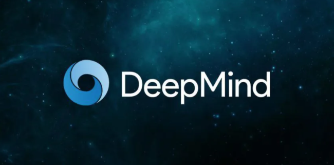

Miami, FL. Mar 08, 2022

Taking a <a target="_blank" href="https://www.cobuildlab.com/services/"> software tool idea </a> and writing the code for a big project is still time-consuming and labor-intensive. 

Experts have tackled an <a target="_blank" href="https://www.cobuildlab.com/blog/AI-and-machine-learning-trends-to-watch-in-2022/"> AI solution</a> that writes the code before development begins to address the time and money concerns. 

Intelligent programming assistance with AI will reduce the burden to some extent. Although it may sound like science fiction, this is real. 

**Artificial intelligence for software development** can turn the story around, thanks to the incorporation of natural language processing and AI tools. Here are some examples of this technological advance.

 

<title-2>Some examples of AI programming software solutions</title-2>

 

<title-3>**Codex:**</title-3>

 

The codex was built by OpenAI, one of the world's most ambitious research labs.

Although a wide range of AI technologies has improved by leaps and bounds over the past decade, even the most impressive systems have ended up complementing human workers rather than replacing them. The purpose scientist gave to this technology is to complete human work.

Codex is a technology that can generate programs in 12 computer languages and even translate between them. But it often makes mistakes and, while its skills are impressive, it cannot reason like a human. It can recognize or mimic what it has seen in the past, but it is not agile enough to think for itself. 

Thanks to the rapid rise of a mathematical system called a neural network, machines can now learn specific skills by analyzing large amounts of data. Such as facial recognition. 

Thanks to this technology, programmers can do their daily work much faster. It could help them find the essential elements they need or direct them to new ideas. 

Thanks to this technology, <a target="_blank" href="http://github.com/"> GitHub </a>, a popular online service for programmers, now offers Copilot, a tool that suggests the following line of code, in the same way, that autocomplete tools suggest the next word when writing texts or emails.

 

 

<a target="_blank" href="https://openai.com/blog/openai-codex/"> OpenAi </a>

 

<title-3>**Alpha code:**</title-3>

 

DeepMind is the latest AI research lab to unveil a deep learning model capable of generating <a target="_blank" href="https://www.cobuildlab.com/blog/enterprise-open-source-software-erp-platforms/"> software source code </a> with remarkable results called AlphaCode. The model is based on Transformers, the same architecture that OpenAI uses in its code generation models. 

Programming is one of the promising applications of deep learning and large language models. 

The growing demand for programming talent has spurred a race to create tools that can make developers more productive and give non-developers tools to develop software. <a target="_blank" href="https://www.cobuildlab.com/services/low-code-or-no-code-development"> Low-code and no-code </a> is other proof that this is the new path to follow.

Other similar systems focus on generating short code snippets, such as a function or a block of code that performs a small task, such as configuring a web server extracting information from an <a target="_blank" href="https://www.cobuildlab.com/blog/ideas-to-take-advantage-of-APIs-from-other-platforms-to-generate-useful-software-tools/"> API system. </a> 

While impressive feats, these tasks become trivial when the language model has been exposed to a large enough corpus of source code. AlphaCode, on the other hand, aims to solve competitive programming problems.  

A <a target="_blank" href="https://www.cobuildlab.com/blog/robots-AI-and-machine-learning-for-your-SMB/">  machine learning </a> model that participates in coding challenges must generate a complete program that solves a problem, unlike anything it has seen before. That is more difficult than synthesizing a source code snippet based on previously seen examples.

 

 

<a target="_blank" href="https://techbriefly.com/2022/02/03/alphacode-ai-from-deepmind-produces-code-at-a-competitive-level/"> Techbriefly </a>

 

<a target="_blank" href="https://www.cobuildlab.com/services/artificial-intelligence-development"> Artificial intelligence </a> is advancing significant steps for the most complex programming activities, such as recreating the imagination or solving complex and different problems when programming software. AI still has a long way to go, as it is far from reaching it effectively. 

However, we do not rule out the idea that we will be able to develop an intelligence that, in the long term, can perfectly complement the work of teams of programmers in small, medium, and large companies. 

If a company or business advantages <a target="_blank" href="https://www.cobuildlab.com/services/"> these technologies </a> will be ahead of competitors, so do not leave it for later and start to document and understand a little more these types of technology and drive your company towards more efficient and productive software development thanks to **AI programming custom software solutions** in coordination with you software team. 

**Cobuild Lab Team**

